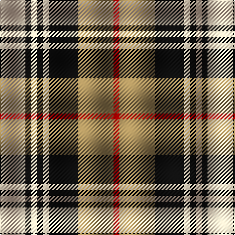

In pattern [RYKWKWKW](/patterns/rykwkwkw/).

This was sourced from tartans-authority.  It is a [8 stripes tartan](/stripes/stripes8/).

Original link http://www.tartansauthority.com/tartan-ferret/display/8680/

## Thread count
LR/26 K6 LR6 K6 LR6 K30 LT36 R/6

## Palette
Each colour and its ΔE from the base-6 reference it is a variant of.

| Colour | Shade | Base | ΔE (OKLab) |
|---|---|---|---|
| K | <code style="background-color:#101010;">#101010</code> `#101010` | K <code style="background-color:#000000;">#000000</code> | 0.17 |
| LR | <code style="background-color:#E8CCB8;">#E8CCB8</code> `#E8CCB8` | W <code style="background-color:#F7F7F7;">#F7F7F7</code> | 0.12 |
| LT | <code style="background-color:#A08858;">#A08858</code> `#A08858` | Y <code style="background-color:#F2BF00;">#F2BF00</code> | 0.21 |
| R | <code style="background-color:#C80000;">#C80000</code> `#C80000` | R <code style="background-color:#CC0000;">#CC0000</code> | 0.01 |

# Sample pattern

## Nearest tartans

The nearest existing variants by ΔTartan distance.

1. [Aberlour](/setts/s8/w23k4w4k4w4k22r23y5x2~k101010-r98481c-we8ccb8-ya08858/) — ΔT 0.31
1. [Holden Brown (Corporate)](/setts/s8/w13k3w3k3w3k15g18r3x2~g604000-k101010-rc80000-we8ccb8/) — ΔT 0.60
1. [Fraser Dress](/setts/s6/r6k14r6g14w27k4~g005020-k101010-rdc0000-we0e0e0/) — ΔT 0.94
1. [Thompson Grey Dress](/setts/s6/r1ra6k1w3k3r1x8~k101010-r880000-ra888888-we0e0e0/) — ΔT 1.00
1. [Edinburgh, City of](/setts/s10/w10k3wa3k3wa3k3w10r6k15r3x2~k101010-rc80000-wc0c0c0-wafcfcfc/) — ΔT 1.00
1. [MacKintosh Dress (Scott Adie)](/setts/s6/r3w8b4g14r4b2x4~b2c2c80-g285800-rc80000-we0e0e0/) — ΔT 1.02
1. [Fraser Red Dress Clan Tartan Tartan Number: 1427. Earliest known date: pre 2003 A sample of this tartan was recorded by the Scottish Tartans Society during the period 1970 to 1990. See products available Copyright © Blair Urquhart, Comrie, 2015](/setts/s7/r4b18r4g19w25r10w4x2~b2c2c80-g006818-rc80000-we0e0e0/) — ΔT 1.03
1. [Fraser, dress](/setts/s6/r6k14r6g14w27k4~g008000-k000000-rc00000-we0e0e0/) — ΔT 1.04
1. [Merrilees](/setts/s6/w23b6w6r5k35r10x2~b5c8ca8-k101010-rc80000-wf8f8f8/) — ΔT 1.06
1. [Robertson Dress (Dalgleish) #2](/setts/s8/b24r4g24r4w20r10g3w4x2~b2c2c80-g006818-rc80000-we0e0e0/) — ΔT 1.06

## Neighbour map

Every grey dot is one of 15726 variants placed by the first two principal components of the ΔTartan feature space (44% of its variance). Red is this tartan; blue dots are its nearest — click one to open its page.

<svg viewBox="0 0 640 380" role="img" style="max-width:100%;height:auto;border:1px solid #e0e0e0;border-radius:4px;display:block" xmlns="http://www.w3.org/2000/svg"><image href="/nn/cloud.v1.png" width="640" height="380"/><a href="/setts/s8/w23k4w4k4w4k22r23y5x2~k101010-r98481c-we8ccb8-ya08858/"><circle cx="128.8" cy="195.5" r="4" fill="#3465a4"><title>Aberlour</title></circle></a><a href="/setts/s8/w13k3w3k3w3k15g18r3x2~g604000-k101010-rc80000-we8ccb8/"><circle cx="130.5" cy="198.6" r="4" fill="#3465a4"><title>Holden Brown (Corporate)</title></circle></a><a href="/setts/s6/r6k14r6g14w27k4~g005020-k101010-rdc0000-we0e0e0/"><circle cx="118.1" cy="212.0" r="4" fill="#3465a4"><title>Fraser Dress</title></circle></a><a href="/setts/s6/r1ra6k1w3k3r1x8~k101010-r880000-ra888888-we0e0e0/"><circle cx="142.4" cy="217.2" r="4" fill="#3465a4"><title>Thompson Grey Dress</title></circle></a><a href="/setts/s10/w10k3wa3k3wa3k3w10r6k15r3x2~k101010-rc80000-wc0c0c0-wafcfcfc/"><circle cx="123.7" cy="200.0" r="4" fill="#3465a4"><title>Edinburgh, City of</title></circle></a><a href="/setts/s6/r3w8b4g14r4b2x4~b2c2c80-g285800-rc80000-we0e0e0/"><circle cx="148.3" cy="216.1" r="4" fill="#3465a4"><title>MacKintosh Dress (Scott Adie)</title></circle></a><a href="/setts/s7/r4b18r4g19w25r10w4x2~b2c2c80-g006818-rc80000-we0e0e0/"><circle cx="105.3" cy="208.8" r="4" fill="#3465a4"><title>Fraser Red Dress Clan Tartan Tartan Number: 1427. Earliest known date: pre 2003 A sample of this tartan was recorded by the Scottish Tartans Society during the period 1970 to 1990. See products available Copyright © Blair Urquhart, Comrie, 2015</title></circle></a><a href="/setts/s6/r6k14r6g14w27k4~g008000-k000000-rc00000-we0e0e0/"><circle cx="110.6" cy="212.0" r="4" fill="#3465a4"><title>Fraser, dress</title></circle></a><a href="/setts/s6/w23b6w6r5k35r10x2~b5c8ca8-k101010-rc80000-wf8f8f8/"><circle cx="155.0" cy="199.0" r="4" fill="#3465a4"><title>Merrilees</title></circle></a><a href="/setts/s8/b24r4g24r4w20r10g3w4x2~b2c2c80-g006818-rc80000-we0e0e0/"><circle cx="103.3" cy="189.8" r="4" fill="#3465a4"><title>Robertson Dress (Dalgleish) #2</title></circle></a><circle cx="126.5" cy="194.6" r="5" fill="#c00000"/></svg>

ID: /setts/s8/w13k3w3k3w3k15y18r3x2~k101010-rc80000-we8ccb8-ya08858/
