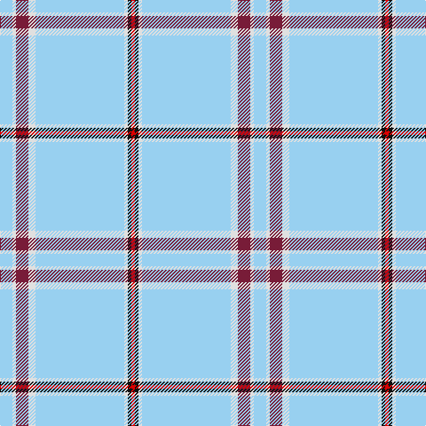

In pattern [RKWWWRWW](/patterns/rkwwwrww/).

This was sourced from register-of-tartans.  It is a [8 stripes tartan](/stripes/stripes8/).

Original link https://www.tartanregister.gov.uk/tartanDetails.aspx?ref=2346

## Thread count
LB/14 LN4 DR14 LN8 LB100 LN4 K4 R/4

## Palette
Each colour and its ΔE from the base-6 reference it is a variant of.

| Colour | Shade | Base | ΔE (OKLab) |
|---|---|---|---|
| DR | <code style="background-color:#781C38;">#781C38</code> `#781C38` | R <code style="background-color:#C80000;">#C80000</code> | 0.17 |
| K | <code style="background-color:#101010;">#101010</code> `#101010` | K <code style="background-color:#000000;">#000000</code> | 0.17 |
| LB | <code style="background-color:#98D0F0;">#98D0F0</code> `#98D0F0` | W <code style="background-color:#F4F4F0;">#F4F4F0</code> | 0.16 |
| LN | <code style="background-color:#E0E0E0;">#E0E0E0</code> `#E0E0E0` | W <code style="background-color:#F4F4F0;">#F4F4F0</code> | 0.06 |
| R | <code style="background-color:#DC0000;">#DC0000</code> `#DC0000` | R <code style="background-color:#C80000;">#C80000</code> | 0.04 |

# Sample pattern

## Nearest tartans

The nearest existing variants by ΔTartan distance.

1. [Wyckoff (Commemorative)](/setts/s8/w140b10w6r10w6wa10b6ra10-b1474b4-re87878-rac80000-w98c8e8-wafcfcfc/) — ΔT 1.54
1. [Gairloch (Fashion)](/setts/s8/w48w2g18w2w18w4g4k4-g808080-k101010-we0e0e0/) — ΔT 1.54
1. [London Fog Safari (Fashion)](/setts/s6/y20k4w10k8y100b4-b1474b4-k101010-we0e0e0-yb8b8b8/) — ΔT 1.82
1. [Miss Emma Halford-MacLeod](/setts/s10/w204b6y6b6w6b24ba28g24w6r6-b383f49-ba405688-g53897b-r994954-we8e9e1-yd3c773/) — ΔT 1.86
1. [Royal College of Midwives](/setts/s9/y10w6k2w12b22w6ba6w86wa6-b5c5c5c-ba1474b4-k101010-wc0c0c0-wafcfcfc-ye8c000/) — ΔT 1.90
1. [Old England House Check](/setts/s12/w92r18w8k16w18ra8w18g4w4g4w4g2-g604000-k101010-r888888-rac80000-we0e0e0/) — ΔT 1.96
1. [Glasgow Islay (Fashion)](/setts/s8/b8w100g8ba8wa4y4k6wa4-b1c1c50-ba780078-g00801c-k101010-w98c8e8-wae0e0e0-ye8c000/) — ΔT 2.01
1. [St. Giles Check (Corporate)](/setts/s7/b12r4w4r100w4r4ba12-b2c2c80-ba780078-r888888-wfcfcfc/) — ΔT 2.05
1. [London Fog Camel (Fashion)](/setts/s12/y144k9y13w9y4k9y4b13w13y4w13k4-b2888c4-k101010-wd4d4c4-yccc0a4/) — ΔT 2.06
1. [Stratford, (Oregon) City of (Dist.)](/setts/s10/b168w20b4w4y36b4g8w4b4r4-b1474b4-g00643c-rc80000-we0e0e0-ybc8c00/) — ΔT 2.10

## Neighbour map

Every grey dot is one of 15726 variants placed by the first two principal components of the ΔTartan feature space (44% of its variance). Red is this tartan; blue dots are its nearest — click one to open its page.

<svg viewBox="0 0 640 380" role="img" style="max-width:100%;height:auto;border:1px solid #e0e0e0;border-radius:4px;display:block" xmlns="http://www.w3.org/2000/svg"><image href="/nn/cloud.v1.png" width="640" height="380"/><a href="/setts/s8/w140b10w6r10w6wa10b6ra10-b1474b4-re87878-rac80000-w98c8e8-wafcfcfc/"><circle cx="528.3" cy="114.9" r="4" fill="#3465a4"><title>Wyckoff (Commemorative)</title></circle></a><a href="/setts/s8/w48w2g18w2w18w4g4k4-g808080-k101010-we0e0e0/"><circle cx="463.3" cy="131.9" r="4" fill="#3465a4"><title>Gairloch (Fashion)</title></circle></a><a href="/setts/s6/y20k4w10k8y100b4-b1474b4-k101010-we0e0e0-yb8b8b8/"><circle cx="552.5" cy="139.6" r="4" fill="#3465a4"><title>London Fog Safari (Fashion)</title></circle></a><a href="/setts/s10/w204b6y6b6w6b24ba28g24w6r6-b383f49-ba405688-g53897b-r994954-we8e9e1-yd3c773/"><circle cx="390.3" cy="39.0" r="4" fill="#3465a4"><title>Miss Emma Halford-MacLeod</title></circle></a><a href="/setts/s9/y10w6k2w12b22w6ba6w86wa6-b5c5c5c-ba1474b4-k101010-wc0c0c0-wafcfcfc-ye8c000/"><circle cx="451.0" cy="74.0" r="4" fill="#3465a4"><title>Royal College of Midwives</title></circle></a><a href="/setts/s12/w92r18w8k16w18ra8w18g4w4g4w4g2-g604000-k101010-r888888-rac80000-we0e0e0/"><circle cx="438.0" cy="50.9" r="4" fill="#3465a4"><title>Old England House Check</title></circle></a><a href="/setts/s8/b8w100g8ba8wa4y4k6wa4-b1c1c50-ba780078-g00801c-k101010-w98c8e8-wae0e0e0-ye8c000/"><circle cx="379.9" cy="56.6" r="4" fill="#3465a4"><title>Glasgow Islay (Fashion)</title></circle></a><a href="/setts/s7/b12r4w4r100w4r4ba12-b2c2c80-ba780078-r888888-wfcfcfc/"><circle cx="544.0" cy="135.5" r="4" fill="#3465a4"><title>St. Giles Check (Corporate)</title></circle></a><a href="/setts/s12/y144k9y13w9y4k9y4b13w13y4w13k4-b2888c4-k101010-wd4d4c4-yccc0a4/"><circle cx="471.2" cy="71.4" r="4" fill="#3465a4"><title>London Fog Camel (Fashion)</title></circle></a><a href="/setts/s10/b168w20b4w4y36b4g8w4b4r4-b1474b4-g00643c-rc80000-we0e0e0-ybc8c00/"><circle cx="477.0" cy="79.1" r="4" fill="#3465a4"><title>Stratford, (Oregon) City of (Dist.)</title></circle></a><circle cx="468.8" cy="98.6" r="5" fill="#c00000"/></svg>

ID: /setts/s8/w14wa4r14wa8w100wa4k4ra4-k101010-r781c38-radc0000-w98d0f0-wae0e0e0/
