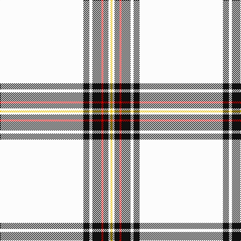

In pattern [WKWKRKWY](/patterns/wkwkrkwy/).

This was sourced from tartans-authority.  It is a [8 stripes tartan](/stripes/stripes8/).

Original link http://www.tartansauthority.com/tartan-ferret/display/6142/

## Thread count
W/166 K12 W6 K18 R4 K10 W4 Y/4

## Palette
Each colour and its ΔE from the base-6 reference it is a variant of.

| Colour | Shade | Base | ΔE (OKLab) |
|---|---|---|---|
| K | <code style="background-color:#101010;">#101010</code> `#101010` | K <code style="background-color:#000000;">#000000</code> | 0.17 |
| R | <code style="background-color:#C80000;">#C80000</code> `#C80000` | R <code style="background-color:#CC0000;">#CC0000</code> | 0.01 |
| W | <code style="background-color:#FCFCFC;">#FCFCFC</code> `#FCFCFC` | W <code style="background-color:#F7F7F7;">#F7F7F7</code> | 0.01 |
| Y | <code style="background-color:#E8C000;">#E8C000</code> `#E8C000` | Y <code style="background-color:#F2BF00;">#F2BF00</code> | 0.02 |

# Sample pattern

## Nearest tartans

The nearest existing variants by ΔTartan distance.

1. [Crane of Cluny Dress (Personal)](/setts/s8/w166k12w6k18r4k10w4y4-k101010-rff0000-wfcfcfc-ye8c000/) — ΔT 0.02
1. [Young, Christina](/setts/s6/w162k10b10y9g6b3-b800070-g908000-k000000-we0e0e0-yff8500/) — ΔT 1.31
1. [Summer Spirit (Fashion)](/setts/s8/r4w4k4w56k16w18k2y4-k101010-rc80000-wfcfcec-ye8c000/) — ΔT 1.61
1. [Wilson's Blanket Sett - Border](/setts/s13/w200r28w26g26w26k2r28k2w26g26w26r24w200-g408060-k101010-rc80000-wfcfcfc/) — ΔT 1.83
1. [Old England House Check](/setts/s12/w92r18w8k16w18ra8w18g4w4g4w4g2-g604000-k101010-r888888-rac80000-we0e0e0/) — ΔT 1.85
1. [Summer Spirit](/setts/s14/y4k2w18k16w56k4w4r4w4k4w56k16w18k2-k101010-rc80000-wfcfcec-ye8c000/) — ΔT 1.88
1. [Old England House Check](/setts/s12/w92y8w18k16w18r8w18b4w4b4w4b4-b4c3428-k101010-rdc0000-wf8f4d0-ya0a0a0/) — ΔT 1.88
1. [Unnamed C18th - Blanket Pattern](/setts/s9/w240k4b8g6w4k4r16w4r6-b38409c-g289c18-k300500-rd05054-wfcfcfc/) — ΔT 1.97
1. [UPS No. 2 (Corporate)](/setts/s16/w16b4w4y4w4b4w30b4w120b8wa2b4wa4b4wa2b8-b381414-wfcf4b4-wafcf890-ydc982c/) — ΔT 2.06
1. [UPS No.2](/setts/s16/b4w16b8wa2b4wa4b4wa2b8w120b4w30b4w4y4w4-b391614-wfef6b4-wafcfa93-ydf982e/) — ΔT 2.09

## Neighbour map

Every grey dot is one of 15726 variants placed by the first two principal components of the ΔTartan feature space (44% of its variance). Red is this tartan; blue dots are its nearest — click one to open its page.

<svg viewBox="0 0 640 380" role="img" style="max-width:100%;height:auto;border:1px solid #e0e0e0;border-radius:4px;display:block" xmlns="http://www.w3.org/2000/svg"><image href="/nn/cloud.v1.png" width="640" height="380"/><a href="/setts/s8/w166k12w6k18r4k10w4y4-k101010-rff0000-wfcfcfc-ye8c000/"><circle cx="506.4" cy="63.6" r="4" fill="#3465a4"><title>Crane of Cluny Dress (Personal)</title></circle></a><a href="/setts/s6/w162k10b10y9g6b3-b800070-g908000-k000000-we0e0e0-yff8500/"><circle cx="531.3" cy="66.6" r="4" fill="#3465a4"><title>Young, Christina</title></circle></a><a href="/setts/s8/r4w4k4w56k16w18k2y4-k101010-rc80000-wfcfcec-ye8c000/"><circle cx="414.1" cy="101.5" r="4" fill="#3465a4"><title>Summer Spirit (Fashion)</title></circle></a><a href="/setts/s13/w200r28w26g26w26k2r28k2w26g26w26r24w200-g408060-k101010-rc80000-wfcfcfc/"><circle cx="506.6" cy="65.7" r="4" fill="#3465a4"><title>Wilson's Blanket Sett - Border</title></circle></a><a href="/setts/s12/w92r18w8k16w18ra8w18g4w4g4w4g2-g604000-k101010-r888888-rac80000-we0e0e0/"><circle cx="438.0" cy="50.9" r="4" fill="#3465a4"><title>Old England House Check</title></circle></a><a href="/setts/s14/y4k2w18k16w56k4w4r4w4k4w56k16w18k2-k101010-rc80000-wfcfcec-ye8c000/"><circle cx="422.8" cy="83.4" r="4" fill="#3465a4"><title>Summer Spirit</title></circle></a><a href="/setts/s12/w92y8w18k16w18r8w18b4w4b4w4b4-b4c3428-k101010-rdc0000-wf8f4d0-ya0a0a0/"><circle cx="439.2" cy="72.2" r="4" fill="#3465a4"><title>Old England House Check</title></circle></a><a href="/setts/s9/w240k4b8g6w4k4r16w4r6-b38409c-g289c18-k300500-rd05054-wfcfcfc/"><circle cx="586.7" cy="35.4" r="4" fill="#3465a4"><title>Unnamed C18th - Blanket Pattern</title></circle></a><a href="/setts/s16/w16b4w4y4w4b4w30b4w120b8wa2b4wa4b4wa2b8-b381414-wfcf4b4-wafcf890-ydc982c/"><circle cx="510.8" cy="24.9" r="4" fill="#3465a4"><title>UPS No. 2 (Corporate)</title></circle></a><a href="/setts/s16/b4w16b8wa2b4wa4b4wa2b8w120b4w30b4w4y4w4-b391614-wfef6b4-wafcfa93-ydf982e/"><circle cx="510.6" cy="24.6" r="4" fill="#3465a4"><title>UPS No.2</title></circle></a><circle cx="506.2" cy="63.7" r="5" fill="#c00000"/></svg>

ID: /setts/s8/w166k12w6k18r4k10w4y4-k101010-rc80000-wfcfcfc-ye8c000/
