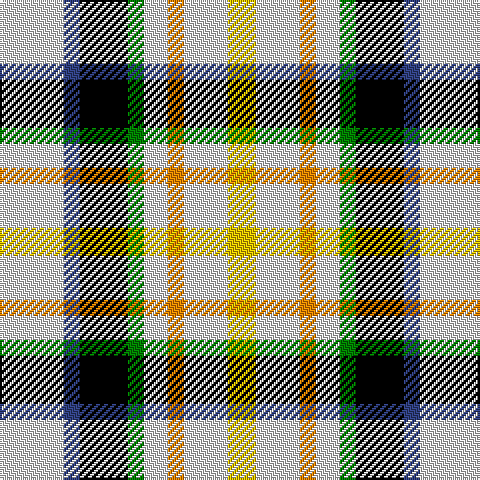

In pattern [WBKGWYWY](/patterns/wbkgwywy/).

This was sourced from weddslist.  It is a [8 stripes tartan](/stripes/stripes8/).

Original link http://www.weddslist.com/cgi-bin/tartans/pg.pl?source=sts

## Thread count
LN/32 B8 K24 G8 LN12 O8 LN22 Y/14

## Palette
Each colour and its ΔE from the base-6 reference it is a variant of.

| Colour | Shade | Base | ΔE (OKLab) |
|---|---|---|---|
| B | <code style="background-color:#304080;">#304080</code> `#304080` | B <code style="background-color:#2A418A;">#2A418A</code> | 0.02 |
| G | <code style="background-color:#008000;">#008000</code> `#008000` | G <code style="background-color:#006100;">#006100</code> | 0.10 |
| K | <code style="background-color:#000000;">#000000</code> `#000000` | K <code style="background-color:#000000;">#000000</code> | 0.00 |
| LN | <code style="background-color:#E0E0E0;">#E0E0E0</code> `#E0E0E0` | W <code style="background-color:#F7F7F7;">#F7F7F7</code> | 0.07 |
| O | <code style="background-color:#FF8500;">#FF8500</code> `#FF8500` | Y <code style="background-color:#F2BF00;">#F2BF00</code> | 0.14 |
| Y | <code style="background-color:#F0C000;">#F0C000</code> `#F0C000` | Y <code style="background-color:#F2BF00;">#F2BF00</code> | 0.00 |

# Sample pattern

## Nearest tartans

The nearest existing variants by ΔTartan distance.

1. [MacLaren Dress (Dance)](/setts/s8/w16b4k12g4w6y4w11ya7x2~b2c2c80-g285800-k101010-we0e0e0-yd87c00-yae8c000/) — ΔT 0.31
1. [MacLaren (D.C Dalgliesh version)](/setts/s8/w16b4k12g4w6r4w11y7x2~b2c4084-g005020-k101010-rfa4b00-we0e0e0-ye8c000/) — ΔT 0.33
1. [MacLaren Albino (Dance)](/setts/s8/w8b2k6g2w3r2w6y4x4~b00008c-g004c00-k000000-ra83000-wc8c8c8-yc89800/) — ΔT 0.71
1. [Desang](/setts/s8/b4w2k3wa8g2wa8w2ba4x2~b202060-ba680028-g285800-k101010-we0e0e0-wae8ccb8/) — ΔT 0.88
1. [Desang (Corporate)](/setts/s8/b4w2k3wa8g2wa8w2r4x4~b2c2c88-g3c9000-k101010-ra8003c-we0e0e0-wae8ccb8/) — ΔT 1.03
1. [MacDuff Dress](/setts/s8/w4k1w4g6k4w5r1b2x2~b3c82af-g005020-k101010-rdc0000-we0e0e0/) — ΔT 1.26
1. [MacDuff, dress](/setts/s8/w4k1w4g6k4w5r1b2x2~b5480b0-g008000-k000000-rc00000-we0e0e0/) — ΔT 1.26
1. [Game Fair (Corporate)](/setts/s7/g3b12g12w12g2w12g3x2~b1870a4-g003820-we0e0e0/) — ΔT 1.66
1. [Spirit of 1994](/setts/s9/b13w4g15w4r13w4g15y4k13x2~b0000cd-g008b00-k101010-rff0000-wffffff-yffe600/) — ΔT 1.92
1. [Mitsukoshi (Corporate)](/setts/s8/w12k3wa3k3w13b6k17r3x2~b5c8ca8-k101010-rc80000-wc0c0c0-wae8ccb8/) — ΔT 1.94

## Neighbour map

Every grey dot is one of 15726 variants placed by the first two principal components of the ΔTartan feature space (44% of its variance). Red is this tartan; blue dots are its nearest — click one to open its page.

<svg viewBox="0 0 640 380" role="img" style="max-width:100%;height:auto;border:1px solid #e0e0e0;border-radius:4px;display:block" xmlns="http://www.w3.org/2000/svg"><image href="/nn/cloud.v1.png" width="640" height="380"/><a href="/setts/s8/w16b4k12g4w6y4w11ya7x2~b2c2c80-g285800-k101010-we0e0e0-yd87c00-yae8c000/"><circle cx="100.2" cy="199.8" r="4" fill="#3465a4"><title>MacLaren Dress (Dance)</title></circle></a><a href="/setts/s8/w16b4k12g4w6r4w11y7x2~b2c4084-g005020-k101010-rfa4b00-we0e0e0-ye8c000/"><circle cx="100.7" cy="199.2" r="4" fill="#3465a4"><title>MacLaren (D.C Dalgliesh version)</title></circle></a><a href="/setts/s8/w8b2k6g2w3r2w6y4x4~b00008c-g004c00-k000000-ra83000-wc8c8c8-yc89800/"><circle cx="98.7" cy="204.4" r="4" fill="#3465a4"><title>MacLaren Albino (Dance)</title></circle></a><a href="/setts/s8/b4w2k3wa8g2wa8w2ba4x2~b202060-ba680028-g285800-k101010-we0e0e0-wae8ccb8/"><circle cx="90.6" cy="193.7" r="4" fill="#3465a4"><title>Desang</title></circle></a><a href="/setts/s8/b4w2k3wa8g2wa8w2r4x4~b2c2c88-g3c9000-k101010-ra8003c-we0e0e0-wae8ccb8/"><circle cx="95.7" cy="193.6" r="4" fill="#3465a4"><title>Desang (Corporate)</title></circle></a><a href="/setts/s8/w4k1w4g6k4w5r1b2x2~b3c82af-g005020-k101010-rdc0000-we0e0e0/"><circle cx="117.8" cy="208.4" r="4" fill="#3465a4"><title>MacDuff Dress</title></circle></a><a href="/setts/s8/w4k1w4g6k4w5r1b2x2~b5480b0-g008000-k000000-rc00000-we0e0e0/"><circle cx="110.9" cy="207.0" r="4" fill="#3465a4"><title>MacDuff, dress</title></circle></a><a href="/setts/s7/g3b12g12w12g2w12g3x2~b1870a4-g003820-we0e0e0/"><circle cx="83.8" cy="194.3" r="4" fill="#3465a4"><title>Game Fair (Corporate)</title></circle></a><a href="/setts/s9/b13w4g15w4r13w4g15y4k13x2~b0000cd-g008b00-k101010-rff0000-wffffff-yffe600/"><circle cx="14.0" cy="200.7" r="4" fill="#3465a4"><title>Spirit of 1994</title></circle></a><a href="/setts/s8/w12k3wa3k3w13b6k17r3x2~b5c8ca8-k101010-rc80000-wc0c0c0-wae8ccb8/"><circle cx="128.8" cy="193.0" r="4" fill="#3465a4"><title>Mitsukoshi (Corporate)</title></circle></a><circle cx="93.6" cy="198.1" r="5" fill="#c00000"/></svg>

ID: /setts/s8/w16b4k12g4w6y4w11ya7x2~b304080-g008000-k000000-we0e0e0-yff8500-yaf0c000/
