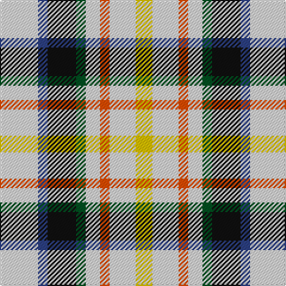

**Bands:** [YWRWGKBW](/stripes/ywrwgkbw/) · **Stripes:** [LY W R W DG K DB W](/stripes/stripes8/) LY W R W DG K DB W

This was sourced from register-of-tartans.  It is a [8 band tartan](/bands/bands8/).

Original link https://www.tartanregister.gov.uk/tartanDetails.aspx?ref=2596

## Register references

External register numbers recorded for this tartan.

- Scottish Register of Tartans: [2596](https://www.tartanregister.gov.uk/tartanDetails.aspx?ref=2596)
- Scottish Tartans World Register: 1770

## Thread count
LN/32 B8 K24 G8 LN12 R8 LN22 Y/14

## Palette
Each colour and its ΔE from the base-6 reference it is a variant of.

| Colour | Shade | Base | ΔE (OKLab) |
|---|---|---|---|
| B | <code style="background-color:#2C4084;">#2C4084</code> `#2C4084` | B <code style="background-color:#2A418A;">#2A418A</code> | 0.01 |
| G | <code style="background-color:#005020;">#005020</code> `#005020` | G <code style="background-color:#006100;">#006100</code> | 0.07 |
| K | <code style="background-color:#101010;">#101010</code> `#101010` | K <code style="background-color:#000000;">#000000</code> | 0.17 |
| LN | <code style="background-color:#E0E0E0;">#E0E0E0</code> `#E0E0E0` | W <code style="background-color:#F7F7F7;">#F7F7F7</code> | 0.07 |
| R | <code style="background-color:#FA4B00;">#FA4B00</code> `#FA4B00` | R <code style="background-color:#CC0000;">#CC0000</code> | 0.13 |
| Y | <code style="background-color:#E8C000;">#E8C000</code> `#E8C000` | Y <code style="background-color:#F2BF00;">#F2BF00</code> | 0.02 |

# Sample pattern

## Nearest tartans

The nearest existing variants by ΔTartan distance.

1. [MacLaren Dress (Dance)](/setts/s8/w16db4k12dg4w6lo4w11ly7~x2/) — ΔT 0.11
1. [MacLaren](/setts/s8/w16db4k12g4w6lo4w11ly7~x2/) — ΔT 0.33
1. [Desang](/setts/s8/dr4w2lb8dg2lb8k3w2db4~x2/) — ΔT 0.73
1. [Desang (Corporate)](/setts/s8/db4w2k3lb8g2lb8w2r4~x4/) — ΔT 0.78
1. [MacLaren Albino (Dance)](/setts/s8/lb8db2k6dg2lb3o2lb6ly4~x4/) — ΔT 0.83
1. [MacDuff Dress](/setts/s8/w4k1w4dg6k4w5r1t2~x2/) — ΔT 1.31
1. [MacDuff, dress](/setts/s8/w4k1w4g6k4w5r1t2~x2/) — ΔT 1.39
1. [Game Fair (Corporate)](/setts/s7/dg3b12dg12w12dg2w12dg3~x2/) — ΔT 1.66
1. [MacGregor-Ryan (Personal)](/setts/s6/lb67k13dy17dy13w40t20~x2/) — ΔT 1.84
1. [MacGregor-Ryan (Personal)](/setts/s6/lb62dt13lo17dy13w40t20~x2/) — ΔT 1.87

## Neighbour map

Every grey dot is one of 14299 variants placed by the first two principal components of the ΔTartan feature space (44% of its variance). Red is this tartan; blue dots are its nearest — click one to open its page.

<svg viewBox="0 0 640 380" role="img" style="max-width:100%;height:auto;border:1px solid #e0e0e0;border-radius:4px;display:block" xmlns="http://www.w3.org/2000/svg"><image href="/nn/cloud.v1.png" width="640" height="380"/><a href="/setts/s8/w16db4k12dg4w6lo4w11ly7~x2/"><circle cx="102.1" cy="195.9" r="4" fill="#3465a4"><title>MacLaren Dress (Dance)</title></circle></a><a href="/setts/s8/w16db4k12g4w6lo4w11ly7~x2/"><circle cx="95.6" cy="193.6" r="4" fill="#3465a4"><title>MacLaren</title></circle></a><a href="/setts/s8/dr4w2lb8dg2lb8k3w2db4~x2/"><circle cx="92.5" cy="190.5" r="4" fill="#3465a4"><title>Desang</title></circle></a><a href="/setts/s8/db4w2k3lb8g2lb8w2r4~x4/"><circle cx="97.4" cy="190.7" r="4" fill="#3465a4"><title>Desang (Corporate)</title></circle></a><a href="/setts/s8/lb8db2k6dg2lb3o2lb6ly4~x4/"><circle cx="101.0" cy="200.6" r="4" fill="#3465a4"><title>MacLaren Albino (Dance)</title></circle></a><a href="/setts/s8/w4k1w4dg6k4w5r1t2~x2/"><circle cx="120.3" cy="204.9" r="4" fill="#3465a4"><title>MacDuff Dress</title></circle></a><a href="/setts/s8/w4k1w4g6k4w5r1t2~x2/"><circle cx="113.5" cy="203.0" r="4" fill="#3465a4"><title>MacDuff, dress</title></circle></a><a href="/setts/s7/dg3b12dg12w12dg2w12dg3~x2/"><circle cx="87.0" cy="193.6" r="4" fill="#3465a4"><title>Game Fair (Corporate)</title></circle></a><a href="/setts/s6/lb67k13dy17dy13w40t20~x2/"><circle cx="90.1" cy="190.8" r="4" fill="#3465a4"><title>MacGregor-Ryan (Personal)</title></circle></a><a href="/setts/s6/lb62dt13lo17dy13w40t20~x2/"><circle cx="69.8" cy="189.8" r="4" fill="#3465a4"><title>MacGregor-Ryan (Personal)</title></circle></a><circle cx="102.6" cy="195.2" r="5" fill="#c00000"/></svg>

ID: /setts/s8/w16db4k12dg4w6r4w11ly7~x2/
