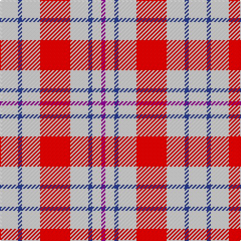

In pattern [BWBWRWBW](/patterns/bwbwrwbw/).

This was sourced from weddslist.  It is a [8 stripes tartan](/stripes/stripes8/).

Original link http://www.weddslist.com/cgi-bin/tartans/pg.pl?source=sts

## Thread count
LN/18 B4 LN18 R30 LN18 B4 LN9 P/4

## Palette
Each colour and its ΔE from the base-6 reference it is a variant of.

| Colour | Shade | Base | ΔE (OKLab) |
|---|---|---|---|
| B | <code style="background-color:#304080;">#304080</code> `#304080` | B <code style="background-color:#2A418A;">#2A418A</code> | 0.02 |
| LN | <code style="background-color:#E0E0E0;">#E0E0E0</code> `#E0E0E0` | W <code style="background-color:#F7F7F7;">#F7F7F7</code> | 0.07 |
| P | <code style="background-color:#800080;">#800080</code> `#800080` | B <code style="background-color:#2A418A;">#2A418A</code> | 0.17 |
| R | <code style="background-color:#C00000;">#C00000</code> `#C00000` | R <code style="background-color:#CC0000;">#CC0000</code> | 0.03 |

# Sample pattern

## Nearest tartans

The nearest existing variants by ΔTartan distance.

1. [Milne Dress Family Tartan Tartan Number: 634. Earliest known date: pre 2003 Milnes are usually regarded as being a Sept of the Gordons or of the Ogilvys. See products available Copyright © Blair Urquhart, Comrie, 2015](/setts/s8/w18b4w18r30w18b4w9ba4-b2c2c80-ba780078-rc80000-we0e0e0/) — ΔT 0.07
1. [Milne, Dress (Dance)](/setts/s8/w48b8w48r68w48b8w20ba8-b2888c4-ba780078-rc80000-wf8f8f8/) — ΔT 0.87
1. [Milne (Personal)](/setts/s8/w48g8w48r68w48g8w20b8-b6840fc-g005448-rd05054-wfcfcfc/) — ΔT 1.11
1. [Boswell Dress Personal Tartan Tartan Number: 6359. Earliest known date: 2004 A tartan for William Boswell of Balmuto in Fife. See products available Copyright © Blair Urquhart, Comrie, 2015](/setts/s8/w26r6w4k10w4r6w26b16-b2c2c80-k101010-rc80000-we0e0e0/) — ΔT 1.14
1. [Bull-Dog Sauce](/setts/s7/w40g4w40k16r40g6r4-g006818-k101010-rc80000-wf8f8f8/) — ΔT 1.27
1. [Twilfit](/setts/s9/b25r46w11r11w7r11w11r46b12-b2c2c80-re87878-wfcfcfc/) — ΔT 1.31
1. [Milne Dress Fancy Tartan Tartan Number: 6550. Earliest known date: pre 2004 Colour change for #634. Thought to be a Dancers' Fancy. See products available Copyright © Blair Urquhart, Comrie, 2015](/setts/s14/w20b8w48r68w48b8w48b8w48r68w48b8w20ba8-b2888c4-ba780078-rc80000-wf8f8f8/) — ΔT 1.33
1. [Milne Purple Dress (Dance)](/setts/s8/w48b8w48r68w48b8w20ra8-b202060-rb468ac-rac80000-wfcfcfc/) — ΔT 1.33
1. [Buchanan VS](/setts/s6/w2r4w2r4w9k1-k000000-rff0000-wd0d0d0/) — ΔT 1.37
1. [Clayton Dress (Dance)](/setts/s6/w16r28w16r28w70k8-k000000-r880000-wfcfcfc/) — ΔT 1.41

## Neighbour map

Every grey dot is one of 15726 variants placed by the first two principal components of the ΔTartan feature space (44% of its variance). Red is this tartan; blue dots are its nearest — click one to open its page.

<svg viewBox="0 0 640 380" role="img" style="max-width:100%;height:auto;border:1px solid #e0e0e0;border-radius:4px;display:block" xmlns="http://www.w3.org/2000/svg"><image href="/nn/cloud.v1.png" width="640" height="380"/><a href="/setts/s8/w18b4w18r30w18b4w9ba4-b2c2c80-ba780078-rc80000-we0e0e0/"><circle cx="271.1" cy="192.9" r="4" fill="#3465a4"><title>Milne Dress Family Tartan Tartan Number: 634. Earliest known date: pre 2003 Milnes are usually regarded as being a Sept of the Gordons or of the Ogilvys. See products available Copyright © Blair Urquhart, Comrie, 2015</title></circle></a><a href="/setts/s8/w48b8w48r68w48b8w20ba8-b2888c4-ba780078-rc80000-wf8f8f8/"><circle cx="298.9" cy="183.6" r="4" fill="#3465a4"><title>Milne, Dress (Dance)</title></circle></a><a href="/setts/s8/w48g8w48r68w48g8w20b8-b6840fc-g005448-rd05054-wfcfcfc/"><circle cx="301.0" cy="186.2" r="4" fill="#3465a4"><title>Milne (Personal)</title></circle></a><a href="/setts/s8/w26r6w4k10w4r6w26b16-b2c2c80-k101010-rc80000-we0e0e0/"><circle cx="246.9" cy="194.2" r="4" fill="#3465a4"><title>Boswell Dress Personal Tartan Tartan Number: 6359. Earliest known date: 2004 A tartan for William Boswell of Balmuto in Fife. See products available Copyright © Blair Urquhart, Comrie, 2015</title></circle></a><a href="/setts/s7/w40g4w40k16r40g6r4-g006818-k101010-rc80000-wf8f8f8/"><circle cx="230.7" cy="171.4" r="4" fill="#3465a4"><title>Bull-Dog Sauce</title></circle></a><a href="/setts/s9/b25r46w11r11w7r11w11r46b12-b2c2c80-re87878-wfcfcfc/"><circle cx="320.6" cy="208.1" r="4" fill="#3465a4"><title>Twilfit</title></circle></a><a href="/setts/s14/w20b8w48r68w48b8w48b8w48r68w48b8w20ba8-b2888c4-ba780078-rc80000-wf8f8f8/"><circle cx="273.0" cy="159.9" r="4" fill="#3465a4"><title>Milne Dress Fancy Tartan Tartan Number: 6550. Earliest known date: pre 2004 Colour change for #634. Thought to be a Dancers' Fancy. See products available Copyright © Blair Urquhart, Comrie, 2015</title></circle></a><a href="/setts/s8/w48b8w48r68w48b8w20ra8-b202060-rb468ac-rac80000-wfcfcfc/"><circle cx="299.0" cy="186.8" r="4" fill="#3465a4"><title>Milne Purple Dress (Dance)</title></circle></a><a href="/setts/s6/w2r4w2r4w9k1-k000000-rff0000-wd0d0d0/"><circle cx="324.6" cy="210.1" r="4" fill="#3465a4"><title>Buchanan VS</title></circle></a><a href="/setts/s6/w16r28w16r28w70k8-k000000-r880000-wfcfcfc/"><circle cx="305.6" cy="203.8" r="4" fill="#3465a4"><title>Clayton Dress (Dance)</title></circle></a><circle cx="272.1" cy="193.7" r="5" fill="#c00000"/></svg>

ID: /setts/s8/w18b4w18r30w18b4w9ba4-b304080-ba800080-rc00000-we0e0e0/
