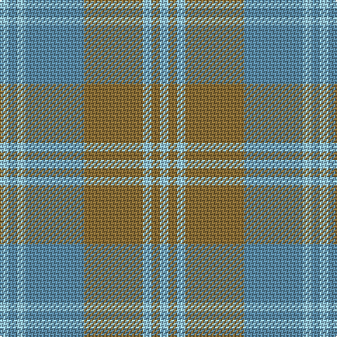

In pattern [WBWBGWGW](/patterns/wbwbgwgw/).

This was sourced from tartans-authority.  It is a [8 stripes tartan](/stripes/stripes8/).

Original link http://www.tartansauthority.com/tartan-ferret/display/3580/

## Thread count
LB/6 B6 LB6 B42 LT42 LB6 LT6 LB/6

## Palette
Each colour and its ΔE from the base-6 reference it is a variant of.

| Colour | Shade | Base | ΔE (OKLab) |
|---|---|---|---|
| B | <code style="background-color:#5C8CA8;">#5C8CA8</code> `#5C8CA8` | B <code style="background-color:#2A418A;">#2A418A</code> | 0.23 |
| LB | <code style="background-color:#98C8E8;">#98C8E8</code> `#98C8E8` | W <code style="background-color:#F7F7F7;">#F7F7F7</code> | 0.18 |
| LT | <code style="background-color:#8C7038;">#8C7038</code> `#8C7038` | G <code style="background-color:#006100;">#006100</code> | 0.18 |

# Sample pattern

## Nearest tartans

The nearest existing variants by ΔTartan distance.

1. [Chambers Bay](/setts/s7/g2b15y5g2b2g7w2~b5f749c-g408060-wffffff-yb0b0b0~x4/) — ΔT 1.43
1. [Manx Centenary](/setts/s9/b22g3b3g3b3g9ga28g3ga6~b304080-g008000-ga808080~x2/) — ΔT 1.70
1. [Universal, Ancient](/setts/s8/b12g2b2g2b2r8ga8r1~b5480b0-g008000-ga30a010-r806050~x2/) — ΔT 1.72
1. [Canadian Fancy](/setts/s6/g4r25g6b12g12b3~b5480b0-g008000-r806050~x2/) — ΔT 1.76
1. [Dama Classic (Fashion)](/setts/s8/y30w3y3w3y12b30r3b5~b5c5c5c-r888888-wf0dcbc-ya0a0a0~x2/) — ΔT 1.83
1. [MacPherson Gathering 1996](/setts/s9/b3r2g16r2b3r2ra16r2b3~b1870a4-g00643c-rc80000-ra888888~x4/) — ΔT 1.87
1. [Clyde Trade Tartan Tartan Number: 1296. Earliest known date: pre 1992 See Strathclyde District See products available Copyright © Blair Urquhart, Comrie, 2015](/setts/s10/w4b2w18r2b5ra16r2ra2r2ra2~b5c5c5c-rc80000-ra888888-wc0c0c0~x2/) — ΔT 1.88
1. [Manx Centenary](/setts/s9/b22g3b3g3b3g9r28g3r6~b40748c-g006818-r888888~x2/) — ΔT 1.90
1. [MacPherson Gathering 1996](/setts/s9/b3r2ba16r2b3r2g16r2b3~b1870a4-ba5c5c5c-g00643c-rc80000~x4/) — ΔT 1.96
1. [Bannockbane, Grey](/setts/s8/g2r2g15r2w10ra15r2ra2~g808080-r806050-ra906030-we0e0e0~x2/) — ΔT 1.97

## Neighbour map

Every grey dot is one of 15726 variants placed by the first two principal components of the ΔTartan feature space (44% of its variance). Red is this tartan; blue dots are its nearest — click one to open its page.

<svg viewBox="0 0 640 380" role="img" style="max-width:100%;height:auto;border:1px solid #e0e0e0;border-radius:4px;display:block" xmlns="http://www.w3.org/2000/svg"><image href="/nn/cloud.v1.png" width="640" height="380"/><a href="/setts/s7/g2b15y5g2b2g7w2~b5f749c-g408060-wffffff-yb0b0b0~x4/"><circle cx="304.0" cy="234.2" r="4" fill="#3465a4"><title>Chambers Bay</title></circle></a><a href="/setts/s9/b22g3b3g3b3g9ga28g3ga6~b304080-g008000-ga808080~x2/"><circle cx="301.4" cy="221.8" r="4" fill="#3465a4"><title>Manx Centenary</title></circle></a><a href="/setts/s8/b12g2b2g2b2r8ga8r1~b5480b0-g008000-ga30a010-r806050~x2/"><circle cx="288.3" cy="223.0" r="4" fill="#3465a4"><title>Universal, Ancient</title></circle></a><a href="/setts/s6/g4r25g6b12g12b3~b5480b0-g008000-r806050~x2/"><circle cx="314.0" cy="282.4" r="4" fill="#3465a4"><title>Canadian Fancy</title></circle></a><a href="/setts/s8/y30w3y3w3y12b30r3b5~b5c5c5c-r888888-wf0dcbc-ya0a0a0~x2/"><circle cx="343.0" cy="202.1" r="4" fill="#3465a4"><title>Dama Classic (Fashion)</title></circle></a><a href="/setts/s9/b3r2g16r2b3r2ra16r2b3~b1870a4-g00643c-rc80000-ra888888~x4/"><circle cx="225.2" cy="202.8" r="4" fill="#3465a4"><title>MacPherson Gathering 1996</title></circle></a><a href="/setts/s10/w4b2w18r2b5ra16r2ra2r2ra2~b5c5c5c-rc80000-ra888888-wc0c0c0~x2/"><circle cx="262.5" cy="180.6" r="4" fill="#3465a4"><title>Clyde Trade Tartan Tartan Number: 1296. Earliest known date: pre 1992 See Strathclyde District See products available Copyright © Blair Urquhart, Comrie, 2015</title></circle></a><a href="/setts/s9/b22g3b3g3b3g9r28g3r6~b40748c-g006818-r888888~x2/"><circle cx="369.5" cy="250.8" r="4" fill="#3465a4"><title>Manx Centenary</title></circle></a><a href="/setts/s9/b3r2ba16r2b3r2g16r2b3~b1870a4-ba5c5c5c-g00643c-rc80000~x4/"><circle cx="258.6" cy="219.9" r="4" fill="#3465a4"><title>MacPherson Gathering 1996</title></circle></a><a href="/setts/s8/g2r2g15r2w10ra15r2ra2~g808080-r806050-ra906030-we0e0e0~x2/"><circle cx="219.7" cy="209.8" r="4" fill="#3465a4"><title>Bannockbane, Grey</title></circle></a><circle cx="317.3" cy="238.9" r="5" fill="#c00000"/></svg>

ID: /setts/s8/w1b1w1b7g7w1g1w1~b5c8ca8-g8c7038-w98c8e8~x6/
