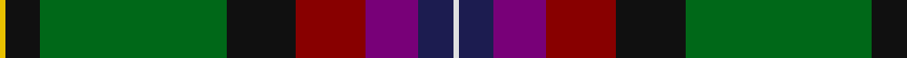
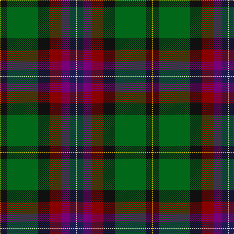

In pattern [WBBRKGKY](/stripes/wbbrkgky/).

This was sourced from register-of-tartans.  It is a [8 stripe tartan](/stripes/stripes8/).

Original link https://www.tartanregister.gov.uk/tartanDetails.aspx?ref=1286

## Attestations

This cloth appears in 2 source records; the oldest owns this page.

- 01/01/2007 — Fujitsu (register-of-tartans, [record](https://www.tartanregister.gov.uk/tartanDetails.aspx?ref=1286))
- pre 2007 — Fujitsu (Corporate?) (tartans-authority, [record](http://www.tartansauthority.com/tartan-ferret/display/7248/))

## Register references

External register numbers recorded for this tartan.

- Scottish Register of Tartans: [1286](https://www.tartanregister.gov.uk/tartanDetails.aspx?ref=1286)
- Scottish Tartans Authority (ITI): 7248

## Thread count
Y/2 K12 G64 K24 DR24 P18 DB12 LN/2

## Palette
Each colour and the base-6 reference it is a variant of.

| Colour | Shade | Base |
|---|---|---|
| DB | <code style="background-color:#1C1C50;">#1C1C50</code> `oklch(26.2% 0.093 277.9)` <small>#1C1C50</small> | B <code style="background-color:#2A418A;">#2A418A</code> |
| DR | <code style="background-color:#880000;">#880000</code> `oklch(39.4% 0.162 29.2)` <small>#880000</small> | R <code style="background-color:#CC0000;">#CC0000</code> |
| G | <code style="background-color:#006818;">#006818</code> `oklch(45.0% 0.142 145.0)` <small>#006818</small> | G <code style="background-color:#006100;">#006100</code> |
| K | <code style="background-color:#101010;">#101010</code> `oklch(17.3% 0.000 89.9)` <small>#101010</small> | K <code style="background-color:#000000;">#000000</code> |
| LN | <code style="background-color:#E0E0E0;">#E0E0E0</code> `oklch(90.7% 0.000 89.9)` <small>#E0E0E0</small> | W <code style="background-color:#F7F7F7;">#F7F7F7</code> |
| P | <code style="background-color:#780078;">#780078</code> `oklch(40.2% 0.185 328.4)` <small>#780078</small> | B <code style="background-color:#2A418A;">#2A418A</code> |
| Y | <code style="background-color:#E8C000;">#E8C000</code> `oklch(81.9% 0.168 93.7)` <small>#E8C000</small> | Y <code style="background-color:#F2BF00;">#F2BF00</code> |

# Sample pattern

## Nearest tartans

The nearest existing variants by ΔTartan distance, with this tartan at the top so the swatches line up against it.

ΔTartan

Tartan

Sett

—

<a href="/ttd/edit/#slug=w1db6dp9r12k12g32k6ly1~x2">Fujitsu</a> <a class="nn-out" href="/setts/s8/w1db6dp9r12k12g32k6ly1~x2/" title="open its dictionary page">↗</a>

0.98

<a href="/ttd/edit/#slug=k49dy15lb2dy6g6dy16lo3lo23dy9lo2b9~x2">State Seal of Wyoming (Fashion)</a> <a class="nn-out" href="/setts/s11/k49dy15lb2dy6g6dy16lo3lo23dy9lo2b9~x2/" title="open its dictionary page">↗</a>

1.13

<a href="/ttd/edit/#slug=w1k6b9r12k12g32k6ly1~x2">McGeachie (Personal)</a> <a class="nn-out" href="/setts/s8/w1k6b9r12k12g32k6ly1~x2/" title="open its dictionary page">↗</a>

1.16

<a href="/ttd/edit/#slug=dp5k1y5dp15dg15g28k2r4~x2">Batten of Argyll Clan Tartan Tartan Number: 5768. Earliest known date: 2003 The Baddenach family originally emigrated from Argyll, Scotland to Jamestown, Virginia. This can be worn by all of the name or its anglicised variants (Batten, Batton, Battin, Badden etc). IT is also to serve as the official tartan for the St Andrews Legion/St Andrews Legion Pipes &amp; Drums headquartered in Richmond Virginia, whose founder is the designer of this tartan. It may also serve as a tartan for anyone having Scottish ancestors who settled in the Virginia Colony. See products available Copyright © Blair Urquhart, Comrie, 2015</a> <a class="nn-out" href="/setts/s8/dp5k1y5dp15dg15g28k2r4~x2/" title="open its dictionary page">↗</a>

1.24

<a href="/ttd/edit/#slug=k5b3dy4ly1db13dy13g29w2~x2">Teviotdale</a> <a class="nn-out" href="/setts/s8/k5b3dy4ly1db13dy13g29w2~x2/" title="open its dictionary page">↗</a>

1.26

<a href="/ttd/edit/#slug=r4lb1y6g25k8db15lb2~x2">Jones (Name)</a> <a class="nn-out" href="/setts/s7/r4lb1y6g25k8db15lb2~x2/" title="open its dictionary page">↗</a>

1.26

<a href="/ttd/edit/#slug=g28r4k3o2k1dg2r3db20ly2~x2">Stirling University Corporate Tartan Tartan Number: 2074. Earliest known date: Aug 1992 This is a simplified Stirling and Bannockburn district sett with the Universities 'Green and Grey' striped through the black. See products available Copyright © Blair Urquhart, Comrie, 2015</a> <a class="nn-out" href="/setts/s9/g28r4k3o2k1dg2r3db20ly2~x2/" title="open its dictionary page">↗</a>

1.29

<a href="/ttd/edit/#slug=k2w2k8lo8db24dg13k3m1~x2">Froben, Christian (Personal)</a> <a class="nn-out" href="/setts/s8/k2w2k8lo8db24dg13k3m1~x2/" title="open its dictionary page">↗</a>

1.31

<a href="/ttd/edit/#slug=m8k2dy10dp30dy30g55k4lo6">Aberuchill</a> <a class="nn-out" href="/setts/s8/m8k2dy10dp30dy30g55k4lo6/" title="open its dictionary page">↗</a>

1.31

<a href="/ttd/edit/#slug=dg28r4k3y2k1dg2r3db20ly2~x2">Stirling University</a> <a class="nn-out" href="/setts/s9/dg28r4k3y2k1dg2r3db20ly2~x2/" title="open its dictionary page">↗</a>

1.32

<a href="/ttd/edit/#slug=db24r8g8r2g8k1ly2~x2">Scout Mapping Service #1 (Corporate)</a> <a class="nn-out" href="/setts/s7/db24r8g8r2g8k1ly2~x2/" title="open its dictionary page">↗</a>

## Neighbour map

Every grey dot is one of 14299 variants placed by the first two principal components of the ΔTartan feature space (44% of its variance). Red is this tartan; blue dots are its nearest — click one to open its page.

<svg viewBox="0 0 640 380" role="img" style="max-width:100%;height:auto;border:1px solid #e0e0e0;border-radius:4px;display:block" xmlns="http://www.w3.org/2000/svg"><image href="/nn/cloud.v1.png" width="640" height="380"/><a href="/setts/s11/k49dy15lb2dy6g6dy16lo3lo23dy9lo2b9~x2/"><circle cx="170.6" cy="97.1" r="4" fill="#3465a4"><title>State Seal of Wyoming (Fashion)</title></circle></a><a href="/setts/s8/w1k6b9r12k12g32k6ly1~x2/"><circle cx="212.2" cy="119.8" r="4" fill="#3465a4"><title>McGeachie (Personal)</title></circle></a><a href="/setts/s8/dp5k1y5dp15dg15g28k2r4~x2/"><circle cx="201.1" cy="133.3" r="4" fill="#3465a4"><title>Batten of Argyll Clan Tartan Tartan Number: 5768. Earliest known date: 2003 The Baddenach family originally emigrated from Argyll, Scotland to Jamestown, Virginia. This can be worn by all of the name or its anglicised variants (Batten, Batton, Battin, Badden etc). IT is also to serve as the official tartan for the St Andrews Legion/St Andrews Legion Pipes &amp; Drums headquartered in Richmond Virginia, whose founder is the designer of this tartan. It may also serve as a tartan for anyone having Scottish ancestors who settled in the Virginia Colony. See products available Copyright © Blair Urquhart, Comrie, 2015</title></circle></a><a href="/setts/s8/k5b3dy4ly1db13dy13g29w2~x2/"><circle cx="224.0" cy="124.1" r="4" fill="#3465a4"><title>Teviotdale</title></circle></a><a href="/setts/s7/r4lb1y6g25k8db15lb2~x2/"><circle cx="209.6" cy="147.1" r="4" fill="#3465a4"><title>Jones (Name)</title></circle></a><a href="/setts/s9/g28r4k3o2k1dg2r3db20ly2~x2/"><circle cx="234.2" cy="92.4" r="4" fill="#3465a4"><title>Stirling University Corporate Tartan Tartan Number: 2074. Earliest known date: Aug 1992 This is a simplified Stirling and Bannockburn district sett with the Universities 'Green and Grey' striped through the black. See products available Copyright © Blair Urquhart, Comrie, 2015</title></circle></a><a href="/setts/s8/k2w2k8lo8db24dg13k3m1~x2/"><circle cx="187.9" cy="130.5" r="4" fill="#3465a4"><title>Froben, Christian (Personal)</title></circle></a><a href="/setts/s8/m8k2dy10dp30dy30g55k4lo6/"><circle cx="232.4" cy="141.4" r="4" fill="#3465a4"><title>Aberuchill</title></circle></a><a href="/setts/s9/dg28r4k3y2k1dg2r3db20ly2~x2/"><circle cx="247.7" cy="99.7" r="4" fill="#3465a4"><title>Stirling University</title></circle></a><a href="/setts/s7/db24r8g8r2g8k1ly2~x2/"><circle cx="204.8" cy="118.5" r="4" fill="#3465a4"><title>Scout Mapping Service #1 (Corporate)</title></circle></a><circle cx="200.6" cy="112.1" r="5" fill="#c00000"/></svg>

ID: /setts/s8/w1db6dp9r12k12g32k6ly1~x2/
