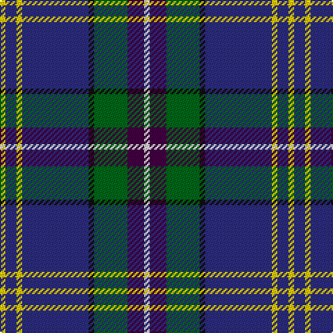

In pattern [WBGKBYBY](/stripes/wbgkbyby/).

This was sourced from tartans-authority.  It is a [8 stripe tartan](/stripes/stripes8/).

Original link http://www.tartansauthority.com/tartan-ferret/display/10433/

## Thread count
Y/4 DB8 Y4 DB48 K4 G24 DP12 LN/4

## Palette
Each colour and the base-6 reference it is a variant of.

| Colour | Shade | Base |
|---|---|---|
| DB | <code style="background-color:#2C2C80;">#2C2C80</code> `oklch(35.0% 0.138 276.6)` <small>#2C2C80</small> | B <code style="background-color:#2A418A;">#2A418A</code> |
| DP | <code style="background-color:#440044;">#440044</code> `oklch(27.1% 0.125 328.4)` <small>#440044</small> | B <code style="background-color:#2A418A;">#2A418A</code> |
| G | <code style="background-color:#006818;">#006818</code> `oklch(45.0% 0.142 145.0)` <small>#006818</small> | G <code style="background-color:#006100;">#006100</code> |
| K | <code style="background-color:#101010;">#101010</code> `oklch(17.3% 0.000 89.9)` <small>#101010</small> | K <code style="background-color:#000000;">#000000</code> |
| LN | <code style="background-color:#E0E0E0;">#E0E0E0</code> `oklch(90.7% 0.000 89.9)` <small>#E0E0E0</small> | W <code style="background-color:#F7F7F7;">#F7F7F7</code> |
| Y | <code style="background-color:#FCCC00;">#FCCC00</code> `oklch(86.2% 0.176 91.5)` <small>#FCCC00</small> | Y <code style="background-color:#F2BF00;">#F2BF00</code> |

# Sample pattern

## Nearest tartans

The nearest existing variants by ΔTartan distance, with this tartan at the top so the swatches line up against it.

ΔTartan

Tartan

Sett

—

<a href="/ttd/edit/#slug=w1dp3g6k1db12ly1db2ly1~x4">Lambert, Patrice (Personal)</a> <a class="nn-out" href="/setts/s8/w1dp3g6k1db12ly1db2ly1~x4/" title="open its dictionary page">↗</a>

0.76

<a href="/ttd/edit/#slug=r2w2dg8g2dg2db20t8g2db15w2~x2">Tupper, John Charles (Personal)</a> <a class="nn-out" href="/setts/s10/r2w2dg8g2dg2db20t8g2db15w2~x2/" title="open its dictionary page">↗</a>

0.81

<a href="/ttd/edit/#slug=k4n4dt32r4t17w2~x2">Shearer (2016)</a> <a class="nn-out" href="/setts/s6/k4n4dt32r4t17w2~x2/" title="open its dictionary page">↗</a>

0.88

<a href="/ttd/edit/#slug=b12dt35lb4w3k11r5~x2">Ferster, James Carney (Personal)</a> <a class="nn-out" href="/setts/s6/b12dt35lb4w3k11r5~x2/" title="open its dictionary page">↗</a>

0.91

<a href="/ttd/edit/#slug=t12dp35lr4w3k11k5~x2">Ferster, James Carney</a> <a class="nn-out" href="/setts/s6/t12dp35lr4w3k11k5~x2/" title="open its dictionary page">↗</a>

0.97

<a href="/ttd/edit/#slug=db4ly2db24k2db5r3k14g14w3r3db3~x2">Czech National (District)</a> <a class="nn-out" href="/setts/s11/db4ly2db24k2db5r3k14g14w3r3db3~x2/" title="open its dictionary page">↗</a>

1.02

<a href="/ttd/edit/#slug=b11db5g4w3r3k16db28b2~x2">Scottish Italian</a> <a class="nn-out" href="/setts/s8/b11db5g4w3r3k16db28b2~x2/" title="open its dictionary page">↗</a>

1.07

<a href="/ttd/edit/#slug=db30b10lb10db5m3ly3g3~x2">Wrigglesworth (Name)</a> <a class="nn-out" href="/setts/s7/db30b10lb10db5m3ly3g3~x2/" title="open its dictionary page">↗</a>

1.08

<a href="/ttd/edit/#slug=r3db38k13w3o20ly2~x2">LLoyd of Astargus Canadian Family Tartan Tartan Number: 5771. Earliest known date: 2001 The designer of this tartan is of Welsh &amp; Scottish blood and sees this tartan as being appropriate for any Lloyds with Scottish blood. The 'Astargus' derives from Gaelic - 'Astar' being said to mean &quot;travelling or making distance&quot; and 'gus' meaning &quot;until I come back&quot; See products available Copyright © Blair Urquhart, Comrie, 2015</a> <a class="nn-out" href="/setts/s6/r3db38k13w3o20ly2~x2/" title="open its dictionary page">↗</a>

1.09

<a href="/ttd/edit/#slug=db4g2db24g8t2r2t2ly2t10db2w3~x2">McCartney (Evening/Night)</a> <a class="nn-out" href="/setts/s11/db4g2db24g8t2r2t2ly2t10db2w3~x2/" title="open its dictionary page">↗</a>

1.13

<a href="/ttd/edit/#slug=t5ly5db12g1db1r1db1w2~x4">Hodgkinson</a> <a class="nn-out" href="/setts/s8/t5ly5db12g1db1r1db1w2~x4/" title="open its dictionary page">↗</a>

## Neighbour map

Every grey dot is one of 14299 variants placed by the first two principal components of the ΔTartan feature space (44% of its variance). Red is this tartan; blue dots are its nearest — click one to open its page.

<svg viewBox="0 0 640 380" role="img" style="max-width:100%;height:auto;border:1px solid #e0e0e0;border-radius:4px;display:block" xmlns="http://www.w3.org/2000/svg"><image href="/nn/cloud.v1.png" width="640" height="380"/><a href="/setts/s10/r2w2dg8g2dg2db20t8g2db15w2~x2/"><circle cx="239.8" cy="152.6" r="4" fill="#3465a4"><title>Tupper, John Charles (Personal)</title></circle></a><a href="/setts/s6/k4n4dt32r4t17w2~x2/"><circle cx="249.5" cy="150.3" r="4" fill="#3465a4"><title>Shearer (2016)</title></circle></a><a href="/setts/s6/b12dt35lb4w3k11r5~x2/"><circle cx="220.4" cy="172.6" r="4" fill="#3465a4"><title>Ferster, James Carney (Personal)</title></circle></a><a href="/setts/s6/t12dp35lr4w3k11k5~x2/"><circle cx="222.8" cy="167.1" r="4" fill="#3465a4"><title>Ferster, James Carney</title></circle></a><a href="/setts/s11/db4ly2db24k2db5r3k14g14w3r3db3~x2/"><circle cx="199.3" cy="140.4" r="4" fill="#3465a4"><title>Czech National (District)</title></circle></a><a href="/setts/s8/b11db5g4w3r3k16db28b2~x2/"><circle cx="208.4" cy="156.1" r="4" fill="#3465a4"><title>Scottish Italian</title></circle></a><a href="/setts/s7/db30b10lb10db5m3ly3g3~x2/"><circle cx="238.7" cy="159.6" r="4" fill="#3465a4"><title>Wrigglesworth (Name)</title></circle></a><a href="/setts/s6/r3db38k13w3o20ly2~x2/"><circle cx="236.9" cy="145.6" r="4" fill="#3465a4"><title>LLoyd of Astargus Canadian Family Tartan Tartan Number: 5771. Earliest known date: 2001 The designer of this tartan is of Welsh &amp; Scottish blood and sees this tartan as being appropriate for any Lloyds with Scottish blood. The 'Astargus' derives from Gaelic - 'Astar' being said to mean &quot;travelling or making distance&quot; and 'gus' meaning &quot;until I come back&quot; See products available Copyright © Blair Urquhart, Comrie, 2015</title></circle></a><a href="/setts/s11/db4g2db24g8t2r2t2ly2t10db2w3~x2/"><circle cx="226.5" cy="130.5" r="4" fill="#3465a4"><title>McCartney (Evening/Night)</title></circle></a><a href="/setts/s8/t5ly5db12g1db1r1db1w2~x4/"><circle cx="203.2" cy="131.8" r="4" fill="#3465a4"><title>Hodgkinson</title></circle></a><circle cx="235.4" cy="144.8" r="5" fill="#c00000"/></svg>

ID: /setts/s8/w1dp3g6k1db12ly1db2ly1~x4/
