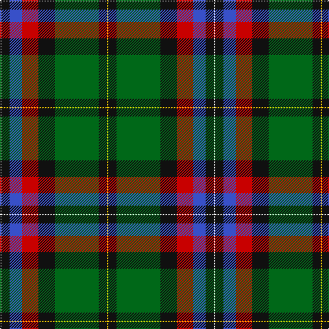

In pattern [WKBRKGKY](/patterns/wkbrkgky/).

This was sourced from register-of-tartans.  It is a [8 stripes tartan](/stripes/stripes8/).

Original link https://www.tartanregister.gov.uk/tartanDetails.aspx?ref=2883

## Attestations

This cloth appears in 2 source records; the oldest owns this page.

- 01/08/2007 — McGeachie (Personal) (register-of-tartans, [record](https://www.tartanregister.gov.uk/tartanDetails.aspx?ref=2883))
- August 2007 — McGeachie (Personal) (tartans-authority, [record](http://www.tartansauthority.com/tartan-ferret/display/7291/))

## Register references

External register numbers recorded for this tartan.

- Scottish Register of Tartans: [2883](https://www.tartanregister.gov.uk/tartanDetails.aspx?ref=2883)
- Scottish Tartans Authority (ITI): 7291
- Scottish Tartans World Register: 3240

## Thread count
LN/2 K12 B18 R24 K24 G64 K12 Y/2

## Palette
Each colour and its ΔE from the base-6 reference it is a variant of.

| Colour | Shade | Base | ΔE (OKLab) |
|---|---|---|---|
| B | <code style="background-color:#3850C8;">#3850C8</code> `#3850C8` | B <code style="background-color:#2A418A;">#2A418A</code> | 0.11 |
| G | <code style="background-color:#006818;">#006818</code> `#006818` | G <code style="background-color:#006100;">#006100</code> | 0.02 |
| K | <code style="background-color:#101010;">#101010</code> `#101010` | K <code style="background-color:#000000;">#000000</code> | 0.17 |
| LN | <code style="background-color:#E0E0E0;">#E0E0E0</code> `#E0E0E0` | W <code style="background-color:#F7F7F7;">#F7F7F7</code> | 0.07 |
| R | <code style="background-color:#C80000;">#C80000</code> `#C80000` | R <code style="background-color:#CC0000;">#CC0000</code> | 0.01 |
| Y | <code style="background-color:#E8C000;">#E8C000</code> `#E8C000` | Y <code style="background-color:#F2BF00;">#F2BF00</code> | 0.02 |

# Sample pattern

## Nearest tartans

The nearest existing variants by ΔTartan distance.

1. [Tooth Family Tartan Tartan Number: 922. Earliest known date: 1980 STS collection. See products available Copyright © Blair Urquhart, Comrie, 2015](/setts/s8/g5y1r2g25k14b19w4g2~b2c2c80-g006818-k101010-rc80000-we0e0e0-ye8c000~x2/) — ΔT 0.88
1. [Froben, Christian (Personal)](/setts/s8/k2w2k8y8b24g13k3r1~b141e46-g004c00-k101010-r781c38-wfcfcfc-ydc9436~x2/) — ΔT 0.92
1. [National Millennium](/setts/s9/w2b4r16k12g36y1b6k2w2~b2c2c80-g006818-k101010-rc80000-we0e0e0-ye8c000~x2/) — ΔT 0.92
1. [Birch Family Tartan Tartan Number: 2157. Earliest known date: 1993 The Birch family tartan was designed and produced by Mr Robin Birch of Connell Reid kiltmaker, Blairgowrie. The new sett has been recorded by the Scottish Tartans Society. See products available Copyright © Blair Urquhart, Comrie, 2015](/setts/s9/g3b4g23k10r2k10ba18k1w3~b780078-ba5c8ca8-g006818-k101010-rc8002c-we0e0e0~x2/) — ΔT 0.97
1. [PMMC](/setts/s7/r3k11g29k28ga19y2b1~b0000ff-g005020-ga289c18-k101010-rff0000-yffe600~x2/) — ΔT 0.98
1. [Letter Dress (2014)](/setts/s9/r29k23y1g9y2ra4k14w2k4~g006818-k101010-r888888-rac80000-wfcfcfc-yd09800~x2/) — ΔT 0.99
1. [Fermanagh County, Crest Range](/setts/s10/r4w6k10b5k3ra16k3g33k1w4~b141e46-g005020-k101010-r960000-rac87814-we0e0e0~x2/) — ΔT 1.03
1. [Bergen Scottish](/setts/s7/b5w3r12g37k12ba21w2~b2c2c80-ba202060-g006818-k101010-rc80000-wf8f8f8~x2/) — ΔT 1.04
1. [Jones (Name)](/setts/s7/r4w1g6ga25k8b15w2~b2c2c80-g5c6428-ga006818-k101010-rc80000-wc0c0c0~x2/) — ΔT 1.07
1. [Froben, Christian (Personal)](/setts/s8/k2w2k8y8b24g13k3r1~b202060-g006818-k101010-r880000-wfcfcfc-yfccc00~x2/) — ΔT 1.07

## Neighbour map

Every grey dot is one of 15726 variants placed by the first two principal components of the ΔTartan feature space (44% of its variance). Red is this tartan; blue dots are its nearest — click one to open its page.

<svg viewBox="0 0 640 380" role="img" style="max-width:100%;height:auto;border:1px solid #e0e0e0;border-radius:4px;display:block" xmlns="http://www.w3.org/2000/svg"><image href="/nn/cloud.v1.png" width="640" height="380"/><a href="/setts/s8/g5y1r2g25k14b19w4g2~b2c2c80-g006818-k101010-rc80000-we0e0e0-ye8c000~x2/"><circle cx="217.1" cy="129.3" r="4" fill="#3465a4"><title>Tooth Family Tartan Tartan Number: 922. Earliest known date: 1980 STS collection. See products available Copyright © Blair Urquhart, Comrie, 2015</title></circle></a><a href="/setts/s8/k2w2k8y8b24g13k3r1~b141e46-g004c00-k101010-r781c38-wfcfcfc-ydc9436~x2/"><circle cx="184.7" cy="127.0" r="4" fill="#3465a4"><title>Froben, Christian (Personal)</title></circle></a><a href="/setts/s9/w2b4r16k12g36y1b6k2w2~b2c2c80-g006818-k101010-rc80000-we0e0e0-ye8c000~x2/"><circle cx="234.1" cy="86.9" r="4" fill="#3465a4"><title>National Millennium</title></circle></a><a href="/setts/s9/g3b4g23k10r2k10ba18k1w3~b780078-ba5c8ca8-g006818-k101010-rc8002c-we0e0e0~x2/"><circle cx="157.5" cy="124.9" r="4" fill="#3465a4"><title>Birch Family Tartan Tartan Number: 2157. Earliest known date: 1993 The Birch family tartan was designed and produced by Mr Robin Birch of Connell Reid kiltmaker, Blairgowrie. The new sett has been recorded by the Scottish Tartans Society. See products available Copyright © Blair Urquhart, Comrie, 2015</title></circle></a><a href="/setts/s7/r3k11g29k28ga19y2b1~b0000ff-g005020-ga289c18-k101010-rff0000-yffe600~x2/"><circle cx="209.6" cy="139.0" r="4" fill="#3465a4"><title>PMMC</title></circle></a><a href="/setts/s9/r29k23y1g9y2ra4k14w2k4~g006818-k101010-r888888-rac80000-wfcfcfc-yd09800~x2/"><circle cx="230.3" cy="107.0" r="4" fill="#3465a4"><title>Letter Dress (2014)</title></circle></a><a href="/setts/s10/r4w6k10b5k3ra16k3g33k1w4~b141e46-g005020-k101010-r960000-rac87814-we0e0e0~x2/"><circle cx="177.1" cy="85.8" r="4" fill="#3465a4"><title>Fermanagh County, Crest Range</title></circle></a><a href="/setts/s7/b5w3r12g37k12ba21w2~b2c2c80-ba202060-g006818-k101010-rc80000-wf8f8f8~x2/"><circle cx="167.0" cy="143.5" r="4" fill="#3465a4"><title>Bergen Scottish</title></circle></a><a href="/setts/s7/r4w1g6ga25k8b15w2~b2c2c80-g5c6428-ga006818-k101010-rc80000-wc0c0c0~x2/"><circle cx="206.7" cy="141.5" r="4" fill="#3465a4"><title>Jones (Name)</title></circle></a><a href="/setts/s8/k2w2k8y8b24g13k3r1~b202060-g006818-k101010-r880000-wfcfcfc-yfccc00~x2/"><circle cx="164.0" cy="117.2" r="4" fill="#3465a4"><title>Froben, Christian (Personal)</title></circle></a><circle cx="209.3" cy="117.1" r="5" fill="#c00000"/></svg>

ID: /setts/s8/w1k6b9r12k12g32k6y1~b3850c8-g006818-k101010-rc80000-we0e0e0-ye8c000~x2/
