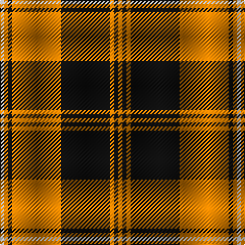

In pattern [WYKYKYKY](/patterns/wykykyky/).

This was sourced from tartans-authority.  It is a [8 stripes tartan](/stripes/stripes8/).

Original link http://www.tartansauthority.com/tartan-ferret/display/8090/

## Thread count
LN/4 O4 K4 O48 K48 O4 K4 O/4

## Palette
Each colour and its ΔE from the base-6 reference it is a variant of.

| Colour | Shade | Base | ΔE (OKLab) |
|---|---|---|---|
| K | <code style="background-color:#101010;">#101010</code> `#101010` | K <code style="background-color:#000000;">#000000</code> | 0.17 |
| LN | <code style="background-color:#E0E0E0;">#E0E0E0</code> `#E0E0E0` | W <code style="background-color:#F7F7F7;">#F7F7F7</code> | 0.07 |
| O | <code style="background-color:#D87C00;">#D87C00</code> `#D87C00` | Y <code style="background-color:#F2BF00;">#F2BF00</code> | 0.17 |

# Sample pattern

## Nearest tartans

The nearest existing variants by ΔTartan distance.

1. [Johnston Orange/Black (Corporate)](/setts/s8/w1y1k1y12k12y1k1y1x4~k000000-wfcfcfc-yd87c00/) — ΔT 0.82
1. [Pittsburgh St Andrew's Society](/setts/s8/b1r1y1k15y15r1b1y1x4~b5f749c-k1c1714-rb03000-ye0a126/) — ΔT 1.25
1. [Brecheen](/setts/s9/k3r1k14y14r1y1r1y1r2x4~k000000-r8c0000-yc88c00/) — ΔT 1.31
1. [Wcwm 1166-2](/setts/s6/b44y3b4w3b4y44x2~b3c2010-wc8c8c8-yc09898/) — ΔT 1.32
1. [Brecheen (Name)](/setts/s9/k3r1k14y14r1y1r1y1r2x4~k000000-r8c0000-yb8983c/) — ΔT 1.35
1. [Dunbar Ancient](/setts/s6/k13w2k4r28k4w2x2~k101010-rcc4438-we0e0e0/) — ΔT 1.41
1. [MacLeod, Snuffbox](/setts/s9/k1y12r1y2k4r1k4y2k1x4~k000000-rc00000-yf0c000/) — ΔT 1.43
1. [Tweedside Red](/setts/s9/k18r2k2r5w2r2w2r2k2x4~k101010-rc80000-wfcfcfc/) — ΔT 1.44
1. [Hanna of Falkirk (Clan?)](/setts/s10/k9y4k2y4k2y30k9y4k14ya2x2~k000000-yfc9898-yac89800/) — ΔT 1.46
1. [Cunningham #2](/setts/s7/k3r2k30r28k2r2w3x2~k101010-rc80000-we0e0e0/) — ΔT 1.47

## Neighbour map

Every grey dot is one of 15726 variants placed by the first two principal components of the ΔTartan feature space (44% of its variance). Red is this tartan; blue dots are its nearest — click one to open its page.

<svg viewBox="0 0 640 380" role="img" style="max-width:100%;height:auto;border:1px solid #e0e0e0;border-radius:4px;display:block" xmlns="http://www.w3.org/2000/svg"><image href="/nn/cloud.v1.png" width="640" height="380"/><a href="/setts/s8/w1y1k1y12k12y1k1y1x4~k000000-wfcfcfc-yd87c00/"><circle cx="312.7" cy="165.8" r="4" fill="#3465a4"><title>Johnston Orange/Black (Corporate)</title></circle></a><a href="/setts/s8/b1r1y1k15y15r1b1y1x4~b5f749c-k1c1714-rb03000-ye0a126/"><circle cx="282.4" cy="133.9" r="4" fill="#3465a4"><title>Pittsburgh St Andrew's Society</title></circle></a><a href="/setts/s9/k3r1k14y14r1y1r1y1r2x4~k000000-r8c0000-yc88c00/"><circle cx="273.6" cy="156.4" r="4" fill="#3465a4"><title>Brecheen</title></circle></a><a href="/setts/s6/b44y3b4w3b4y44x2~b3c2010-wc8c8c8-yc09898/"><circle cx="344.9" cy="184.1" r="4" fill="#3465a4"><title>Wcwm 1166-2</title></circle></a><a href="/setts/s9/k3r1k14y14r1y1r1y1r2x4~k000000-r8c0000-yb8983c/"><circle cx="270.9" cy="157.5" r="4" fill="#3465a4"><title>Brecheen (Name)</title></circle></a><a href="/setts/s6/k13w2k4r28k4w2x2~k101010-rcc4438-we0e0e0/"><circle cx="333.6" cy="183.7" r="4" fill="#3465a4"><title>Dunbar Ancient</title></circle></a><a href="/setts/s9/k1y12r1y2k4r1k4y2k1x4~k000000-rc00000-yf0c000/"><circle cx="306.9" cy="164.4" r="4" fill="#3465a4"><title>MacLeod, Snuffbox</title></circle></a><a href="/setts/s9/k18r2k2r5w2r2w2r2k2x4~k101010-rc80000-wfcfcfc/"><circle cx="333.7" cy="176.8" r="4" fill="#3465a4"><title>Tweedside Red</title></circle></a><a href="/setts/s10/k9y4k2y4k2y30k9y4k14ya2x2~k000000-yfc9898-yac89800/"><circle cx="310.6" cy="158.1" r="4" fill="#3465a4"><title>Hanna of Falkirk (Clan?)</title></circle></a><a href="/setts/s7/k3r2k30r28k2r2w3x2~k101010-rc80000-we0e0e0/"><circle cx="350.0" cy="172.6" r="4" fill="#3465a4"><title>Cunningham #2</title></circle></a><circle cx="323.4" cy="166.1" r="5" fill="#c00000"/></svg>

ID: /setts/s8/w1y1k1y12k12y1k1y1x4~k101010-we0e0e0-yd87c00/
