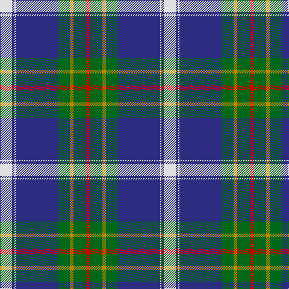

In pattern [RGYGBWBW](/patterns/rgygbwbw/).

This was sourced from register-of-tartans.  It is a [8 stripes tartan](/stripes/stripes8/).

Original link https://www.tartanregister.gov.uk/tartanDetails.aspx?ref=5395

## Attestations

This cloth appears in 2 source records; the oldest owns this page.

- 01/01/2007 — Sandelin (Personal) (register-of-tartans, [record](https://www.tartanregister.gov.uk/tartanDetails.aspx?ref=5395))
- pre 2007 — Sandelin (Personal) (tartans-authority, [record](http://www.tartansauthority.com/tartan-ferret/display/7145/))

## Thread count
LN/20 DB4 LN2 DB70 G20 DY6 G20 R/8

## Palette
Each colour and its ΔE from the base-6 reference it is a variant of.

| Colour | Shade | Base | ΔE (OKLab) |
|---|---|---|---|
| DB | <code style="background-color:#2C2C80;">#2C2C80</code> `#2C2C80` | B <code style="background-color:#2A418A;">#2A418A</code> | 0.06 |
| DY | <code style="background-color:#BC8C00;">#BC8C00</code> `#BC8C00` | Y <code style="background-color:#F2BF00;">#F2BF00</code> | 0.16 |
| G | <code style="background-color:#006818;">#006818</code> `#006818` | G <code style="background-color:#006100;">#006100</code> | 0.02 |
| LN | <code style="background-color:#E0E0E0;">#E0E0E0</code> `#E0E0E0` | W <code style="background-color:#F7F7F7;">#F7F7F7</code> | 0.07 |
| R | <code style="background-color:#C80000;">#C80000</code> `#C80000` | R <code style="background-color:#CC0000;">#CC0000</code> | 0.01 |

# Sample pattern

## Nearest tartans

The nearest existing variants by ΔTartan distance.

1. [Nynashamn Whisky Society (Corporate)](/setts/s6/y21g26b62w2ga2w2-b2c2c80-g006818-ga003820-we0e0e0-ye8c000/) — ΔT 0.84
1. [Sandelin #2 (Personal)](/setts/s8/w20b4w2b70g20y6g20r8-b141e46-g003c14-rdc0000-we0e0e0-yc89600/) — ΔT 0.86
1. [Ballarat](/setts/s10/w10b76r6ba22r2ba22r6b8w10y2-b5c5c5c-ba202060-r888888-wfcfcfc-yfcb464/) — ΔT 0.86
1. [Ballarat](/setts/s10/w10b76g6ba22g2ba22g6b8w10y2-b505050-ba141e46-g808080-wf8f4d0-yd87c00/) — ΔT 0.93
1. [MacRaes of America](/setts/s8/w16b8y4b72ba96b4ba8r10-b202060-ba5c8ca8-rc80000-wf0f0d8-ye8c000/) — ΔT 0.99
1. [Ferguson (Tarlogie)](/setts/s9/b48k16g16r4g8k2w4k2g8-b3850c8-g146400-k101010-rc80000-wfcfcfc/) — ΔT 1.01
1. [Thomas Jean Marc Personal Tartan Tartan Number: 6990. Earliest known date: 2005 A personal tartan for Jean Marc Thomas, Paris. See products available Copyright © Blair Urquhart, Comrie, 2015](/setts/s8/b144r32k10y4ba32y4k10r32-b2888c4-ba003c64-k101010-rc80000-ye8c000/) — ΔT 1.03
1. [Wiegratz Alba (Personal)](/setts/s9/w6k4b60k10r10y10b10ba24w2-b2888c4-ba1c1c50-k101010-rc80000-we0e0e0-ye8c000/) — ΔT 1.08
1. [Comrie, Navy Blue (Dance)](/setts/s8/b84ba4w4ba4b10k24w64bb8-b003c64-ba2888c4-bb1c0070-k101010-wf0e0c8/) — ΔT 1.10
1. [Wiegratz Alba (Personal)](/setts/s9/w6k4b60k10r10y10b10ba24w2-b608c9c-ba1c1c50-k101010-rc80000-we0e0e0-ye8c000/) — ΔT 1.13

## Neighbour map

Every grey dot is one of 15726 variants placed by the first two principal components of the ΔTartan feature space (44% of its variance). Red is this tartan; blue dots are its nearest — click one to open its page.

<svg viewBox="0 0 640 380" role="img" style="max-width:100%;height:auto;border:1px solid #e0e0e0;border-radius:4px;display:block" xmlns="http://www.w3.org/2000/svg"><image href="/nn/cloud.v1.png" width="640" height="380"/><a href="/setts/s6/y21g26b62w2ga2w2-b2c2c80-g006818-ga003820-we0e0e0-ye8c000/"><circle cx="297.1" cy="127.2" r="4" fill="#3465a4"><title>Nynashamn Whisky Society (Corporate)</title></circle></a><a href="/setts/s8/w20b4w2b70g20y6g20r8-b141e46-g003c14-rdc0000-we0e0e0-yc89600/"><circle cx="267.0" cy="112.5" r="4" fill="#3465a4"><title>Sandelin #2 (Personal)</title></circle></a><a href="/setts/s10/w10b76r6ba22r2ba22r6b8w10y2-b5c5c5c-ba202060-r888888-wfcfcfc-yfcb464/"><circle cx="299.8" cy="89.6" r="4" fill="#3465a4"><title>Ballarat</title></circle></a><a href="/setts/s10/w10b76g6ba22g2ba22g6b8w10y2-b505050-ba141e46-g808080-wf8f4d0-yd87c00/"><circle cx="302.0" cy="92.5" r="4" fill="#3465a4"><title>Ballarat</title></circle></a><a href="/setts/s8/w16b8y4b72ba96b4ba8r10-b202060-ba5c8ca8-rc80000-wf0f0d8-ye8c000/"><circle cx="279.3" cy="118.8" r="4" fill="#3465a4"><title>MacRaes of America</title></circle></a><a href="/setts/s9/b48k16g16r4g8k2w4k2g8-b3850c8-g146400-k101010-rc80000-wfcfcfc/"><circle cx="239.4" cy="124.1" r="4" fill="#3465a4"><title>Ferguson (Tarlogie)</title></circle></a><a href="/setts/s8/b144r32k10y4ba32y4k10r32-b2888c4-ba003c64-k101010-rc80000-ye8c000/"><circle cx="322.7" cy="101.9" r="4" fill="#3465a4"><title>Thomas Jean Marc Personal Tartan Tartan Number: 6990. Earliest known date: 2005 A personal tartan for Jean Marc Thomas, Paris. See products available Copyright © Blair Urquhart, Comrie, 2015</title></circle></a><a href="/setts/s9/w6k4b60k10r10y10b10ba24w2-b2888c4-ba1c1c50-k101010-rc80000-we0e0e0-ye8c000/"><circle cx="239.9" cy="91.8" r="4" fill="#3465a4"><title>Wiegratz Alba (Personal)</title></circle></a><a href="/setts/s8/b84ba4w4ba4b10k24w64bb8-b003c64-ba2888c4-bb1c0070-k101010-wf0e0c8/"><circle cx="226.1" cy="115.6" r="4" fill="#3465a4"><title>Comrie, Navy Blue (Dance)</title></circle></a><a href="/setts/s9/w6k4b60k10r10y10b10ba24w2-b608c9c-ba1c1c50-k101010-rc80000-we0e0e0-ye8c000/"><circle cx="245.4" cy="90.6" r="4" fill="#3465a4"><title>Wiegratz Alba (Personal)</title></circle></a><circle cx="269.0" cy="111.0" r="5" fill="#c00000"/></svg>

ID: /setts/s8/w20b4w2b70g20y6g20r8-b2c2c80-g006818-rc80000-we0e0e0-ybc8c00/
