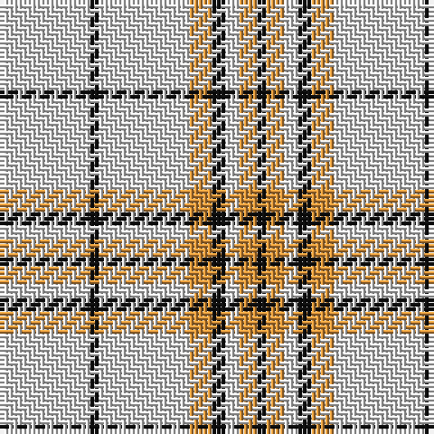

This page is one **sett** — a single exact thread-count. It belongs to the [tartan](/tartans/w20k2w20lo5k3w3lo4k2/)
(the same proportion at any scale), whose colour order is pattern [KYWKYWKW](/stripes/kywkywkw/).

Sourced from tartans-authority.  It is a [8 stripe tartan](/stripes/stripes8/).

Original link http://www.tartansauthority.com/tartan-ferret/display/10560/

## Register references

External register numbers recorded for this tartan.

- Scottish Register of Tartans: [10560](https://www.tartanregister.gov.uk/tartanDetails?ref=10560)
- Scottish Tartans Authority (ITI): 10560

## Thread count
LN/20 K2 LN20 O5 K3 LN3 O4 K/2

## Palette

Palette: <strong>Tartan Register</strong>
<table><thead><tr><th>Colour</th><th>Threads</th><th>Shade</th><th>Base</th><th>OKLCh</th></tr></thead><tbody><tr><td>LN/</td><td style="text-align:right;font-variant-numeric:tabular-nums">20</td><td><code style="background-color:#E0E0E0;">#E0E0E0</code> <small style="color:#888">#E0E0E0</small></td><td>W <code style="background-color:#F7F7F7;">#F7F7F7</code></td><td><small style="color:#888">oklch(90.7% 0.000 89.9)</small></td></tr><tr><td>K</td><td style="text-align:right;font-variant-numeric:tabular-nums">2</td><td><code style="background-color:#101010;">#101010</code> <small style="color:#888">#101010</small></td><td>K <code style="background-color:#000000;">#000000</code></td><td><small style="color:#888">oklch(17.3% 0.000 89.9)</small></td></tr><tr><td>LN</td><td style="text-align:right;font-variant-numeric:tabular-nums">20</td><td><code style="background-color:#E0E0E0;">#E0E0E0</code> <small style="color:#888">#E0E0E0</small></td><td>W <code style="background-color:#F7F7F7;">#F7F7F7</code></td><td><small style="color:#888">oklch(90.7% 0.000 89.9)</small></td></tr><tr><td>O</td><td style="text-align:right;font-variant-numeric:tabular-nums">5</td><td><code style="background-color:#DC943C;">#DC943C</code> <small style="color:#888">#DC943C</small></td><td>Y <code style="background-color:#F2BF00;">#F2BF00</code></td><td><small style="color:#888">oklch(72.3% 0.133 67.9)</small></td></tr><tr><td>K</td><td style="text-align:right;font-variant-numeric:tabular-nums">3</td><td><code style="background-color:#101010;">#101010</code> <small style="color:#888">#101010</small></td><td>K <code style="background-color:#000000;">#000000</code></td><td><small style="color:#888">oklch(17.3% 0.000 89.9)</small></td></tr><tr><td>LN</td><td style="text-align:right;font-variant-numeric:tabular-nums">3</td><td><code style="background-color:#E0E0E0;">#E0E0E0</code> <small style="color:#888">#E0E0E0</small></td><td>W <code style="background-color:#F7F7F7;">#F7F7F7</code></td><td><small style="color:#888">oklch(90.7% 0.000 89.9)</small></td></tr><tr><td>O</td><td style="text-align:right;font-variant-numeric:tabular-nums">4</td><td><code style="background-color:#DC943C;">#DC943C</code> <small style="color:#888">#DC943C</small></td><td>Y <code style="background-color:#F2BF00;">#F2BF00</code></td><td><small style="color:#888">oklch(72.3% 0.133 67.9)</small></td></tr><tr><td>K/</td><td style="text-align:right;font-variant-numeric:tabular-nums">2</td><td><code style="background-color:#101010;">#101010</code> <small style="color:#888">#101010</small></td><td>K <code style="background-color:#000000;">#000000</code></td><td><small style="color:#888">oklch(17.3% 0.000 89.9)</small></td></tr></tbody></table>

# Sample pattern

## Nearest tartans

The nearest existing variants by ΔTartan distance, with this tartan at the top so the swatches line up against it.

ΔTartan

Tartan

Sett

—

<a href="/ttd/edit/#slug=w20k2w20lo5k3w3lo4k2">Guzzo Dress (Personal)</a> <a class="nn-out" href="/setts/s8/w20k2w20lo5k3w3lo4k2/" title="open its dictionary page">↗</a>

0.95

<a href="/ttd/edit/#slug=w20k2w20ly5k3w3ly4k2">Guzzo Dress (Montreal, Canada) (Personal)</a> <a class="nn-out" href="/setts/s8/w20k2w20ly5k3w3ly4k2/" title="open its dictionary page">↗</a>

1.39

<a href="/ttd/edit/#slug=w93o6w13db35w12o6">Butties</a> <a class="nn-out" href="/setts/s6/w93o6w13db35w12o6/" title="open its dictionary page">↗</a>

1.40

<a href="/ttd/edit/#slug=k7w3k7w45r3w3r3~x2">White Stripes (Corporate)</a> <a class="nn-out" href="/setts/s7/k7w3k7w45r3w3r3~x2/" title="open its dictionary page">↗</a>

1.67

<a href="/ttd/edit/#slug=lr3lb2lr18t9lr18lb2lr18k9lr18lb2">London Fog Camel 2 (Fashion)</a> <a class="nn-out" href="/setts/s10/lr3lb2lr18t9lr18lb2lr18k9lr18lb2/" title="open its dictionary page">↗</a>

1.68

<a href="/ttd/edit/#slug=r14w35k4w35r14w8r14w8~x2">Clayton Dress (Dance)</a> <a class="nn-out" href="/setts/s8/r14w35k4w35r14w8r14w8~x2/" title="open its dictionary page">↗</a>

1.71

<a href="/ttd/edit/#slug=w93lr6w13b35w12lr6">Butties</a> <a class="nn-out" href="/setts/s6/w93lr6w13b35w12lr6/" title="open its dictionary page">↗</a>

1.82

<a href="/ttd/edit/#slug=w24g2w8db5ly4db5ly4~x2">Clackson Arisaid (Name?)</a> <a class="nn-out" href="/setts/s7/w24g2w8db5ly4db5ly4~x2/" title="open its dictionary page">↗</a>

1.87

<a href="/ttd/edit/#slug=w12r2w12g17w12r2w5p2~x4">Milne, Green (Dance)</a> <a class="nn-out" href="/setts/s8/w12r2w12g17w12r2w5p2~x4/" title="open its dictionary page">↗</a>

1.88

<a href="/ttd/edit/#slug=w12dg2w12r17w12dg2w5b2~x4">Milne (Personal)</a> <a class="nn-out" href="/setts/s8/w12dg2w12r17w12dg2w5b2~x4/" title="open its dictionary page">↗</a>

1.89

<a href="/ttd/edit/#slug=w81dg6lo8dg8~x2">Young in Australia</a> <a class="nn-out" href="/setts/s4/w81dg6lo8dg8~x2/" title="open its dictionary page">↗</a>

## Neighbour map

Every grey dot is one of 14359 variants placed by the first two principal components of the ΔTartan feature space (44% of its variance). Red is this tartan; blue dots are its nearest — click one to open its page.

<svg viewBox="0 0 640 380" role="img" style="max-width:100%;height:auto;border:1px solid #e0e0e0;border-radius:4px;display:block" xmlns="http://www.w3.org/2000/svg"><image href="/nn/cloud.v1.png" width="640" height="380"/><a href="/setts/s8/w20k2w20ly5k3w3ly4k2/"><circle cx="384.3" cy="165.4" r="4" fill="#3465a4"><title>Guzzo Dress (Montreal, Canada) (Personal)</title></circle></a><a href="/setts/s6/w93o6w13db35w12o6/"><circle cx="405.8" cy="156.6" r="4" fill="#3465a4"><title>Butties</title></circle></a><a href="/setts/s7/k7w3k7w45r3w3r3~x2/"><circle cx="418.5" cy="134.1" r="4" fill="#3465a4"><title>White Stripes (Corporate)</title></circle></a><a href="/setts/s10/lr3lb2lr18t9lr18lb2lr18k9lr18lb2/"><circle cx="392.7" cy="194.0" r="4" fill="#3465a4"><title>London Fog Camel 2 (Fashion)</title></circle></a><a href="/setts/s8/r14w35k4w35r14w8r14w8~x2/"><circle cx="315.9" cy="192.9" r="4" fill="#3465a4"><title>Clayton Dress (Dance)</title></circle></a><a href="/setts/s6/w93lr6w13b35w12lr6/"><circle cx="421.8" cy="162.7" r="4" fill="#3465a4"><title>Butties</title></circle></a><a href="/setts/s7/w24g2w8db5ly4db5ly4~x2/"><circle cx="303.2" cy="162.2" r="4" fill="#3465a4"><title>Clackson Arisaid (Name?)</title></circle></a><a href="/setts/s8/w12r2w12g17w12r2w5p2~x4/"><circle cx="297.8" cy="193.1" r="4" fill="#3465a4"><title>Milne, Green (Dance)</title></circle></a><a href="/setts/s8/w12dg2w12r17w12dg2w5b2~x4/"><circle cx="297.9" cy="183.0" r="4" fill="#3465a4"><title>Milne (Personal)</title></circle></a><a href="/setts/s4/w81dg6lo8dg8~x2/"><circle cx="495.6" cy="184.1" r="4" fill="#3465a4"><title>Young in Australia</title></circle></a><circle cx="399.2" cy="174.7" r="5" fill="#c00000"/></svg>

ID: /setts/s8/w20k2w20lo5k3w3lo4k2/
