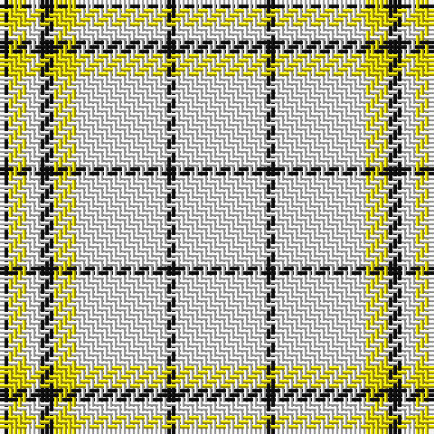

In pattern [KYWKYWKW](/patterns/kywkywkw/).

This was sourced from register-of-tartans.  It is a [8 stripes tartan](/stripes/stripes8/).

Original link https://www.tartanregister.gov.uk/tartanDetails.aspx?ref=10560

## Thread count
K/2 Y4 W3 K3 Y5 W20 K2 W/20

## Palette
Each colour and its ΔE from the base-6 reference it is a variant of.

| Colour | Shade | Base | ΔE (OKLab) |
|---|---|---|---|
| K | <code style="background-color:#101010;">#101010</code> `#101010` | K <code style="background-color:#000000;">#000000</code> | 0.17 |
| W | <code style="background-color:#FFFFFF;">#FFFFFF</code> `#FFFFFF` | W <code style="background-color:#F7F7F7;">#F7F7F7</code> | 0.02 |
| Y | <code style="background-color:#FFE600;">#FFE600</code> `#FFE600` | Y <code style="background-color:#F2BF00;">#F2BF00</code> | 0.10 |

# Sample pattern

## Nearest tartans

The nearest existing variants by ΔTartan distance.

1. [Guzzo Dress (Personal)](/setts/s8/w20k2w20y5k3w3y4k2~k101010-we0e0e0-ydc943c/) — ΔT 0.95
1. [Butties](/setts/s6/w93r6w13b35w12r6~b202060-r888888-wfcfcfc/) — ΔT 1.58
1. [White Stripes (Corporate)](/setts/s7/k7w3k7w45r3w3r3~k101010-rc80000-wf0f0d8~x2/) — ΔT 1.68
1. [Butties](/setts/s6/w93y6w13b35w12y6~b3850c8-wffffff-yb0b0b0/) — ΔT 1.79
1. [Milne, Green (Dance)](/setts/s8/w12r2w12g17w12r2w5b2~b9058d8-g009468-rc80000-wf8f8f8~x4/) — ΔT 1.95
1. [Clayton Dress (Dance)](/setts/s8/r14w35k4w35r14w8r14w8~k000000-r880000-wfcfcfc~x2/) — ΔT 2.00
1. [Young in Australia](/setts/s4/w81g6y8g8~g23321b-we8ddcb-ye0a126~x2/) — ΔT 2.07
1. [Summer Spirit (Fashion)](/setts/s8/r2w2k2w28k8w9k1y2~k101010-rc80000-wfcfcec-ye8c000~x2/) — ΔT 2.08
1. [Milne (Personal)](/setts/s8/w12g2w12r17w12g2w5b2~b6840fc-g005448-rd05054-wfcfcfc~x4/) — ΔT 2.08
1. [Triplett, Jack Arnold](/setts/s4/w35b12r2ba2~b335280-ba666666-rff0000-wf8eeb7~x2/) — ΔT 2.11

## Neighbour map

Every grey dot is one of 15726 variants placed by the first two principal components of the ΔTartan feature space (44% of its variance). Red is this tartan; blue dots are its nearest — click one to open its page.

<svg viewBox="0 0 640 380" role="img" style="max-width:100%;height:auto;border:1px solid #e0e0e0;border-radius:4px;display:block" xmlns="http://www.w3.org/2000/svg"><image href="/nn/cloud.v1.png" width="640" height="380"/><a href="/setts/s8/w20k2w20y5k3w3y4k2~k101010-we0e0e0-ydc943c/"><circle cx="400.3" cy="182.6" r="4" fill="#3465a4"><title>Guzzo Dress (Personal)</title></circle></a><a href="/setts/s6/w93r6w13b35w12r6~b202060-r888888-wfcfcfc/"><circle cx="406.2" cy="165.8" r="4" fill="#3465a4"><title>Butties</title></circle></a><a href="/setts/s7/k7w3k7w45r3w3r3~k101010-rc80000-wf0f0d8~x2/"><circle cx="419.4" cy="144.0" r="4" fill="#3465a4"><title>White Stripes (Corporate)</title></circle></a><a href="/setts/s6/w93y6w13b35w12y6~b3850c8-wffffff-yb0b0b0/"><circle cx="422.4" cy="170.2" r="4" fill="#3465a4"><title>Butties</title></circle></a><a href="/setts/s8/w12r2w12g17w12r2w5b2~b9058d8-g009468-rc80000-wf8f8f8~x4/"><circle cx="298.1" cy="197.5" r="4" fill="#3465a4"><title>Milne, Green (Dance)</title></circle></a><a href="/setts/s8/r14w35k4w35r14w8r14w8~k000000-r880000-wfcfcfc~x2/"><circle cx="317.2" cy="202.2" r="4" fill="#3465a4"><title>Clayton Dress (Dance)</title></circle></a><a href="/setts/s4/w81g6y8g8~g23321b-we8ddcb-ye0a126~x2/"><circle cx="497.3" cy="193.5" r="4" fill="#3465a4"><title>Young in Australia</title></circle></a><a href="/setts/s8/r2w2k2w28k8w9k1y2~k101010-rc80000-wfcfcec-ye8c000~x2/"><circle cx="413.5" cy="106.7" r="4" fill="#3465a4"><title>Summer Spirit (Fashion)</title></circle></a><a href="/setts/s8/w12g2w12r17w12g2w5b2~b6840fc-g005448-rd05054-wfcfcfc~x4/"><circle cx="299.1" cy="189.3" r="4" fill="#3465a4"><title>Milne (Personal)</title></circle></a><a href="/setts/s4/w35b12r2ba2~b335280-ba666666-rff0000-wf8eeb7~x2/"><circle cx="392.9" cy="171.2" r="4" fill="#3465a4"><title>Triplett, Jack Arnold</title></circle></a><circle cx="385.5" cy="174.6" r="5" fill="#c00000"/></svg>

ID: /setts/s8/w20k2w20y5k3w3y4k2~k101010-wffffff-yffe600/
