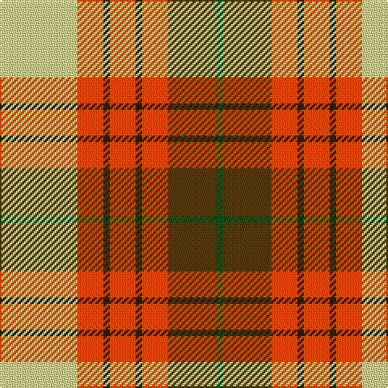

This page is one **sett** — a single exact thread-count. It belongs to the [tartan](/tartans/w24r8dy2r8dy2r8dyi15dg2/)
(the same proportion at any scale), whose colour order is pattern [GGRGRGRW](/stripes/ggrgrgrw/).

Sourced from register-of-tartans.  It is a [8 stripe tartan](/stripes/stripes8/).

Original link https://www.tartanregister.gov.uk/tartanDetails.aspx?ref=4297

## Register references

External register numbers recorded for this tartan.

- Scottish Register of Tartans: [4297](https://www.tartanregister.gov.uk/tartanDetails.aspx?ref=4297)
- Scottish Tartans World Register: 2698

## Thread count
LY/48 R16 K4 R16 K4 R16 T30 G/4

## Palette

Palette: <strong>Tartan Register</strong> <small style="color:#888">(3 of 5 colours)</small>
<table><thead><tr><th>Colour</th><th>Threads</th><th>Shade</th><th>Base</th><th>OKLCh</th></tr></thead><tbody><tr><td>LY/</td><td style="text-align:right;font-variant-numeric:tabular-nums">48</td><td><code style="background-color:#F5DCA0;">#F5DCA0</code> <small style="color:#888">#F5DCA0</small></td><td>W <code style="background-color:#F7F7F7;">#F7F7F7</code></td><td><small style="color:#888">oklch(90.1% 0.082 88.0)</small></td></tr><tr><td>R</td><td style="text-align:right;font-variant-numeric:tabular-nums">16</td><td><code style="background-color:#FA4B00;">#FA4B00</code> <small style="color:#888">#FA4B00</small></td><td>R <code style="background-color:#CC0000;">#CC0000</code></td><td><small style="color:#888">oklch(65.7% 0.220 36.9)</small></td></tr><tr><td>K</td><td style="text-align:right;font-variant-numeric:tabular-nums">4</td><td><code style="background-color:#2A2303;">#2A2303</code> <small style="color:#888">#2A2303</small></td><td>G <code style="background-color:#006100;">#006100</code></td><td><small style="color:#888">oklch(25.7% 0.049 96.8)</small></td></tr><tr><td>R</td><td style="text-align:right;font-variant-numeric:tabular-nums">16</td><td><code style="background-color:#FA4B00;">#FA4B00</code> <small style="color:#888">#FA4B00</small></td><td>R <code style="background-color:#CC0000;">#CC0000</code></td><td><small style="color:#888">oklch(65.7% 0.220 36.9)</small></td></tr><tr><td>K</td><td style="text-align:right;font-variant-numeric:tabular-nums">4</td><td><code style="background-color:#2A2303;">#2A2303</code> <small style="color:#888">#2A2303</small></td><td>G <code style="background-color:#006100;">#006100</code></td><td><small style="color:#888">oklch(25.7% 0.049 96.8)</small></td></tr><tr><td>R</td><td style="text-align:right;font-variant-numeric:tabular-nums">16</td><td><code style="background-color:#FA4B00;">#FA4B00</code> <small style="color:#888">#FA4B00</small></td><td>R <code style="background-color:#CC0000;">#CC0000</code></td><td><small style="color:#888">oklch(65.7% 0.220 36.9)</small></td></tr><tr><td>T</td><td style="text-align:right;font-variant-numeric:tabular-nums">30</td><td><code style="background-color:#503C14;">#503C14</code> <small style="color:#888">#503C14</small></td><td>G <code style="background-color:#006100;">#006100</code></td><td><small style="color:#888">oklch(37.0% 0.062 81.8)</small></td></tr><tr><td>G/</td><td style="text-align:right;font-variant-numeric:tabular-nums">4</td><td><code style="background-color:#005020;">#005020</code> <small style="color:#888">#005020</small></td><td>G <code style="background-color:#006100;">#006100</code></td><td><small style="color:#888">oklch(37.7% 0.105 149.6)</small></td></tr></tbody></table>

# Sample pattern

## Nearest tartans

The nearest existing variants by ΔTartan distance, with this tartan at the top so the swatches line up against it.

ΔTartan

Tartan

Sett

—

<a href="/ttd/edit/#slug=w24r8dy2r8dy2r8dyi15dg2~x2">Unidentified from Winnipeg</a> <a class="nn-out" href="/setts/s8/w24r8dy2r8dy2r8dyi15dg2~x2/" title="open its dictionary page">↗</a>

0.94

<a href="/ttd/edit/#slug=dy18ly4t10w2r20ly5r2w2dy6~x2">Satchidananda (Personal)</a> <a class="nn-out" href="/setts/s9/dy18ly4t10w2r20ly5r2w2dy6~x2/" title="open its dictionary page">↗</a>

1.17

<a href="/ttd/edit/#slug=r34w3dg4g23w24k3dg4~x2">MacLachlan, dress</a> <a class="nn-out" href="/setts/s7/r34w3dg4g23w24k3dg4~x2/" title="open its dictionary page">↗</a>

1.24

<a href="/ttd/edit/#slug=r36w3lo4g24w24k3lo6~x2">MacLachlan Dress</a> <a class="nn-out" href="/setts/s7/r36w3lo4g24w24k3lo6~x2/" title="open its dictionary page">↗</a>

1.28

<a href="/ttd/edit/#slug=ly4w2ly2w8r16g3r3g8r6k2~x2">Melieres, Carolyn (Personal)</a> <a class="nn-out" href="/setts/s10/ly4w2ly2w8r16g3r3g8r6k2~x2/" title="open its dictionary page">↗</a>

1.30

<a href="/ttd/edit/#slug=r12g3ly4k2ly4g12ly2r3w1~x4">Prince Charles Edward</a> <a class="nn-out" href="/setts/s9/r12g3ly4k2ly4g12ly2r3w1~x4/" title="open its dictionary page">↗</a>

1.31

<a href="/ttd/edit/#slug=ly4r2ly21dt11w2o21lyi4~x2">Barbour - Muted</a> <a class="nn-out" href="/setts/s7/ly4r2ly21dt11w2o21lyi4~x2/" title="open its dictionary page">↗</a>

1.39

<a href="/setts/s7/ly3r3lo2r20k16wi24w2~x2/">Oor Wullie (DC Thomson)</a>

1.41

<a href="/ttd/edit/#slug=r1w12g6r8lb3lo1~x4">MacLean Dress (Lumsden)</a> <a class="nn-out" href="/setts/s6/r1w12g6r8lb3lo1~x4/" title="open its dictionary page">↗</a>

1.43

<a href="/ttd/edit/#slug=r34w3gi4g23w24k3gi4~x2">MacLachlan Dress Clan Tartan Tartan Number: 828. Earliest known date: 1990 Based on the MacLachlan pattern in Old And Rare See products available Copyright © Blair Urquhart, Comrie, 2015</a> <a class="nn-out" href="/setts/s7/r34w3gi4g23w24k3gi4~x2/" title="open its dictionary page">↗</a>

1.46

<a href="/ttd/edit/#slug=r1w12g6r8t3ly1~x4">MacLean, dress</a> <a class="nn-out" href="/setts/s6/r1w12g6r8t3ly1~x4/" title="open its dictionary page">↗</a>

## Neighbour map

Every grey dot is one of 14359 variants placed by the first two principal components of the ΔTartan feature space (44% of its variance). Red is this tartan; blue dots are its nearest — click one to open its page.

<svg viewBox="0 0 640 380" role="img" style="max-width:100%;height:auto;border:1px solid #e0e0e0;border-radius:4px;display:block" xmlns="http://www.w3.org/2000/svg"><image href="/nn/cloud.v1.png" width="640" height="380"/><a href="/setts/s9/dy18ly4t10w2r20ly5r2w2dy6~x2/"><circle cx="151.5" cy="154.8" r="4" fill="#3465a4"><title>Satchidananda (Personal)</title></circle></a><a href="/setts/s7/r34w3dg4g23w24k3dg4~x2/"><circle cx="148.0" cy="151.7" r="4" fill="#3465a4"><title>MacLachlan, dress</title></circle></a><a href="/setts/s7/r36w3lo4g24w24k3lo6~x2/"><circle cx="139.4" cy="147.3" r="4" fill="#3465a4"><title>MacLachlan Dress</title></circle></a><a href="/setts/s10/ly4w2ly2w8r16g3r3g8r6k2~x2/"><circle cx="173.1" cy="157.2" r="4" fill="#3465a4"><title>Melieres, Carolyn (Personal)</title></circle></a><a href="/setts/s9/r12g3ly4k2ly4g12ly2r3w1~x4/"><circle cx="153.0" cy="149.0" r="4" fill="#3465a4"><title>Prince Charles Edward</title></circle></a><a href="/setts/s7/ly4r2ly21dt11w2o21lyi4~x2/"><circle cx="147.8" cy="145.3" r="4" fill="#3465a4"><title>Barbour - Muted</title></circle></a><a href="/setts/s7/ly3r3lo2r20k16wi24w2~x2/"><circle cx="119.2" cy="118.1" r="4" fill="#3465a4"><title>Oor Wullie (DC Thomson)</title></circle></a><a href="/setts/s6/r1w12g6r8lb3lo1~x4/"><circle cx="148.4" cy="159.7" r="4" fill="#3465a4"><title>MacLean Dress (Lumsden)</title></circle></a><a href="/setts/s7/r34w3gi4g23w24k3gi4~x2/"><circle cx="153.8" cy="156.1" r="4" fill="#3465a4"><title>MacLachlan Dress Clan Tartan Tartan Number: 828. Earliest known date: 1990 Based on the MacLachlan pattern in Old And Rare See products available Copyright © Blair Urquhart, Comrie, 2015</title></circle></a><a href="/setts/s6/r1w12g6r8t3ly1~x4/"><circle cx="157.9" cy="165.6" r="4" fill="#3465a4"><title>MacLean, dress</title></circle></a><circle cx="152.4" cy="142.6" r="5" fill="#c00000"/></svg>

ID: /setts/s8/w24r8dy2r8dy2r8dyi15dg2~x2/
