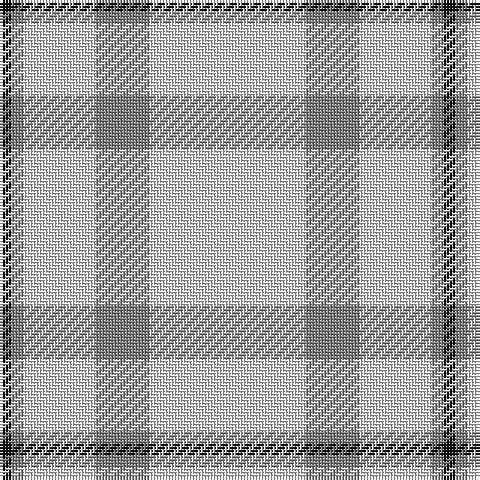

In pattern [KGWWWGWW](/patterns/kgwwwgww/).

This was sourced from tartans-authority.  It is a [8 stripes tartan](/stripes/stripes8/).

Original link http://www.tartansauthority.com/tartan-ferret/display/3852/

## Thread count
K/4 Na4 LN4 LN18 LN2 N18 LN2 LN/48

## Palette
Each colour and its ΔE from the base-6 reference it is a variant of.

| Colour | Shade | Base | ΔE (OKLab) |
|---|---|---|---|
| K | <code style="background-color:#101010;">#101010</code> `#101010` | K <code style="background-color:#000000;">#000000</code> | 0.17 |
| LN | <code style="background-color:#E0E0E0;">#E0E0E0</code> `#E0E0E0` | W <code style="background-color:#F7F7F7;">#F7F7F7</code> | 0.07 |
| N | <code style="background-color:#808080;">#808080</code> `#808080` | G <code style="background-color:#006100;">#006100</code> | 0.23 |
| Na | <code style="background-color:#808080;">#808080</code> `#808080` | G <code style="background-color:#006100;">#006100</code> | 0.23 |

# Sample pattern

## Nearest tartans

The nearest existing variants by ΔTartan distance.

1. [MacDonald from Rawtenstall (Personal)](/setts/s8/w7wa2r7wa4w50wa2k2ra2x2~k101010-r781c38-radc0000-w98d0f0-wae0e0e0/) — ΔT 1.54
1. [London Fog Safari (Fashion)](/setts/s6/y10k2w5k4y50b2x2~b1474b4-k101010-we0e0e0-yb8b8b8/) — ΔT 1.54
1. [Shaw of Tordarroch, Mrs (Personal)](/setts/s11/r8w46b4w4b4w5g7w7g7w4b2x2~b202060-g5c6428-re86000-we8ccb8/) — ΔT 1.74
1. [Butties](/setts/s6/w93y6w13b35w12y6~b3850c8-wffffff-yb0b0b0/) — ΔT 1.78
1. [Summer Spirit (Fashion)](/setts/s8/r2w2k2w28k8w9k1y2x2~k101010-rc80000-wfcfcec-ye8c000/) — ΔT 1.79
1. [Elvan](/setts/s11/y42g10b2g2w2g2y10w6g2w3y2x2~b00008c-g604000-wc8c8c8-yd8c0a4/) — ΔT 1.93
1. [Old England House Check](/setts/s12/w46r9w4k8w9ra4w9g2w2g2w2g1x2~g604000-k101010-r888888-rac80000-we0e0e0/) — ΔT 1.93
1. [London Fog Camel (Fashion)](/setts/s12/y144k9y13w9y4k9y4b13w13y4w13k4~b2888c4-k101010-wd4d4c4-yccc0a4/) — ΔT 1.94
1. [Wilson's Blanket Sett - Border](/setts/s13/w100r14w13g13w13k1r14k1w13g13w13r12w100x2~g408060-k101010-rc80000-wfcfcfc/) — ΔT 1.96
1. [Guzzo Dress (Personal)](/setts/s8/w20k2w20y5k3w3y4k2~k101010-we0e0e0-ydc943c/) — ΔT 1.97

## Neighbour map

Every grey dot is one of 15726 variants placed by the first two principal components of the ΔTartan feature space (44% of its variance). Red is this tartan; blue dots are its nearest — click one to open its page.

<svg viewBox="0 0 640 380" role="img" style="max-width:100%;height:auto;border:1px solid #e0e0e0;border-radius:4px;display:block" xmlns="http://www.w3.org/2000/svg"><image href="/nn/cloud.v1.png" width="640" height="380"/><a href="/setts/s8/w7wa2r7wa4w50wa2k2ra2x2~k101010-r781c38-radc0000-w98d0f0-wae0e0e0/"><circle cx="469.7" cy="102.1" r="4" fill="#3465a4"><title>MacDonald from Rawtenstall (Personal)</title></circle></a><a href="/setts/s6/y10k2w5k4y50b2x2~b1474b4-k101010-we0e0e0-yb8b8b8/"><circle cx="551.8" cy="145.0" r="4" fill="#3465a4"><title>London Fog Safari (Fashion)</title></circle></a><a href="/setts/s11/r8w46b4w4b4w5g7w7g7w4b2x2~b202060-g5c6428-re86000-we8ccb8/"><circle cx="396.2" cy="105.5" r="4" fill="#3465a4"><title>Shaw of Tordarroch, Mrs (Personal)</title></circle></a><a href="/setts/s6/w93y6w13b35w12y6~b3850c8-wffffff-yb0b0b0/"><circle cx="422.4" cy="170.2" r="4" fill="#3465a4"><title>Butties</title></circle></a><a href="/setts/s8/r2w2k2w28k8w9k1y2x2~k101010-rc80000-wfcfcec-ye8c000/"><circle cx="413.5" cy="106.7" r="4" fill="#3465a4"><title>Summer Spirit (Fashion)</title></circle></a><a href="/setts/s11/y42g10b2g2w2g2y10w6g2w3y2x2~b00008c-g604000-wc8c8c8-yd8c0a4/"><circle cx="408.0" cy="109.7" r="4" fill="#3465a4"><title>Elvan</title></circle></a><a href="/setts/s12/w46r9w4k8w9ra4w9g2w2g2w2g1x2~g604000-k101010-r888888-rac80000-we0e0e0/"><circle cx="439.1" cy="55.0" r="4" fill="#3465a4"><title>Old England House Check</title></circle></a><a href="/setts/s12/y144k9y13w9y4k9y4b13w13y4w13k4~b2888c4-k101010-wd4d4c4-yccc0a4/"><circle cx="472.7" cy="74.6" r="4" fill="#3465a4"><title>London Fog Camel (Fashion)</title></circle></a><a href="/setts/s13/w100r14w13g13w13k1r14k1w13g13w13r12w100x2~g408060-k101010-rc80000-wfcfcfc/"><circle cx="506.9" cy="70.7" r="4" fill="#3465a4"><title>Wilson's Blanket Sett - Border</title></circle></a><a href="/setts/s8/w20k2w20y5k3w3y4k2~k101010-we0e0e0-ydc943c/"><circle cx="400.3" cy="182.6" r="4" fill="#3465a4"><title>Guzzo Dress (Personal)</title></circle></a><circle cx="463.0" cy="135.8" r="5" fill="#c00000"/></svg>

ID: /setts/s8/w24w1g9w1w9w2g2k2x2~g808080-k101010-we0e0e0/
