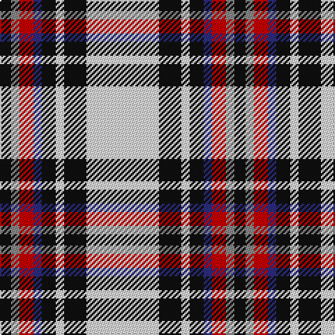

In pattern [KRRBKWKW](/patterns/krrbkwkw/).

This was sourced from register-of-tartans.  It is a [8 stripes tartan](/stripes/stripes8/).

Original link https://www.tartanregister.gov.uk/tartanDetails.aspx?ref=2213

## Attestations

This cloth appears in 2 source records; the oldest owns this page.

- 01/01/2003 — Lootens Jensen (Personal) (register-of-tartans, [record](https://www.tartanregister.gov.uk/tartanDetails.aspx?ref=2213))
- pre 2003 — Lootens Jensen (Personal) (tartans-authority, [record](http://www.tartansauthority.com/tartan-ferret/display/5931/))

## Thread count
K/8 N6 R10 DB6 K10 LN6 K16 LN/52

## Palette
Each colour and its ΔE from the base-6 reference it is a variant of.

| Colour | Shade | Base | ΔE (OKLab) |
|---|---|---|---|
| DB | <code style="background-color:#2C2C80;">#2C2C80</code> `#2C2C80` | B <code style="background-color:#2A418A;">#2A418A</code> | 0.06 |
| K | <code style="background-color:#101010;">#101010</code> `#101010` | K <code style="background-color:#000000;">#000000</code> | 0.17 |
| LN | <code style="background-color:#E0E0E0;">#E0E0E0</code> `#E0E0E0` | W <code style="background-color:#F7F7F7;">#F7F7F7</code> | 0.07 |
| N | <code style="background-color:#888888;">#888888</code> `#888888` | R <code style="background-color:#CC0000;">#CC0000</code> | 0.24 |
| R | <code style="background-color:#C80000;">#C80000</code> `#C80000` | R <code style="background-color:#CC0000;">#CC0000</code> | 0.01 |

# Sample pattern

## Nearest tartans

The nearest existing variants by ΔTartan distance.

1. [MacTavish of Dunardry Dress Clan Tartan Tartan Number: 10731. Earliest known date: 6 November 2012 A 'new' MacTavish Clan tartan, re-creating the Dunardry tartan known to Isobel, daughter of MacLachlan of that Ilk, paternal grandmother to Sheriff Dugald MacTavish of Dunardry. Evidence for the existence of this design can be found in a letter from Sheriff Dugald MacTavish at Kilchrist to John MacTavish, 18 February 1845, the original of which is held in the National Archives of Canada (Library and Archives Canada, James Hargrave and family fonds MG19-A21, Series 2 Mactavish family papers, volume 25/2, “D.M. to John McTavish. Regarding Scottish costume for son John, who will become the lineal representative of the Thane of Knapdale”, February 18th 1845, Kilchrist). The letter describes a tartan that ‘should have as much white as there was yellow in the MacLachlans tartan’. The registration of this Clan tartan has been approved by the current Clan Chief. Registrant details: Steven MacTavish of Dunardry, 27th Chief Clan MacTavish P.O. Box 93093, Burlington, Ontario, Canada, L7M 4A3 See products available Copyright © Blair Urquhart, Comrie, 2015](/setts/s7/b8w28r3g3b8k9b4x2~b5a6e90-g487731-k000000-r95765b-wffffff/) — ΔT 1.08
1. [Shiel, Purple (Dance)](/setts/s7/w8g5b10ba24w30g2wa2x2~b5c8ca8-ba440044-g006818-wf0e0c8-wac49cd8/) — ΔT 1.12
1. [MacPherson Dress (1951)](/setts/s7/w3b3w30k20w3k9y3x2~b940094-k101010-we0e0e0-ye8c000/) — ΔT 1.15
1. [MacDuff Dress Clan Tartan Tartan Number: 1601. Earliest known date: pre 2003 From Scott Adie pattern. See products available Copyright © Blair Urquhart, Comrie, 2015](/setts/s7/w39b9k10g11r7k3r7x2~b2c2c80-g006818-k101010-rc80000-we0e0e0/) — ΔT 1.17
1. [MacDuff Dress #5](/setts/s7/w39b9k10g11r7k3r7x2~b2c4084-g005020-k101010-rdc0000-we0e0e0/) — ΔT 1.18
1. [MacDuff dress](/setts/s7/w39b9k10g11r7k3r7x2~b304080-g008000-k000000-rc00000-we0e0e0/) — ΔT 1.20
1. [MacTavish of Dunardry Dress](/setts/s7/b8w28r3g3b8k9b4x2~b5a6e90-g487731-k101010-r95765b-wffffff/) — ΔT 1.20
1. [Henderson Dress](/setts/s9/w1b6w4b1w16k1g4k6y1x2~b8080d0-g008000-k000000-we0e0e0-yf0c000/) — ΔT 1.21
1. [Virtuoso](/setts/s9/r4w4k4w4k4w4k2g23w2x2~g838b83-k101010-rff0000-wffffff/) — ΔT 1.23
1. [Rui (Personal)](/setts/s6/r1w12k1wa2k5r1x4~k000000-rc80000-wc8c8c8-wafcfcfc/) — ΔT 1.24

## Neighbour map

Every grey dot is one of 15726 variants placed by the first two principal components of the ΔTartan feature space (44% of its variance). Red is this tartan; blue dots are its nearest — click one to open its page.

<svg viewBox="0 0 640 380" role="img" style="max-width:100%;height:auto;border:1px solid #e0e0e0;border-radius:4px;display:block" xmlns="http://www.w3.org/2000/svg"><image href="/nn/cloud.v1.png" width="640" height="380"/><a href="/setts/s7/b8w28r3g3b8k9b4x2~b5a6e90-g487731-k000000-r95765b-wffffff/"><circle cx="155.5" cy="154.7" r="4" fill="#3465a4"><title>MacTavish of Dunardry Dress Clan Tartan Tartan Number: 10731. Earliest known date: 6 November 2012 A 'new' MacTavish Clan tartan, re-creating the Dunardry tartan known to Isobel, daughter of MacLachlan of that Ilk, paternal grandmother to Sheriff Dugald MacTavish of Dunardry. Evidence for the existence of this design can be found in a letter from Sheriff Dugald MacTavish at Kilchrist to John MacTavish, 18 February 1845, the original of which is held in the National Archives of Canada (Library and Archives Canada, James Hargrave and family fonds MG19-A21, Series 2 Mactavish family papers, volume 25/2, “D.M. to John McTavish. Regarding Scottish costume for son John, who will become the lineal representative of the Thane of Knapdale”, February 18th 1845, Kilchrist). The letter describes a tartan that ‘should have as much white as there was yellow in the MacLachlans tartan’. The registration of this Clan tartan has been approved by the current Clan Chief. Registrant details: Steven MacTavish of Dunardry, 27th Chief Clan MacTavish P.O. Box 93093, Burlington, Ontario, Canada, L7M 4A3 See products available Copyright © Blair Urquhart, Comrie, 2015</title></circle></a><a href="/setts/s7/w8g5b10ba24w30g2wa2x2~b5c8ca8-ba440044-g006818-wf0e0c8-wac49cd8/"><circle cx="196.8" cy="141.5" r="4" fill="#3465a4"><title>Shiel, Purple (Dance)</title></circle></a><a href="/setts/s7/w3b3w30k20w3k9y3x2~b940094-k101010-we0e0e0-ye8c000/"><circle cx="245.3" cy="170.0" r="4" fill="#3465a4"><title>MacPherson Dress (1951)</title></circle></a><a href="/setts/s7/w39b9k10g11r7k3r7x2~b2c2c80-g006818-k101010-rc80000-we0e0e0/"><circle cx="168.7" cy="143.0" r="4" fill="#3465a4"><title>MacDuff Dress Clan Tartan Tartan Number: 1601. Earliest known date: pre 2003 From Scott Adie pattern. See products available Copyright © Blair Urquhart, Comrie, 2015</title></circle></a><a href="/setts/s7/w39b9k10g11r7k3r7x2~b2c4084-g005020-k101010-rdc0000-we0e0e0/"><circle cx="169.2" cy="142.6" r="4" fill="#3465a4"><title>MacDuff Dress #5</title></circle></a><a href="/setts/s7/w39b9k10g11r7k3r7x2~b304080-g008000-k000000-rc00000-we0e0e0/"><circle cx="162.9" cy="142.2" r="4" fill="#3465a4"><title>MacDuff dress</title></circle></a><a href="/setts/s7/b8w28r3g3b8k9b4x2~b5a6e90-g487731-k101010-r95765b-wffffff/"><circle cx="161.2" cy="155.8" r="4" fill="#3465a4"><title>MacTavish of Dunardry Dress</title></circle></a><a href="/setts/s9/w1b6w4b1w16k1g4k6y1x2~b8080d0-g008000-k000000-we0e0e0-yf0c000/"><circle cx="214.7" cy="118.6" r="4" fill="#3465a4"><title>Henderson Dress</title></circle></a><a href="/setts/s9/r4w4k4w4k4w4k2g23w2x2~g838b83-k101010-rff0000-wffffff/"><circle cx="204.6" cy="141.7" r="4" fill="#3465a4"><title>Virtuoso</title></circle></a><a href="/setts/s6/r1w12k1wa2k5r1x4~k000000-rc80000-wc8c8c8-wafcfcfc/"><circle cx="258.7" cy="159.2" r="4" fill="#3465a4"><title>Rui (Personal)</title></circle></a><circle cx="201.8" cy="145.9" r="5" fill="#c00000"/></svg>

ID: /setts/s8/w26k8w3k5b3r5ra3k4x2~b2c2c80-k101010-rc80000-ra888888-we0e0e0/
