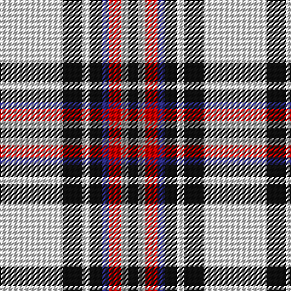

In pattern [KRRBKWKW](/stripes/krrbkwkw/).

This was sourced from register-of-tartans.  It is a [8 stripe tartan](/stripes/stripes8/).

Original link https://www.tartanregister.gov.uk/tartanDetails.aspx?ref=2213

## Attestations

This cloth appears in 2 source records; the oldest owns this page.

- 01/01/2003 — Lootens Jensen (Personal) (register-of-tartans, [record](https://www.tartanregister.gov.uk/tartanDetails.aspx?ref=2213))
- pre 2003 — Lootens Jensen (Personal) (tartans-authority, [record](http://www.tartansauthority.com/tartan-ferret/display/5931/))

## Register references

External register numbers recorded for this tartan.

- Scottish Register of Tartans: [2213](https://www.tartanregister.gov.uk/tartanDetails.aspx?ref=2213)
- Scottish Tartans Authority (ITI): 5931

## Thread count
LN/52 K16 LN6 K10 DB6 R10 N6 K/8

## Palette
Each colour and the base-6 reference it is a variant of.

| Colour | Shade | Base |
|---|---|---|
| DB | <code style="background-color:#2C2C80;">#2C2C80</code> `oklch(35.0% 0.138 276.6)` <small>#2C2C80</small> | B <code style="background-color:#2A418A;">#2A418A</code> |
| K | <code style="background-color:#101010;">#101010</code> `oklch(17.3% 0.000 89.9)` <small>#101010</small> | K <code style="background-color:#000000;">#000000</code> |
| LN | <code style="background-color:#E0E0E0;">#E0E0E0</code> `oklch(90.7% 0.000 89.9)` <small>#E0E0E0</small> | W <code style="background-color:#F7F7F7;">#F7F7F7</code> |
| N | <code style="background-color:#888888;">#888888</code> `oklch(62.7% 0.000 89.9)` <small>#888888</small> | R <code style="background-color:#CC0000;">#CC0000</code> |
| R | <code style="background-color:#C80000;">#C80000</code> `oklch(52.3% 0.215 29.2)` <small>#C80000</small> | R <code style="background-color:#CC0000;">#CC0000</code> |

# Sample pattern

## Nearest tartans

The nearest existing variants by ΔTartan distance.

1. [Shiel, Purple (Dance)](/setts/s7/w8g5t10dp24w30g2lp2~x2/) — ΔT 1.12
1. [MacPherson Dress (1951)](/setts/s7/w3p3w30k20w3k9ly3~x2/) — ΔT 1.16
1. [MacDuff Dress #5](/setts/s7/w39db9k10dg11r7k3r7~x2/) — ΔT 1.18
1. [MacDuff dress](/setts/s7/w39db9k10g11r7k3r7~x2/) — ΔT 1.20
1. [MacTavish of Dunardry Dress](/setts/s7/n8w28o3g3n8k9n4~x2/) — ΔT 1.20
1. [Henderson Dress](/setts/s9/w1b6w4b1w16k1g4k6ly1~x2/) — ΔT 1.21
1. [Virtuoso](/setts/s9/r4w4k4w4k4w4k2y23w2~x2/) — ΔT 1.23
1. [Rui (Personal)](/setts/s6/r1lb12k1w2k5r1~x4/) — ΔT 1.24
1. [Virtuoso (Corporate)](/setts/s9/r4w4k4w4k4w4k2o23w2~x2/) — ΔT 1.29
1. [Puffin (Personal)](/setts/s9/k4w1k1w9g1w1g1w1o4~x4/) — ΔT 1.31

## Neighbour map

Every grey dot is one of 14299 variants placed by the first two principal components of the ΔTartan feature space (44% of its variance). Red is this tartan; blue dots are its nearest — click one to open its page.

<svg viewBox="0 0 640 380" role="img" style="max-width:100%;height:auto;border:1px solid #e0e0e0;border-radius:4px;display:block" xmlns="http://www.w3.org/2000/svg"><image href="/nn/cloud.v1.png" width="640" height="380"/><a href="/setts/s7/w8g5t10dp24w30g2lp2~x2/"><circle cx="198.8" cy="137.3" r="4" fill="#3465a4"><title>Shiel, Purple (Dance)</title></circle></a><a href="/setts/s7/w3p3w30k20w3k9ly3~x2/"><circle cx="247.6" cy="163.6" r="4" fill="#3465a4"><title>MacPherson Dress (1951)</title></circle></a><a href="/setts/s7/w39db9k10dg11r7k3r7~x2/"><circle cx="171.3" cy="138.8" r="4" fill="#3465a4"><title>MacDuff Dress #5</title></circle></a><a href="/setts/s7/w39db9k10g11r7k3r7~x2/"><circle cx="165.2" cy="138.0" r="4" fill="#3465a4"><title>MacDuff dress</title></circle></a><a href="/setts/s7/n8w28o3g3n8k9n4~x2/"><circle cx="163.8" cy="152.1" r="4" fill="#3465a4"><title>MacTavish of Dunardry Dress</title></circle></a><a href="/setts/s9/w1b6w4b1w16k1g4k6ly1~x2/"><circle cx="217.2" cy="114.2" r="4" fill="#3465a4"><title>Henderson Dress</title></circle></a><a href="/setts/s9/r4w4k4w4k4w4k2y23w2~x2/"><circle cx="206.7" cy="137.6" r="4" fill="#3465a4"><title>Virtuoso</title></circle></a><a href="/setts/s6/r1lb12k1w2k5r1~x4/"><circle cx="260.8" cy="152.2" r="4" fill="#3465a4"><title>Rui (Personal)</title></circle></a><a href="/setts/s9/r4w4k4w4k4w4k2o23w2~x2/"><circle cx="217.5" cy="144.3" r="4" fill="#3465a4"><title>Virtuoso (Corporate)</title></circle></a><a href="/setts/s9/k4w1k1w9g1w1g1w1o4~x4/"><circle cx="214.6" cy="146.8" r="4" fill="#3465a4"><title>Puffin (Personal)</title></circle></a><circle cx="204.0" cy="140.8" r="5" fill="#c00000"/></svg>

ID: /setts/s8/w26k8w3k5db3r5o3k4~x2/
