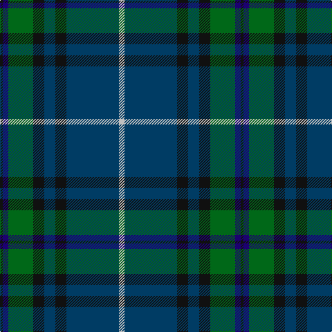

In pattern [KBGKBKBW](/patterns/kbgkbkbw/).

This was sourced from register-of-tartans.  It is a [8 stripes tartan](/stripes/stripes8/).

Original link https://www.tartanregister.gov.uk/tartanDetails.aspx?ref=946

## Thread count
K/4 DBa8 G36 K16 DB16 K16 DB76 N/8

## Palette
Each colour and its ΔE from the base-6 reference it is a variant of.

| Colour | Shade | Base | ΔE (OKLab) |
|---|---|---|---|
| DB | <code style="background-color:#003C64;">#003C64</code> `#003C64` | B <code style="background-color:#2A418A;">#2A418A</code> | 0.08 |
| DBa | <code style="background-color:#1C0070;">#1C0070</code> `#1C0070` | B <code style="background-color:#2A418A;">#2A418A</code> | 0.14 |
| G | <code style="background-color:#006818;">#006818</code> `#006818` | G <code style="background-color:#006100;">#006100</code> | 0.02 |
| K | <code style="background-color:#101010;">#101010</code> `#101010` | K <code style="background-color:#000000;">#000000</code> | 0.17 |
| N | <code style="background-color:#C0C0C0;">#C0C0C0</code> `#C0C0C0` | W <code style="background-color:#F7F7F7;">#F7F7F7</code> | 0.17 |

# Sample pattern

## Nearest tartans

The nearest existing variants by ΔTartan distance.

1. [Dollar Academy (1999) (Corporate)](/setts/s8/w2b19k4b4k4g9ba2k1~b005088-ba1c0070-g006818-k101010-we0e0e0~x4/) — ΔT 0.85
1. [Lowry](/setts/s7/b6y2b1g25ba16k2ba4~b440044-ba282878-g006438-k101010-yd8b000~x2/) — ΔT 0.86
1. [MacFadzean](/setts/s6/b48w2k20g22r3g4~b2c4084-g005020-k101010-rdc0000-we0e0e0~x2/) — ΔT 0.87
1. [Peter of Lee (Chief) (Personal)](/setts/s8/r4g4k2g29b21k3b3y3~b2c2c80-g003820-k101010-rc80000-ye8c000~x2/) — ΔT 0.89
1. [Lawrie Clan Tartan Tartan Number: 3202. Earliest known date: 2000 One of a set of three similar designs for Laurie, Lawrie and Lowry, designed by Peter MacDonald for Iain Laurie. See products available Copyright © Blair Urquhart, Comrie, 2015](/setts/s7/b6r2b1g25ba16k2ba4~b440044-ba2c2c80-g006818-k101010-r945008~x2/) — ΔT 0.89
1. [Laurie Clan Tartan Tartan Number: 3201. Earliest known date: 2000 One of a set of three similar designs for Laurie, Lawrie and Lowry, designed by Peter MacDonald for Iain Laurie. See products available Copyright © Blair Urquhart, Comrie, 2015](/setts/s7/b6r2b1g25ba16k2ba4~b440044-ba2c2c80-g006818-k101010-rc80000~x2/) — ΔT 0.95
1. [Lawrie](/setts/s7/b6g2b1ga25ba16k2ba4~b700070-ba2c2c84-g784400-ga007040-k101010~x2/) — ΔT 1.04
1. [Los Angeles Police Bagpipe Band](/setts/s12/r2b6g15ba6b4ba4b28ba4b4ba6g6y2~b14283c-ba2c2c80-g006818-rc80000-ye8c000~x2/) — ΔT 1.10
1. [Fraser Gathering, Green (1997)](/setts/s9/r2b12g2ga11g4b5ga2g24w2~b1c0070-g003820-ga006818-rc80000-wfcfcfc~x2/) — ΔT 1.12
1. [Lowry Clan Tartan Tartan Number: 3203. Earliest known date: 2000 One of a set of three similar designs for Laurie, Lawrie and Lowry, designed by Peter MacDonald for Iain Laurie. See products available Copyright © Blair Urquhart, Comrie, 2015](/setts/s7/b6y2b1g25ba16k2ba4~b440044-ba2c2c80-g006818-k101010-ye8c000~x2/) — ΔT 1.13

## Neighbour map

Every grey dot is one of 15726 variants placed by the first two principal components of the ΔTartan feature space (44% of its variance). Red is this tartan; blue dots are its nearest — click one to open its page.

<svg viewBox="0 0 640 380" role="img" style="max-width:100%;height:auto;border:1px solid #e0e0e0;border-radius:4px;display:block" xmlns="http://www.w3.org/2000/svg"><image href="/nn/cloud.v1.png" width="640" height="380"/><a href="/setts/s8/w2b19k4b4k4g9ba2k1~b005088-ba1c0070-g006818-k101010-we0e0e0~x4/"><circle cx="280.9" cy="164.8" r="4" fill="#3465a4"><title>Dollar Academy (1999) (Corporate)</title></circle></a><a href="/setts/s7/b6y2b1g25ba16k2ba4~b440044-ba282878-g006438-k101010-yd8b000~x2/"><circle cx="301.2" cy="162.7" r="4" fill="#3465a4"><title>Lowry</title></circle></a><a href="/setts/s6/b48w2k20g22r3g4~b2c4084-g005020-k101010-rdc0000-we0e0e0~x2/"><circle cx="311.9" cy="176.3" r="4" fill="#3465a4"><title>MacFadzean</title></circle></a><a href="/setts/s8/r4g4k2g29b21k3b3y3~b2c2c80-g003820-k101010-rc80000-ye8c000~x2/"><circle cx="294.9" cy="170.5" r="4" fill="#3465a4"><title>Peter of Lee (Chief) (Personal)</title></circle></a><a href="/setts/s7/b6r2b1g25ba16k2ba4~b440044-ba2c2c80-g006818-k101010-r945008~x2/"><circle cx="301.9" cy="162.9" r="4" fill="#3465a4"><title>Lawrie Clan Tartan Tartan Number: 3202. Earliest known date: 2000 One of a set of three similar designs for Laurie, Lawrie and Lowry, designed by Peter MacDonald for Iain Laurie. See products available Copyright © Blair Urquhart, Comrie, 2015</title></circle></a><a href="/setts/s7/b6r2b1g25ba16k2ba4~b440044-ba2c2c80-g006818-k101010-rc80000~x2/"><circle cx="296.9" cy="160.1" r="4" fill="#3465a4"><title>Laurie Clan Tartan Tartan Number: 3201. Earliest known date: 2000 One of a set of three similar designs for Laurie, Lawrie and Lowry, designed by Peter MacDonald for Iain Laurie. See products available Copyright © Blair Urquhart, Comrie, 2015</title></circle></a><a href="/setts/s7/b6g2b1ga25ba16k2ba4~b700070-ba2c2c84-g784400-ga007040-k101010~x2/"><circle cx="308.3" cy="163.9" r="4" fill="#3465a4"><title>Lawrie</title></circle></a><a href="/setts/s12/r2b6g15ba6b4ba4b28ba4b4ba6g6y2~b14283c-ba2c2c80-g006818-rc80000-ye8c000~x2/"><circle cx="286.7" cy="172.4" r="4" fill="#3465a4"><title>Los Angeles Police Bagpipe Band</title></circle></a><a href="/setts/s9/r2b12g2ga11g4b5ga2g24w2~b1c0070-g003820-ga006818-rc80000-wfcfcfc~x2/"><circle cx="247.9" cy="177.5" r="4" fill="#3465a4"><title>Fraser Gathering, Green (1997)</title></circle></a><a href="/setts/s7/b6y2b1g25ba16k2ba4~b440044-ba2c2c80-g006818-k101010-ye8c000~x2/"><circle cx="282.7" cy="155.1" r="4" fill="#3465a4"><title>Lowry Clan Tartan Tartan Number: 3203. Earliest known date: 2000 One of a set of three similar designs for Laurie, Lawrie and Lowry, designed by Peter MacDonald for Iain Laurie. See products available Copyright © Blair Urquhart, Comrie, 2015</title></circle></a><circle cx="303.2" cy="175.0" r="5" fill="#c00000"/></svg>

ID: /setts/s8/w2b19k4b4k4g9ba2k1~b003c64-ba1c0070-g006818-k101010-wc0c0c0~x4/
