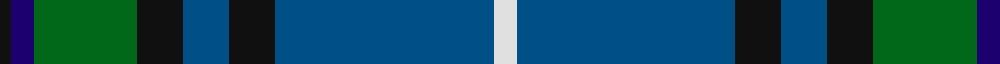
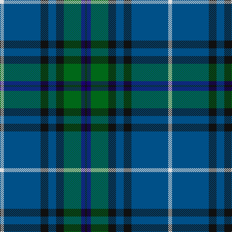

In pattern [KBGKBKBW](/stripes/kbgkbkbw/).

This was sourced from tartans-authority.  It is a [8 stripe tartan](/stripes/stripes8/).

Original link http://www.tartansauthority.com/tartan-ferret/display/2668/

## Thread count
LN/8 DBa76 K16 DBa16 K16 G36 DB8 K/4

## Palette
Each colour and the base-6 reference it is a variant of.

| Colour | Shade | Base |
|---|---|---|
| DB | <code style="background-color:#1C0070;">#1C0070</code> `oklch(26.3% 0.162 277.1)` <small>#1C0070</small> | B <code style="background-color:#2A418A;">#2A418A</code> |
| DBa | <code style="background-color:#005088;">#005088</code> `oklch(42.2% 0.114 248.2)` <small>#005088</small> | B <code style="background-color:#2A418A;">#2A418A</code> |
| G | <code style="background-color:#006818;">#006818</code> `oklch(45.0% 0.142 145.0)` <small>#006818</small> | G <code style="background-color:#006100;">#006100</code> |
| K | <code style="background-color:#101010;">#101010</code> `oklch(17.3% 0.000 89.9)` <small>#101010</small> | K <code style="background-color:#000000;">#000000</code> |
| LN | <code style="background-color:#E0E0E0;">#E0E0E0</code> `oklch(90.7% 0.000 89.9)` <small>#E0E0E0</small> | W <code style="background-color:#F7F7F7;">#F7F7F7</code> |

# Sample pattern

## Nearest tartans

The nearest existing variants by ΔTartan distance, with this tartan at the top so the swatches line up against it.

ΔTartan

Tartan

Sett

—

<a href="/ttd/edit/#slug=w2db19k4db4k4g9db2k1~x4">Dollar Academy (1999) (Corporate)</a> <a class="nn-out" href="/setts/s8/w2db19k4db4k4g9db2k1~x4/" title="open its dictionary page">↗</a>

0.83

<a href="/ttd/edit/#slug=dy2g12k10r1b16r2b16r1~x4">MacWilliam</a> <a class="nn-out" href="/setts/s8/dy2g12k10r1b16r2b16r1~x4/" title="open its dictionary page">↗</a>

0.85

<a href="/ttd/edit/#slug=lb2dt19k4dt4k4g9db2k1~x4">Dollar Academy (1999)</a> <a class="nn-out" href="/setts/s8/lb2dt19k4dt4k4g9db2k1~x4/" title="open its dictionary page">↗</a>

0.91

<a href="/ttd/edit/#slug=db18dp2db16k13g3k2g42lo3~x2">McFadden (Personal)</a> <a class="nn-out" href="/setts/s8/db18dp2db16k13g3k2g42lo3~x2/" title="open its dictionary page">↗</a>

0.98

<a href="/ttd/edit/#slug=b24k8g8r2g8k1w2~x2">Ferguson of Atholl Clan</a> <a class="nn-out" href="/setts/s7/b24k8g8r2g8k1w2~x2/" title="open its dictionary page">↗</a>

0.99

<a href="/ttd/edit/#slug=r2db6g15b9db30b9g6lo2~x2">Miller</a> <a class="nn-out" href="/setts/s8/r2db6g15b9db30b9g6lo2~x2/" title="open its dictionary page">↗</a>

1.02

<a href="/ttd/edit/#slug=m4g9w2g24db37r3~x2">Hardie Clan Tartan Tartan Number: 3903. Earliest known date: 2001 Designed by Paul Hardie of Ecclesmachan, West Lothian so that the Hardie family could have their own tartan. Hardie's have worn the MacHardie tartan till now. See products available Copyright © Blair Urquhart, Comrie, 2015</a> <a class="nn-out" href="/setts/s6/m4g9w2g24db37r3~x2/" title="open its dictionary page">↗</a>

1.11

<a href="/ttd/edit/#slug=t4g4r1db24t4k2g24r1db10t4db2~x2">Coopers &amp; Lybrand</a> <a class="nn-out" href="/setts/s11/t4g4r1db24t4k2g24r1db10t4db2~x2/" title="open its dictionary page">↗</a>

1.13

<a href="/ttd/edit/#slug=dp6ly2dp1g25db16k2db4~x2">Lowry</a> <a class="nn-out" href="/setts/s7/dp6ly2dp1g25db16k2db4~x2/" title="open its dictionary page">↗</a>

1.14

<a href="/ttd/edit/#slug=dp6r2dp1g25db16k2db4~x2">Laurie Clan Tartan Tartan Number: 3201. Earliest known date: 2000 One of a set of three similar designs for Laurie, Lawrie and Lowry, designed by Peter MacDonald for Iain Laurie. See products available Copyright © Blair Urquhart, Comrie, 2015</a> <a class="nn-out" href="/setts/s7/dp6r2dp1g25db16k2db4~x2/" title="open its dictionary page">↗</a>

1.14

<a href="/ttd/edit/#slug=g40k8g4k8g4r14db64t9db3">West Lothian</a> <a class="nn-out" href="/setts/s9/g40k8g4k8g4r14db64t9db3/" title="open its dictionary page">↗</a>

## Neighbour map

Every grey dot is one of 14299 variants placed by the first two principal components of the ΔTartan feature space (44% of its variance). Red is this tartan; blue dots are its nearest — click one to open its page.

<svg viewBox="0 0 640 380" role="img" style="max-width:100%;height:auto;border:1px solid #e0e0e0;border-radius:4px;display:block" xmlns="http://www.w3.org/2000/svg"><image href="/nn/cloud.v1.png" width="640" height="380"/><a href="/setts/s8/dy2g12k10r1b16r2b16r1~x4/"><circle cx="274.5" cy="180.7" r="4" fill="#3465a4"><title>MacWilliam</title></circle></a><a href="/setts/s8/lb2dt19k4dt4k4g9db2k1~x4/"><circle cx="306.3" cy="182.4" r="4" fill="#3465a4"><title>Dollar Academy (1999)</title></circle></a><a href="/setts/s8/db18dp2db16k13g3k2g42lo3~x2/"><circle cx="270.5" cy="160.1" r="4" fill="#3465a4"><title>McFadden (Personal)</title></circle></a><a href="/setts/s7/b24k8g8r2g8k1w2~x2/"><circle cx="253.7" cy="157.0" r="4" fill="#3465a4"><title>Ferguson of Atholl Clan</title></circle></a><a href="/setts/s8/r2db6g15b9db30b9g6lo2~x2/"><circle cx="230.0" cy="180.7" r="4" fill="#3465a4"><title>Miller</title></circle></a><a href="/setts/s6/m4g9w2g24db37r3~x2/"><circle cx="299.4" cy="180.5" r="4" fill="#3465a4"><title>Hardie Clan Tartan Tartan Number: 3903. Earliest known date: 2001 Designed by Paul Hardie of Ecclesmachan, West Lothian so that the Hardie family could have their own tartan. Hardie's have worn the MacHardie tartan till now. See products available Copyright © Blair Urquhart, Comrie, 2015</title></circle></a><a href="/setts/s11/t4g4r1db24t4k2g24r1db10t4db2~x2/"><circle cx="291.4" cy="143.0" r="4" fill="#3465a4"><title>Coopers &amp; Lybrand</title></circle></a><a href="/setts/s7/dp6ly2dp1g25db16k2db4~x2/"><circle cx="304.0" cy="169.6" r="4" fill="#3465a4"><title>Lowry</title></circle></a><a href="/setts/s7/dp6r2dp1g25db16k2db4~x2/"><circle cx="299.7" cy="166.3" r="4" fill="#3465a4"><title>Laurie Clan Tartan Tartan Number: 3201. Earliest known date: 2000 One of a set of three similar designs for Laurie, Lawrie and Lowry, designed by Peter MacDonald for Iain Laurie. See products available Copyright © Blair Urquhart, Comrie, 2015</title></circle></a><a href="/setts/s9/g40k8g4k8g4r14db64t9db3/"><circle cx="261.3" cy="145.9" r="4" fill="#3465a4"><title>West Lothian</title></circle></a><circle cx="284.3" cy="169.8" r="5" fill="#c00000"/></svg>

ID: /setts/s8/w2db19k4db4k4g9db2k1~x4/
