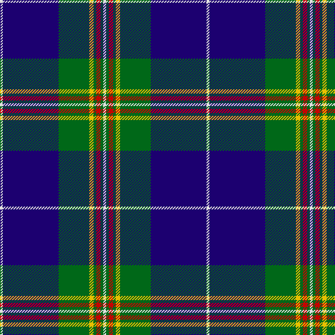

In pattern [WBGYGRGW](/stripes/wbgygrgw/).

This was sourced from tartans-authority.  It is a [8 stripe tartan](/stripes/stripes8/).

Original link http://www.tartansauthority.com/tartan-ferret/display/10059/

## Thread count
LN/4 DB80 G44 Y6 G4 R6 G4 LN/4

## Palette
Each colour and the base-6 reference it is a variant of.

| Colour | Shade | Base |
|---|---|---|
| DB | <code style="background-color:#1C0070;">#1C0070</code> `oklch(26.3% 0.162 277.1)` <small>#1C0070</small> | B <code style="background-color:#2A418A;">#2A418A</code> |
| G | <code style="background-color:#006818;">#006818</code> `oklch(45.0% 0.142 145.0)` <small>#006818</small> | G <code style="background-color:#006100;">#006100</code> |
| LN | <code style="background-color:#E0E0E0;">#E0E0E0</code> `oklch(90.7% 0.000 89.9)` <small>#E0E0E0</small> | W <code style="background-color:#F7F7F7;">#F7F7F7</code> |
| R | <code style="background-color:#C80000;">#C80000</code> `oklch(52.3% 0.215 29.2)` <small>#C80000</small> | R <code style="background-color:#CC0000;">#CC0000</code> |
| Y | <code style="background-color:#E8C000;">#E8C000</code> `oklch(81.9% 0.168 93.7)` <small>#E8C000</small> | Y <code style="background-color:#F2BF00;">#F2BF00</code> |

# Sample pattern

## Nearest tartans

The nearest existing variants by ΔTartan distance.

1. [Tartan Day SA](/setts/s8/w2k40dg22lo3dg2r3dg2w2~x2/) — ΔT 0.97
1. [Liddell (New York) (Name)](/setts/s11/w2k1t22r1t3r1t8k22ly2k3ly2~x2/) — ΔT 1.00
1. [Sinclair-Brown](/setts/s8/db64k11r2k4r2k4g32y4~x2/) — ΔT 1.03
1. [Ewbank](/setts/s9/r3b14ly2k2b14k36ly2k2ly2~x2/) — ΔT 1.07
1. [Anthony Plaid Blue](/setts/s10/db18g1ly3g1lr1db1r2g2r2lr2~x4/) — ΔT 1.08
1. [Chestico](/setts/s7/db20dy1db1dy1dg8k1w3~x2/) — ΔT 1.09
1. [Leblant-Macqueron (Personal)](/setts/s7/lr5k6w2dg7w2dt44w2~x2/) — ΔT 1.12
1. [Home (Clan)](/setts/s8/k36r3k3r3k9b36g3b2~x2/) — ΔT 1.12
1. [MacLaurin, of Brioch](/setts/s7/db36k10g3r3g6k1ly2~x2/) — ΔT 1.14
1. [Glasgow, University of](/setts/s8/k2db22g4k7y2k2w2db2~x2/) — ΔT 1.15

## Neighbour map

Every grey dot is one of 14299 variants placed by the first two principal components of the ΔTartan feature space (44% of its variance). Red is this tartan; blue dots are its nearest — click one to open its page.

<svg viewBox="0 0 640 380" role="img" style="max-width:100%;height:auto;border:1px solid #e0e0e0;border-radius:4px;display:block" xmlns="http://www.w3.org/2000/svg"><image href="/nn/cloud.v1.png" width="640" height="380"/><a href="/setts/s8/w2k40dg22lo3dg2r3dg2w2~x2/"><circle cx="302.7" cy="128.3" r="4" fill="#3465a4"><title>Tartan Day SA</title></circle></a><a href="/setts/s11/w2k1t22r1t3r1t8k22ly2k3ly2~x2/"><circle cx="270.6" cy="105.5" r="4" fill="#3465a4"><title>Liddell (New York) (Name)</title></circle></a><a href="/setts/s8/db64k11r2k4r2k4g32y4~x2/"><circle cx="313.0" cy="115.7" r="4" fill="#3465a4"><title>Sinclair-Brown</title></circle></a><a href="/setts/s9/r3b14ly2k2b14k36ly2k2ly2~x2/"><circle cx="308.8" cy="143.1" r="4" fill="#3465a4"><title>Ewbank</title></circle></a><a href="/setts/s10/db18g1ly3g1lr1db1r2g2r2lr2~x4/"><circle cx="306.1" cy="106.1" r="4" fill="#3465a4"><title>Anthony Plaid Blue</title></circle></a><a href="/setts/s7/db20dy1db1dy1dg8k1w3~x2/"><circle cx="353.2" cy="144.6" r="4" fill="#3465a4"><title>Chestico</title></circle></a><a href="/setts/s7/lr5k6w2dg7w2dt44w2~x2/"><circle cx="364.5" cy="123.4" r="4" fill="#3465a4"><title>Leblant-Macqueron (Personal)</title></circle></a><a href="/setts/s8/k36r3k3r3k9b36g3b2~x2/"><circle cx="318.7" cy="160.7" r="4" fill="#3465a4"><title>Home (Clan)</title></circle></a><a href="/setts/s7/db36k10g3r3g6k1ly2~x2/"><circle cx="353.3" cy="115.7" r="4" fill="#3465a4"><title>MacLaurin, of Brioch</title></circle></a><a href="/setts/s8/k2db22g4k7y2k2w2db2~x2/"><circle cx="276.3" cy="154.5" r="4" fill="#3465a4"><title>Glasgow, University of</title></circle></a><circle cx="303.8" cy="124.7" r="5" fill="#c00000"/></svg>

ID: /setts/s8/w2db40g22ly3g2r3g2w2~x2/
