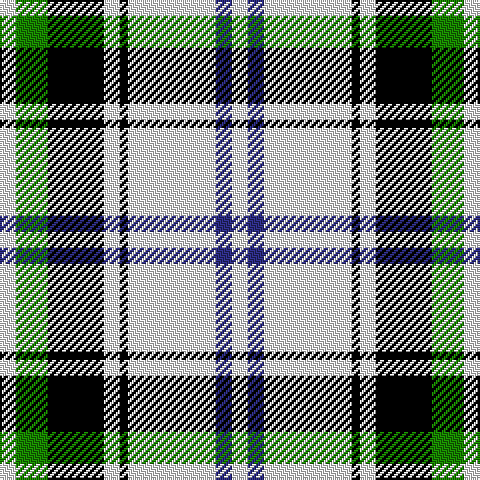

This page is one **sett** — a single exact thread-count. It belongs to the [tartan](/tartans/w2g4k7w2k1w11db2w2/)
(the same proportion at any scale), whose colour order is pattern [WBWKWKGW](/stripes/wbwkwkgw/).

Sourced from tartans-authority.  It is a [8 stripe tartan](/stripes/stripes8/).

Original link http://www.tartansauthority.com/tartan-ferret/display/3490/

## Thread count
W/8 G16 K28 W8 K4 W44 DB8 W/8

## Palette
Each colour and the base-6 reference it is a variant of.

| Colour | Shade | Base |
|---|---|---|
| DB | <code style="background-color:#2C2C80;">#2C2C80</code> `oklch(35.0% 0.138 276.6)` <small>#2C2C80</small> | B <code style="background-color:#2A418A;">#2A418A</code> |
| G | <code style="background-color:#188400;">#188400</code> `oklch(53.4% 0.177 141.3)` <small>#188400</small> | G <code style="background-color:#006100;">#006100</code> |
| K | <code style="background-color:#000000;">#000000</code> `oklch(0.0% 0.000 0.0)` <small>#000000</small> | K <code style="background-color:#000000;">#000000</code> |
| W | <code style="background-color:#F8F8F8;">#F8F8F8</code> `oklch(97.9% 0.000 89.9)` <small>#F8F8F8</small> | W <code style="background-color:#F7F7F7;">#F7F7F7</code> |

# Sample pattern

## Nearest tartans

The nearest existing variants by ΔTartan distance, with this tartan at the top so the swatches line up against it.

ΔTartan

Tartan

Sett

—

<a href="/ttd/edit/#slug=w2g4k7w2k1w11db2w2~x4">Forbes - 1880 (Clans Originaux)</a> <a class="nn-out" href="/setts/s8/w2g4k7w2k1w11db2w2~x4/" title="open its dictionary page">↗</a>

1.00

<a href="/ttd/edit/#slug=w3p3w30k20w3k9ly3~x2">MacPherson Dress (1951)</a> <a class="nn-out" href="/setts/s7/w3p3w30k20w3k9ly3~x2/" title="open its dictionary page">↗</a>

1.07

<a href="/ttd/edit/#slug=k4w1k1w9g1w1g1w1o4~x4">Puffin (Personal)</a> <a class="nn-out" href="/setts/s9/k4w1k1w9g1w1g1w1o4~x4/" title="open its dictionary page">↗</a>

1.12

<a href="/ttd/edit/#slug=k22w16g2w14g2w16k22r3~x2">Kierson</a> <a class="nn-out" href="/setts/s8/k22w16g2w14g2w16k22r3~x2/" title="open its dictionary page">↗</a>

1.18

<a href="/ttd/edit/#slug=ly9k32g6w20ly3w9k5~x2">Black and White Golf</a> <a class="nn-out" href="/setts/s7/ly9k32g6w20ly3w9k5~x2/" title="open its dictionary page">↗</a>

1.19

<a href="/ttd/edit/#slug=k3w1k1w6g1w1g1w1o3~x4">Puffin</a> <a class="nn-out" href="/setts/s9/k3w1k1w6g1w1g1w1o3~x4/" title="open its dictionary page">↗</a>

1.19

<a href="/ttd/edit/#slug=k9w4k2w4k2w30k9w4db14ly2~x2">Hannay</a> <a class="nn-out" href="/setts/s10/k9w4k2w4k2w30k9w4db14ly2~x2/" title="open its dictionary page">↗</a>

1.23

<a href="/ttd/edit/#slug=k9lb4k2lb4k2lb30k9lb4b14lo2~x2">Hannay (Clan)</a> <a class="nn-out" href="/setts/s10/k9lb4k2lb4k2lb30k9lb4b14lo2~x2/" title="open its dictionary page">↗</a>

1.25

<a href="/ttd/edit/#slug=k9w4k2w4k2w29k9w4b14lo2~x2">Hannay</a> <a class="nn-out" href="/setts/s10/k9w4k2w4k2w29k9w4b14lo2~x2/" title="open its dictionary page">↗</a>

1.26

<a href="/ttd/edit/#slug=r1lb12k1w2k5r1~x4">Rui (Personal)</a> <a class="nn-out" href="/setts/s6/r1lb12k1w2k5r1~x4/" title="open its dictionary page">↗</a>

1.29

<a href="/ttd/edit/#slug=w1m2w17k11w2k4ly1~x4">MacPherson - 1842 (VS) Dress</a> <a class="nn-out" href="/setts/s7/w1m2w17k11w2k4ly1~x4/" title="open its dictionary page">↗</a>

## Neighbour map

Every grey dot is one of 14299 variants placed by the first two principal components of the ΔTartan feature space (44% of its variance). Red is this tartan; blue dots are its nearest — click one to open its page.

<svg viewBox="0 0 640 380" role="img" style="max-width:100%;height:auto;border:1px solid #e0e0e0;border-radius:4px;display:block" xmlns="http://www.w3.org/2000/svg"><image href="/nn/cloud.v1.png" width="640" height="380"/><a href="/setts/s7/w3p3w30k20w3k9ly3~x2/"><circle cx="247.6" cy="163.6" r="4" fill="#3465a4"><title>MacPherson Dress (1951)</title></circle></a><a href="/setts/s9/k4w1k1w9g1w1g1w1o4~x4/"><circle cx="214.6" cy="146.8" r="4" fill="#3465a4"><title>Puffin (Personal)</title></circle></a><a href="/setts/s8/k22w16g2w14g2w16k22r3~x2/"><circle cx="210.2" cy="182.7" r="4" fill="#3465a4"><title>Kierson</title></circle></a><a href="/setts/s7/ly9k32g6w20ly3w9k5~x2/"><circle cx="177.9" cy="173.4" r="4" fill="#3465a4"><title>Black and White Golf</title></circle></a><a href="/setts/s9/k3w1k1w6g1w1g1w1o3~x4/"><circle cx="172.2" cy="181.1" r="4" fill="#3465a4"><title>Puffin</title></circle></a><a href="/setts/s10/k9w4k2w4k2w30k9w4db14ly2~x2/"><circle cx="243.1" cy="130.9" r="4" fill="#3465a4"><title>Hannay</title></circle></a><a href="/setts/s10/k9lb4k2lb4k2lb30k9lb4b14lo2~x2/"><circle cx="252.5" cy="131.2" r="4" fill="#3465a4"><title>Hannay (Clan)</title></circle></a><a href="/setts/s10/k9w4k2w4k2w29k9w4b14lo2~x2/"><circle cx="234.3" cy="128.0" r="4" fill="#3465a4"><title>Hannay</title></circle></a><a href="/setts/s6/r1lb12k1w2k5r1~x4/"><circle cx="260.8" cy="152.2" r="4" fill="#3465a4"><title>Rui (Personal)</title></circle></a><a href="/setts/s7/w1m2w17k11w2k4ly1~x4/"><circle cx="281.9" cy="139.9" r="4" fill="#3465a4"><title>MacPherson - 1842 (VS) Dress</title></circle></a><circle cx="225.0" cy="162.8" r="5" fill="#c00000"/></svg>

ID: /setts/s8/w2g4k7w2k1w11db2w2~x4/
