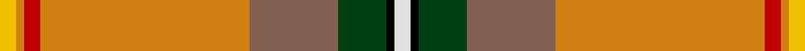
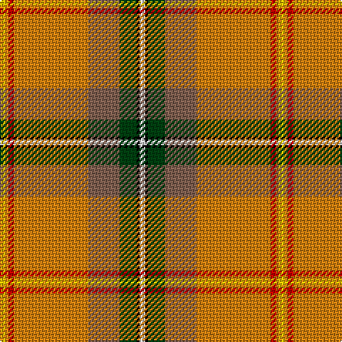

This page is one **sett** — a single exact thread-count. It belongs to the [tartan](/tartans/w2k1dg6o11lo26r2lo1ly2/)
(the same proportion at any scale), whose colour order is pattern [WKGRYRYY](/stripes/wkgryryy/).

Sourced from weddslist.  It is a [8 stripe tartan](/stripes/stripes8/).

Original link http://www.weddslist.com/cgi-bin/tartans/pg.pl?source=sts

## Thread count
Y/4 O2 R4 O52 LT22 DG12 K2 LN/4

## Palette

Palette: <strong>Tartan Register</strong> <small style="color:#888">(2 of 7 colours)</small>
<table><thead><tr><th>Colour</th><th>Threads</th><th>Shade</th><th>Base</th><th>OKLCh</th></tr></thead><tbody><tr><td>Y/</td><td style="text-align:right;font-variant-numeric:tabular-nums">4</td><td><code style="background-color:#F0C000;">#F0C000</code> <small style="color:#888">#F0C000</small></td><td>Y <code style="background-color:#F2BF00;">#F2BF00</code></td><td><small style="color:#888">oklch(82.7% 0.169 90.5)</small></td></tr><tr><td>O</td><td style="text-align:right;font-variant-numeric:tabular-nums">2</td><td><code style="background-color:#D08010;">#D08010</code> <small style="color:#888">#D08010</small></td><td>Y <code style="background-color:#F2BF00;">#F2BF00</code></td><td><small style="color:#888">oklch(67.0% 0.145 66.1)</small></td></tr><tr><td>R</td><td style="text-align:right;font-variant-numeric:tabular-nums">4</td><td><code style="background-color:#C00000;">#C00000</code> <small style="color:#888">#C00000</small></td><td>R <code style="background-color:#CC0000;">#CC0000</code></td><td><small style="color:#888">oklch(50.7% 0.208 29.2)</small></td></tr><tr><td>O</td><td style="text-align:right;font-variant-numeric:tabular-nums">52</td><td><code style="background-color:#D08010;">#D08010</code> <small style="color:#888">#D08010</small></td><td>Y <code style="background-color:#F2BF00;">#F2BF00</code></td><td><small style="color:#888">oklch(67.0% 0.145 66.1)</small></td></tr><tr><td>LT</td><td style="text-align:right;font-variant-numeric:tabular-nums">22</td><td><code style="background-color:#806050;">#806050</code> <small style="color:#888">#806050</small></td><td>R <code style="background-color:#CC0000;">#CC0000</code></td><td><small style="color:#888">oklch(51.7% 0.049 47.8)</small></td></tr><tr><td>DG</td><td style="text-align:right;font-variant-numeric:tabular-nums">12</td><td><code style="background-color:#004010;">#004010</code> <small style="color:#888">#004010</small></td><td>G <code style="background-color:#006100;">#006100</code></td><td><small style="color:#888">oklch(32.3% 0.098 146.3)</small></td></tr><tr><td>K</td><td style="text-align:right;font-variant-numeric:tabular-nums">2</td><td><code style="background-color:#000000;">#000000</code> <small style="color:#888">#000000</small></td><td>K <code style="background-color:#000000;">#000000</code></td><td><small style="color:#888">oklch(0.0% 0.000 0.0)</small></td></tr><tr><td>LN/</td><td style="text-align:right;font-variant-numeric:tabular-nums">4</td><td><code style="background-color:#E0E0E0;">#E0E0E0</code> <small style="color:#888">#E0E0E0</small></td><td>W <code style="background-color:#F7F7F7;">#F7F7F7</code></td><td><small style="color:#888">oklch(90.7% 0.000 89.9)</small></td></tr></tbody></table>

# Sample pattern

## Nearest tartans

The nearest existing variants by ΔTartan distance, with this tartan at the top so the swatches line up against it.

ΔTartan

Tartan

Sett

—

<a href="/ttd/edit/#slug=w2k1dg6o11lo26r2lo1ly2~x2">Saskatchewan</a> <a class="nn-out" href="/setts/s8/w2k1dg6o11lo26r2lo1ly2~x2/" title="open its dictionary page">↗</a>

0.74

<a href="/ttd/edit/#slug=w2k1g6dy11lo26r2lo1ly2~x2">Saskatchewan (District)</a> <a class="nn-out" href="/setts/s8/w2k1g6dy11lo26r2lo1ly2~x2/" title="open its dictionary page">↗</a>

1.44

<a href="/setts/s14/w2k1g6dy11lo26r2lo1ly2~x2/">Saskatchewan</a>

1.57

<a href="/ttd/edit/#slug=r22db3ly1g12r6db3t3w1~x2">Drummond, (Fingask)</a> <a class="nn-out" href="/setts/s8/r22db3ly1g12r6db3t3w1~x2/" title="open its dictionary page">↗</a>

1.60

<a href="/ttd/edit/#slug=ly30k1r4k1g3dgi5dg4t6r2lb2~x2">Essex County (Ontario)</a> <a class="nn-out" href="/setts/s10/ly30k1r4k1g3dgi5dg4t6r2lb2~x2/" title="open its dictionary page">↗</a>

1.64

<a href="/ttd/edit/#slug=w2k1g6dy11ly26r2ly1ly2~x2">Saskatchewan District Tartan Tartan Number: 1817. Earliest known date: 1959 The colours chosen are the same as those for the flag. Red for the Blood of Christ, blue for the Heavenly Father, yellow for Fire of the Holy Spirit when tongues of fire symbolized his presence at Penticost. See products available Copyright © Blair Urquhart, Comrie, 2015</a> <a class="nn-out" href="/setts/s8/w2k1g6dy11ly26r2ly1ly2~x2/" title="open its dictionary page">↗</a>

1.66

<a href="/ttd/edit/#slug=ly6lo48db8lo16w4lo3g19r24lo4r9w4">Muirhead (Original)</a> <a class="nn-out" href="/setts/s11/ly6lo48db8lo16w4lo3g19r24lo4r9w4/" title="open its dictionary page">↗</a>

1.73

<a href="/ttd/edit/#slug=lo18r3g30b4k2w2k2b4r37ly1r3ly1r3~x2">Sri Lanka</a> <a class="nn-out" href="/setts/s13/lo18r3g30b4k2w2k2b4r37ly1r3ly1r3~x2/" title="open its dictionary page">↗</a>

1.75

<a href="/ttd/edit/#slug=r40g16ly2k8y4w1db5w2~x2">Ancient Caledonian Society</a> <a class="nn-out" href="/setts/s8/r40g16ly2k8y4w1db5w2~x2/" title="open its dictionary page">↗</a>

1.77

<a href="/ttd/edit/#slug=r20w1k1m6ly1g18~x2">Gordon of Abergeldie (Red..) Portrait Tartan Tartan Number: 955. Earliest known date: 1723 This sett was reconstructed from a scarf in a painting of Rachael Gordon, hanging in Abergeldie Castle, painted by Alexander in 1723. The count and colour desciption was taken by the Lord Lyon in 1953. See products available Copyright © Blair Urquhart, Comrie, 2015</a> <a class="nn-out" href="/setts/s6/r20w1k1m6ly1g18~x2/" title="open its dictionary page">↗</a>

1.83

<a href="/ttd/edit/#slug=r26g5dg7ri2do9lo1loi1dg4~x2">Tartan Army Whisky</a> <a class="nn-out" href="/setts/s8/r26g5dg7ri2do9lo1loi1dg4~x2/" title="open its dictionary page">↗</a>

## Neighbour map

Every grey dot is one of 14359 variants placed by the first two principal components of the ΔTartan feature space (44% of its variance). Red is this tartan; blue dots are its nearest — click one to open its page.

<svg viewBox="0 0 640 380" role="img" style="max-width:100%;height:auto;border:1px solid #e0e0e0;border-radius:4px;display:block" xmlns="http://www.w3.org/2000/svg"><image href="/nn/cloud.v1.png" width="640" height="380"/><a href="/setts/s8/w2k1g6dy11lo26r2lo1ly2~x2/"><circle cx="288.1" cy="87.2" r="4" fill="#3465a4"><title>Saskatchewan (District)</title></circle></a><a href="/setts/s14/w2k1g6dy11lo26r2lo1ly2~x2/"><circle cx="299.3" cy="73.1" r="4" fill="#3465a4"><title>Saskatchewan</title></circle></a><a href="/setts/s8/r22db3ly1g12r6db3t3w1~x2/"><circle cx="306.9" cy="116.0" r="4" fill="#3465a4"><title>Drummond, (Fingask)</title></circle></a><a href="/setts/s10/ly30k1r4k1g3dgi5dg4t6r2lb2~x2/"><circle cx="235.1" cy="37.7" r="4" fill="#3465a4"><title>Essex County (Ontario)</title></circle></a><a href="/setts/s8/w2k1g6dy11ly26r2ly1ly2~x2/"><circle cx="254.2" cy="68.0" r="4" fill="#3465a4"><title>Saskatchewan District Tartan Tartan Number: 1817. Earliest known date: 1959 The colours chosen are the same as those for the flag. Red for the Blood of Christ, blue for the Heavenly Father, yellow for Fire of the Holy Spirit when tongues of fire symbolized his presence at Penticost. See products available Copyright © Blair Urquhart, Comrie, 2015</title></circle></a><a href="/setts/s11/ly6lo48db8lo16w4lo3g19r24lo4r9w4/"><circle cx="247.8" cy="124.7" r="4" fill="#3465a4"><title>Muirhead (Original)</title></circle></a><a href="/setts/s13/lo18r3g30b4k2w2k2b4r37ly1r3ly1r3~x2/"><circle cx="237.0" cy="41.3" r="4" fill="#3465a4"><title>Sri Lanka</title></circle></a><a href="/setts/s8/r40g16ly2k8y4w1db5w2~x2/"><circle cx="274.4" cy="56.7" r="4" fill="#3465a4"><title>Ancient Caledonian Society</title></circle></a><a href="/setts/s6/r20w1k1m6ly1g18~x2/"><circle cx="253.3" cy="133.4" r="4" fill="#3465a4"><title>Gordon of Abergeldie (Red..) Portrait Tartan Tartan Number: 955. Earliest known date: 1723 This sett was reconstructed from a scarf in a painting of Rachael Gordon, hanging in Abergeldie Castle, painted by Alexander in 1723. The count and colour desciption was taken by the Lord Lyon in 1953. See products available Copyright © Blair Urquhart, Comrie, 2015</title></circle></a><a href="/setts/s8/r26g5dg7ri2do9lo1loi1dg4~x2/"><circle cx="261.6" cy="96.4" r="4" fill="#3465a4"><title>Tartan Army Whisky</title></circle></a><circle cx="290.4" cy="83.5" r="5" fill="#c00000"/></svg>

ID: /setts/s8/w2k1dg6o11lo26r2lo1ly2~x2/
