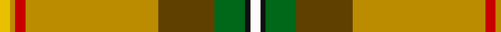
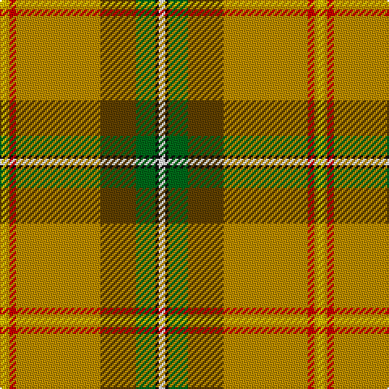

This page is one **sett** — a single exact thread-count. It belongs to the [tartan](/tartans/w2k1g6dy11lo26r2lo1ly2/)
(the same proportion at any scale), whose colour order is pattern [WKGGYRYY](/stripes/wkggyryy/).

Sourced from tartans-authority.  It is a [8 stripe tartan](/stripes/stripes8/).

Original link http://www.tartansauthority.com/tartan-ferret/display/1817/

## Register references

External register numbers recorded for this tartan.

- Scottish Tartans Authority (ITI): 1817

## Thread count
Y/4 DY2 R4 DY52 T22 G12 K2 W/4

## Palette

Palette: <strong>Tartan Register</strong>
<table><thead><tr><th>Colour</th><th>Threads</th><th>Shade</th><th>Base</th><th>OKLCh</th></tr></thead><tbody><tr><td>Y/</td><td style="text-align:right;font-variant-numeric:tabular-nums">4</td><td><code style="background-color:#E8C000;">#E8C000</code> <small style="color:#888">#E8C000</small></td><td>Y <code style="background-color:#F2BF00;">#F2BF00</code></td><td><small style="color:#888">oklch(81.9% 0.168 93.7)</small></td></tr><tr><td>DY</td><td style="text-align:right;font-variant-numeric:tabular-nums">2</td><td><code style="background-color:#BC8C00;">#BC8C00</code> <small style="color:#888">#BC8C00</small></td><td>Y <code style="background-color:#F2BF00;">#F2BF00</code></td><td><small style="color:#888">oklch(66.8% 0.137 84.1)</small></td></tr><tr><td>R</td><td style="text-align:right;font-variant-numeric:tabular-nums">4</td><td><code style="background-color:#C80000;">#C80000</code> <small style="color:#888">#C80000</small></td><td>R <code style="background-color:#CC0000;">#CC0000</code></td><td><small style="color:#888">oklch(52.3% 0.215 29.2)</small></td></tr><tr><td>DY</td><td style="text-align:right;font-variant-numeric:tabular-nums">52</td><td><code style="background-color:#BC8C00;">#BC8C00</code> <small style="color:#888">#BC8C00</small></td><td>Y <code style="background-color:#F2BF00;">#F2BF00</code></td><td><small style="color:#888">oklch(66.8% 0.137 84.1)</small></td></tr><tr><td>T</td><td style="text-align:right;font-variant-numeric:tabular-nums">22</td><td><code style="background-color:#604000;">#604000</code> <small style="color:#888">#604000</small></td><td>G <code style="background-color:#006100;">#006100</code></td><td><small style="color:#888">oklch(39.8% 0.083 76.8)</small></td></tr><tr><td>G</td><td style="text-align:right;font-variant-numeric:tabular-nums">12</td><td><code style="background-color:#006818;">#006818</code> <small style="color:#888">#006818</small></td><td>G <code style="background-color:#006100;">#006100</code></td><td><small style="color:#888">oklch(45.0% 0.142 145.0)</small></td></tr><tr><td>K</td><td style="text-align:right;font-variant-numeric:tabular-nums">2</td><td><code style="background-color:#101010;">#101010</code> <small style="color:#888">#101010</small></td><td>K <code style="background-color:#000000;">#000000</code></td><td><small style="color:#888">oklch(17.3% 0.000 89.9)</small></td></tr><tr><td>W/</td><td style="text-align:right;font-variant-numeric:tabular-nums">4</td><td><code style="background-color:#FCFCFC;">#FCFCFC</code> <small style="color:#888">#FCFCFC</small></td><td>W <code style="background-color:#F7F7F7;">#F7F7F7</code></td><td><small style="color:#888">oklch(99.1% 0.000 89.9)</small></td></tr></tbody></table>

# Sample pattern

## Nearest tartans

The nearest existing variants by ΔTartan distance, with this tartan at the top so the swatches line up against it.

ΔTartan

Tartan

Sett

—

<a href="/ttd/edit/#slug=w2k1g6dy11lo26r2lo1ly2~x2">Saskatchewan (District)</a> <a class="nn-out" href="/setts/s8/w2k1g6dy11lo26r2lo1ly2~x2/" title="open its dictionary page">↗</a>

0.74

<a href="/ttd/edit/#slug=w2k1dg6o11lo26r2lo1ly2~x2">Saskatchewan</a> <a class="nn-out" href="/setts/s8/w2k1dg6o11lo26r2lo1ly2~x2/" title="open its dictionary page">↗</a>

1.22

<a href="/setts/s14/w2k1g6dy11lo26r2lo1ly2~x2/">Saskatchewan</a>

1.28

<a href="/ttd/edit/#slug=w2k1g6dy11ly26r2ly1ly2~x2">Saskatchewan District Tartan Tartan Number: 1817. Earliest known date: 1959 The colours chosen are the same as those for the flag. Red for the Blood of Christ, blue for the Heavenly Father, yellow for Fire of the Holy Spirit when tongues of fire symbolized his presence at Penticost. See products available Copyright © Blair Urquhart, Comrie, 2015</a> <a class="nn-out" href="/setts/s8/w2k1g6dy11ly26r2ly1ly2~x2/" title="open its dictionary page">↗</a>

1.44

<a href="/ttd/edit/#slug=ly30k1r4k1g3dgi5dg4t6r2lb2~x2">Essex County (Ontario)</a> <a class="nn-out" href="/setts/s10/ly30k1r4k1g3dgi5dg4t6r2lb2~x2/" title="open its dictionary page">↗</a>

1.75

<a href="/ttd/edit/#slug=ly30k1r4k1g3gi5dg4t6r2w2~x2">Essex County Ontario District Tartan Tartan Number: 1840. Earliest known date: 1985 The Essex County district tartan was designed by Mrs Edyth Baker of Leamington, Ontario, Canada in 1983. She used colours representing the various industries of the region; agriculture, salt mining, car building anf fishing. Azure blue symbolizes the sky and the water. The tartan was formally adopted by the Corporation of the County of Essex in 1984, and approved by the Leamington Council. The tartan is accredited by the Scottish Tartans Society. (STS archive) See products available Copyright © Blair Urquhart, Comrie, 2015</a> <a class="nn-out" href="/setts/s10/ly30k1r4k1g3gi5dg4t6r2w2~x2/" title="open its dictionary page">↗</a>

1.87

<a href="/ttd/edit/#slug=ly6lo48db8lo16w4lo3g19r24lo4r9w4">Muirhead (Original)</a> <a class="nn-out" href="/setts/s11/ly6lo48db8lo16w4lo3g19r24lo4r9w4/" title="open its dictionary page">↗</a>

1.92

<a href="/ttd/edit/#slug=ly30k1r4k1gi3g5dg4t6r2w2~x2">Essex, County Ontario</a> <a class="nn-out" href="/setts/s10/ly30k1r4k1gi3g5dg4t6r2w2~x2/" title="open its dictionary page">↗</a>

1.96

<a href="/ttd/edit/#slug=w2r16k1t2k1ly43k1t2k1g16t1~x2">Baxter Clan Tartan Tartan Number: 175. Earliest known date: 1856 A discription of this sett is given in The Baronage of Angus and Mearns (1856). See products available Copyright © Blair Urquhart, Comrie, 2015</a> <a class="nn-out" href="/setts/s11/w2r16k1t2k1ly43k1t2k1g16t1~x2/" title="open its dictionary page">↗</a>

1.96

<a href="/ttd/edit/#slug=y30dg5g3r1g3k1g3r1g3db1lo1~x4">California Department of Forestry (Corporate)</a> <a class="nn-out" href="/setts/s11/y30dg5g3r1g3k1g3r1g3db1lo1~x4/" title="open its dictionary page">↗</a>

1.97

<a href="/ttd/edit/#slug=y56lb6ly6lyi2w2lyi2w16lb10w2y6r3~x2">McAleavy (2014)</a> <a class="nn-out" href="/setts/s11/y56lb6ly6lyi2w2lyi2w16lb10w2y6r3~x2/" title="open its dictionary page">↗</a>

## Neighbour map

Every grey dot is one of 14359 variants placed by the first two principal components of the ΔTartan feature space (44% of its variance). Red is this tartan; blue dots are its nearest — click one to open its page.

<svg viewBox="0 0 640 380" role="img" style="max-width:100%;height:auto;border:1px solid #e0e0e0;border-radius:4px;display:block" xmlns="http://www.w3.org/2000/svg"><image href="/nn/cloud.v1.png" width="640" height="380"/><a href="/setts/s8/w2k1dg6o11lo26r2lo1ly2~x2/"><circle cx="290.4" cy="83.5" r="4" fill="#3465a4"><title>Saskatchewan</title></circle></a><a href="/setts/s14/w2k1g6dy11lo26r2lo1ly2~x2/"><circle cx="299.3" cy="73.1" r="4" fill="#3465a4"><title>Saskatchewan</title></circle></a><a href="/setts/s8/w2k1g6dy11ly26r2ly1ly2~x2/"><circle cx="254.2" cy="68.0" r="4" fill="#3465a4"><title>Saskatchewan District Tartan Tartan Number: 1817. Earliest known date: 1959 The colours chosen are the same as those for the flag. Red for the Blood of Christ, blue for the Heavenly Father, yellow for Fire of the Holy Spirit when tongues of fire symbolized his presence at Penticost. See products available Copyright © Blair Urquhart, Comrie, 2015</title></circle></a><a href="/setts/s10/ly30k1r4k1g3dgi5dg4t6r2lb2~x2/"><circle cx="235.1" cy="37.7" r="4" fill="#3465a4"><title>Essex County (Ontario)</title></circle></a><a href="/setts/s10/ly30k1r4k1g3gi5dg4t6r2w2~x2/"><circle cx="222.5" cy="28.5" r="4" fill="#3465a4"><title>Essex County Ontario District Tartan Tartan Number: 1840. Earliest known date: 1985 The Essex County district tartan was designed by Mrs Edyth Baker of Leamington, Ontario, Canada in 1983. She used colours representing the various industries of the region; agriculture, salt mining, car building anf fishing. Azure blue symbolizes the sky and the water. The tartan was formally adopted by the Corporation of the County of Essex in 1984, and approved by the Leamington Council. The tartan is accredited by the Scottish Tartans Society. (STS archive) See products available Copyright © Blair Urquhart, Comrie, 2015</title></circle></a><a href="/setts/s11/ly6lo48db8lo16w4lo3g19r24lo4r9w4/"><circle cx="247.8" cy="124.7" r="4" fill="#3465a4"><title>Muirhead (Original)</title></circle></a><a href="/setts/s10/ly30k1r4k1gi3g5dg4t6r2w2~x2/"><circle cx="214.8" cy="24.2" r="4" fill="#3465a4"><title>Essex, County Ontario</title></circle></a><a href="/setts/s11/w2r16k1t2k1ly43k1t2k1g16t1~x2/"><circle cx="279.7" cy="33.1" r="4" fill="#3465a4"><title>Baxter Clan Tartan Tartan Number: 175. Earliest known date: 1856 A discription of this sett is given in The Baronage of Angus and Mearns (1856). See products available Copyright © Blair Urquhart, Comrie, 2015</title></circle></a><a href="/setts/s11/y30dg5g3r1g3k1g3r1g3db1lo1~x4/"><circle cx="371.7" cy="75.9" r="4" fill="#3465a4"><title>California Department of Forestry (Corporate)</title></circle></a><a href="/setts/s11/y56lb6ly6lyi2w2lyi2w16lb10w2y6r3~x2/"><circle cx="292.9" cy="59.5" r="4" fill="#3465a4"><title>McAleavy (2014)</title></circle></a><circle cx="288.1" cy="87.2" r="5" fill="#c00000"/></svg>

ID: /setts/s8/w2k1g6dy11lo26r2lo1ly2~x2/
