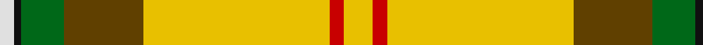

**Bands:** [YYRYGGKW](/stripes/yyryggkw/) · **Stripes:** [LY LY R LY DY G K W](/stripes/stripes8/) LY LY R LY DY G K W

This was sourced from house-of-tartan.  It is a [8 band tartan](/bands/bands8/).

Original link http://www.house-of-tartan.scotland.net/house/TartanViewjs.asp?colr=Def&tnam=1817

## Thread count
LN/4 K2 G12 T22 Y52 R4 Y2 Ya/4

## Palette
Each colour and its ΔE from the base-6 reference it is a variant of.

| Colour | Shade | Base | ΔE (OKLab) |
|---|---|---|---|
| G | <code style="background-color:#006818;">#006818</code> `#006818` | G <code style="background-color:#006100;">#006100</code> | 0.02 |
| K | <code style="background-color:#101010;">#101010</code> `#101010` | K <code style="background-color:#000000;">#000000</code> | 0.17 |
| LN | <code style="background-color:#E0E0E0;">#E0E0E0</code> `#E0E0E0` | W <code style="background-color:#F7F7F7;">#F7F7F7</code> | 0.07 |
| R | <code style="background-color:#C80000;">#C80000</code> `#C80000` | R <code style="background-color:#CC0000;">#CC0000</code> | 0.01 |
| T | <code style="background-color:#604000;">#604000</code> `#604000` | G <code style="background-color:#006100;">#006100</code> | 0.14 |
| Y | <code style="background-color:#E8C000;">#E8C000</code> `#E8C000` | Y <code style="background-color:#F2BF00;">#F2BF00</code> | 0.02 |
| Ya | <code style="background-color:#E8C000;">#E8C000</code> `#E8C000` | Y <code style="background-color:#F2BF00;">#F2BF00</code> | 0.02 |

# Sample pattern

## Nearest tartans

The nearest existing variants by ΔTartan distance.

1. [Essex, County Ontario](/setts/s10/ly30k1r4k1g3g5dg4t6r2w2~x2/) — ΔT 1.22
1. [Saskatchewan (District)](/setts/s8/w2k1g6dy11lo26r2lo1ly2~x2/) — ΔT 1.29
1. [Essex County (Ontario)](/setts/s10/ly30k1r4k1g3dg5dg4t6r2lb2~x2/) — ΔT 1.50
1. [Baxter Clan Tartan Tartan Number: 175. Earliest known date: 1856 A discription of this sett is given in The Baronage of Angus and Mearns (1856). See products available Copyright © Blair Urquhart, Comrie, 2015](/setts/s11/w2r16k1t2k1ly43k1t2k1g16t1~x2/) — ΔT 1.54
1. [Red Rum Commemorative Tartan Tartan Number: 1217. Earliest known date: 1982 Red Remony See products available Copyright © Blair Urquhart, Comrie, 2015](/setts/s7/k2ly30g4w2g14r13ly2~x2/) — ΔT 1.62
1. [Saskatchewan](/setts/s8/w2k1dg6o11lo26r2lo1ly2~x2/) — ΔT 1.65
1. [McAleavy (2014)](/setts/s11/y56lb6ly6ly2w2ly2w16lb10w2y6r3~x2/) — ΔT 1.71
1. [Murison, Ina](/setts/s12/k4ly11k4g3k4r6ly3g3ly4g1ly30g3~x2/) — ΔT 1.78
1. [Shawn Jones Afghan Memorial, The](/setts/s6/r12g4k8dr3ly62r8~x2/) — ΔT 1.90
1. [Saskatchewan](/setts/s14/w2k1g6dy11lo26r2lo1ly2~x2/) — ΔT 1.96

## Neighbour map

Every grey dot is one of 14299 variants placed by the first two principal components of the ΔTartan feature space (44% of its variance). Red is this tartan; blue dots are its nearest — click one to open its page.

<svg viewBox="0 0 640 380" role="img" style="max-width:100%;height:auto;border:1px solid #e0e0e0;border-radius:4px;display:block" xmlns="http://www.w3.org/2000/svg"><image href="/nn/cloud.v1.png" width="640" height="380"/><a href="/setts/s10/ly30k1r4k1g3g5dg4t6r2w2~x2/"><circle cx="216.1" cy="24.4" r="4" fill="#3465a4"><title>Essex, County Ontario</title></circle></a><a href="/setts/s8/w2k1g6dy11lo26r2lo1ly2~x2/"><circle cx="289.2" cy="87.2" r="4" fill="#3465a4"><title>Saskatchewan (District)</title></circle></a><a href="/setts/s10/ly30k1r4k1g3dg5dg4t6r2lb2~x2/"><circle cx="236.2" cy="37.8" r="4" fill="#3465a4"><title>Essex County (Ontario)</title></circle></a><a href="/setts/s11/w2r16k1t2k1ly43k1t2k1g16t1~x2/"><circle cx="281.0" cy="33.3" r="4" fill="#3465a4"><title>Baxter Clan Tartan Tartan Number: 175. Earliest known date: 1856 A discription of this sett is given in The Baronage of Angus and Mearns (1856). See products available Copyright © Blair Urquhart, Comrie, 2015</title></circle></a><a href="/setts/s7/k2ly30g4w2g14r13ly2~x2/"><circle cx="194.8" cy="122.0" r="4" fill="#3465a4"><title>Red Rum Commemorative Tartan Tartan Number: 1217. Earliest known date: 1982 Red Remony See products available Copyright © Blair Urquhart, Comrie, 2015</title></circle></a><a href="/setts/s8/w2k1dg6o11lo26r2lo1ly2~x2/"><circle cx="291.5" cy="83.5" r="4" fill="#3465a4"><title>Saskatchewan</title></circle></a><a href="/setts/s11/y56lb6ly6ly2w2ly2w16lb10w2y6r3~x2/"><circle cx="294.1" cy="59.5" r="4" fill="#3465a4"><title>McAleavy (2014)</title></circle></a><a href="/setts/s12/k4ly11k4g3k4r6ly3g3ly4g1ly30g3~x2/"><circle cx="311.1" cy="60.6" r="4" fill="#3465a4"><title>Murison, Ina</title></circle></a><a href="/setts/s6/r12g4k8dr3ly62r8~x2/"><circle cx="340.3" cy="102.5" r="4" fill="#3465a4"><title>Shawn Jones Afghan Memorial, The</title></circle></a><a href="/setts/s14/w2k1g6dy11lo26r2lo1ly2~x2/"><circle cx="300.4" cy="73.2" r="4" fill="#3465a4"><title>Saskatchewan</title></circle></a><circle cx="255.5" cy="68.1" r="5" fill="#c00000"/></svg>

ID: /setts/s8/w2k1g6dy11ly26r2ly1ly2~x2/
