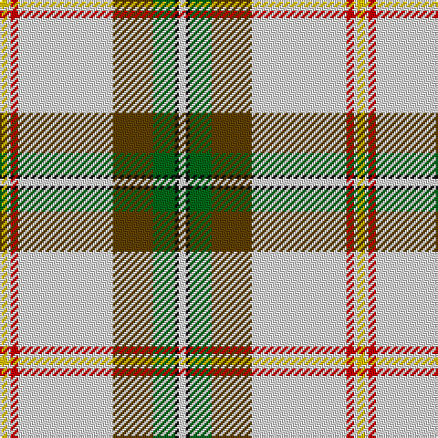

This page is one **sett** — a single exact thread-count. It belongs to the [tartan](/tartans/w2k1g6dy11w26r2w1ly2/)
(the same proportion at any scale), whose colour order is pattern [WKGGWRWY](/stripes/wkggwrwy/).

Sourced from tartans-authority.  It is a [8 stripe tartan](/stripes/stripes8/).

Original link http://www.tartansauthority.com/tartan-ferret/display/7696/

2 attestations — the source records this cloth was collapsed from (oldest owns this page)

<ul>
<li>1977 — Saskatchewan Dress (Dance) (tartans-authority, <a href="http://www.tartansauthority.com/tartan-ferret/display/7696/">record</a>)</li>
<li>undated — Saskatchewan Dress (register-of-tartans, <a href="https://www.tartanregister.gov.uk/tartanDetails.aspx?ref=5693">record</a>)</li>
</ul>

## Register references

External register numbers recorded for this tartan.

- Scottish Register of Tartans: [5693](https://www.tartanregister.gov.uk/tartanDetails.aspx?ref=5693)
- Scottish Tartans Authority (ITI): 7696

## Thread count
Y/4 LN2 R4 LN52 T22 G12 K2 LN/4

## Palette

Palette: <strong>Tartan Register</strong>
<table><thead><tr><th>Colour</th><th>Threads</th><th>Shade</th><th>Base</th><th>OKLCh</th></tr></thead><tbody><tr><td>Y/</td><td style="text-align:right;font-variant-numeric:tabular-nums">4</td><td><code style="background-color:#E8C000;">#E8C000</code> <small style="color:#888">#E8C000</small></td><td>Y <code style="background-color:#F2BF00;">#F2BF00</code></td><td><small style="color:#888">oklch(81.9% 0.168 93.7)</small></td></tr><tr><td>LN</td><td style="text-align:right;font-variant-numeric:tabular-nums">2</td><td><code style="background-color:#E0E0E0;">#E0E0E0</code> <small style="color:#888">#E0E0E0</small></td><td>W <code style="background-color:#F7F7F7;">#F7F7F7</code></td><td><small style="color:#888">oklch(90.7% 0.000 89.9)</small></td></tr><tr><td>R</td><td style="text-align:right;font-variant-numeric:tabular-nums">4</td><td><code style="background-color:#C80000;">#C80000</code> <small style="color:#888">#C80000</small></td><td>R <code style="background-color:#CC0000;">#CC0000</code></td><td><small style="color:#888">oklch(52.3% 0.215 29.2)</small></td></tr><tr><td>LN</td><td style="text-align:right;font-variant-numeric:tabular-nums">52</td><td><code style="background-color:#E0E0E0;">#E0E0E0</code> <small style="color:#888">#E0E0E0</small></td><td>W <code style="background-color:#F7F7F7;">#F7F7F7</code></td><td><small style="color:#888">oklch(90.7% 0.000 89.9)</small></td></tr><tr><td>T</td><td style="text-align:right;font-variant-numeric:tabular-nums">22</td><td><code style="background-color:#604000;">#604000</code> <small style="color:#888">#604000</small></td><td>G <code style="background-color:#006100;">#006100</code></td><td><small style="color:#888">oklch(39.8% 0.083 76.8)</small></td></tr><tr><td>G</td><td style="text-align:right;font-variant-numeric:tabular-nums">12</td><td><code style="background-color:#006818;">#006818</code> <small style="color:#888">#006818</small></td><td>G <code style="background-color:#006100;">#006100</code></td><td><small style="color:#888">oklch(45.0% 0.142 145.0)</small></td></tr><tr><td>K</td><td style="text-align:right;font-variant-numeric:tabular-nums">2</td><td><code style="background-color:#101010;">#101010</code> <small style="color:#888">#101010</small></td><td>K <code style="background-color:#000000;">#000000</code></td><td><small style="color:#888">oklch(17.3% 0.000 89.9)</small></td></tr><tr><td>LN/</td><td style="text-align:right;font-variant-numeric:tabular-nums">4</td><td><code style="background-color:#E0E0E0;">#E0E0E0</code> <small style="color:#888">#E0E0E0</small></td><td>W <code style="background-color:#F7F7F7;">#F7F7F7</code></td><td><small style="color:#888">oklch(90.7% 0.000 89.9)</small></td></tr></tbody></table>

# Sample pattern

## Nearest tartans

The nearest existing variants by ΔTartan distance, with this tartan at the top so the swatches line up against it.

ΔTartan

Tartan

Sett

—

<a href="/ttd/edit/#slug=w2k1g6dy11w26r2w1ly2~x2">Saskatchewan Dress (Dance)</a> <a class="nn-out" href="/setts/s8/w2k1g6dy11w26r2w1ly2~x2/" title="open its dictionary page">↗</a>

1.15

<a href="/ttd/edit/#slug=y56lr6w6ly2w2ly2w16lr10w2y6r3~x2">McAleavy (2014)</a> <a class="nn-out" href="/setts/s11/y56lr6w6ly2w2ly2w16lr10w2y6r3~x2/" title="open its dictionary page">↗</a>

1.15

<a href="/ttd/edit/#slug=w50g15db10r2db10g8ly3~x2">Nimah, Carissa &amp; Bassem (Personal)</a> <a class="nn-out" href="/setts/s7/w50g15db10r2db10g8ly3~x2/" title="open its dictionary page">↗</a>

1.29

<a href="/ttd/edit/#slug=y56lb6ly6ly2w2ly2w16lb10w2y6r3~x2">McAleavy (2014)</a> <a class="nn-out" href="/setts/s11/y56lb6ly6ly2w2ly2w16lb10w2y6r3~x2/" title="open its dictionary page">↗</a>

1.29

<a href="/ttd/edit/#slug=w55dg12r2dg3w2g10dp9dg2dp6w2~x2">Strathyre Dress (Dance)</a> <a class="nn-out" href="/setts/s10/w55dg12r2dg3w2g10dp9dg2dp6w2~x2/" title="open its dictionary page">↗</a>

1.29

<a href="/ttd/edit/#slug=w50o4lo2k2lo2o4lo10o15t2~x2">Australian, dress</a> <a class="nn-out" href="/setts/s9/w50o4lo2k2lo2o4lo10o15t2~x2/" title="open its dictionary page">↗</a>

1.30

<a href="/ttd/edit/#slug=lo10dg1k2b2k18b1w45b1~x2">Highland Burn (Fashion)</a> <a class="nn-out" href="/setts/s8/lo10dg1k2b2k18b1w45b1~x2/" title="open its dictionary page">↗</a>

1.31

<a href="/ttd/edit/#slug=lb24r2lb3dy1ly1dy1lb1dy6o6b1o2lb1~x4">Unidentified #54</a> <a class="nn-out" href="/setts/s12/lb24r2lb3dy1ly1dy1lb1dy6o6b1o2lb1~x4/" title="open its dictionary page">↗</a>

1.34

<a href="/ttd/edit/#slug=w3k1w20dp1db6g6m3g1m1g2~x4">Scotland the Brave Dress (Dance)</a> <a class="nn-out" href="/setts/s10/w3k1w20dp1db6g6m3g1m1g2~x4/" title="open its dictionary page">↗</a>

1.38

<a href="/ttd/edit/#slug=r2w28db4w2k6w2g7r4k1r2w1~x2">Rothesay, Duke of</a> <a class="nn-out" href="/setts/s11/r2w28db4w2k6w2g7r4k1r2w1~x2/" title="open its dictionary page">↗</a>

1.42

<a href="/ttd/edit/#slug=w38k10do2k3w2k3y8o3k2o3w2~x2">Glenmore Green</a> <a class="nn-out" href="/setts/s11/w38k10do2k3w2k3y8o3k2o3w2~x2/" title="open its dictionary page">↗</a>

## Neighbour map

Every grey dot is one of 14299 variants placed by the first two principal components of the ΔTartan feature space (44% of its variance). Red is this tartan; blue dots are its nearest — click one to open its page.

<svg viewBox="0 0 640 380" role="img" style="max-width:100%;height:auto;border:1px solid #e0e0e0;border-radius:4px;display:block" xmlns="http://www.w3.org/2000/svg"><image href="/nn/cloud.v1.png" width="640" height="380"/><a href="/setts/s11/y56lr6w6ly2w2ly2w16lr10w2y6r3~x2/"><circle cx="293.1" cy="60.3" r="4" fill="#3465a4"><title>McAleavy (2014)</title></circle></a><a href="/setts/s7/w50g15db10r2db10g8ly3~x2/"><circle cx="219.3" cy="89.8" r="4" fill="#3465a4"><title>Nimah, Carissa &amp; Bassem (Personal)</title></circle></a><a href="/setts/s11/y56lb6ly6ly2w2ly2w16lb10w2y6r3~x2/"><circle cx="294.1" cy="59.5" r="4" fill="#3465a4"><title>McAleavy (2014)</title></circle></a><a href="/setts/s10/w55dg12r2dg3w2g10dp9dg2dp6w2~x2/"><circle cx="295.7" cy="62.5" r="4" fill="#3465a4"><title>Strathyre Dress (Dance)</title></circle></a><a href="/setts/s9/w50o4lo2k2lo2o4lo10o15t2~x2/"><circle cx="319.0" cy="83.9" r="4" fill="#3465a4"><title>Australian, dress</title></circle></a><a href="/setts/s8/lo10dg1k2b2k18b1w45b1~x2/"><circle cx="299.6" cy="46.4" r="4" fill="#3465a4"><title>Highland Burn (Fashion)</title></circle></a><a href="/setts/s12/lb24r2lb3dy1ly1dy1lb1dy6o6b1o2lb1~x4/"><circle cx="318.4" cy="58.4" r="4" fill="#3465a4"><title>Unidentified #54</title></circle></a><a href="/setts/s10/w3k1w20dp1db6g6m3g1m1g2~x4/"><circle cx="222.3" cy="71.6" r="4" fill="#3465a4"><title>Scotland the Brave Dress (Dance)</title></circle></a><a href="/setts/s11/r2w28db4w2k6w2g7r4k1r2w1~x2/"><circle cx="276.0" cy="63.6" r="4" fill="#3465a4"><title>Rothesay, Duke of</title></circle></a><a href="/setts/s11/w38k10do2k3w2k3y8o3k2o3w2~x2/"><circle cx="267.0" cy="73.7" r="4" fill="#3465a4"><title>Glenmore Green</title></circle></a><circle cx="281.9" cy="76.3" r="5" fill="#c00000"/></svg>

ID: /setts/s8/w2k1g6dy11w26r2w1ly2~x2/
