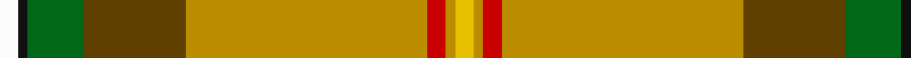
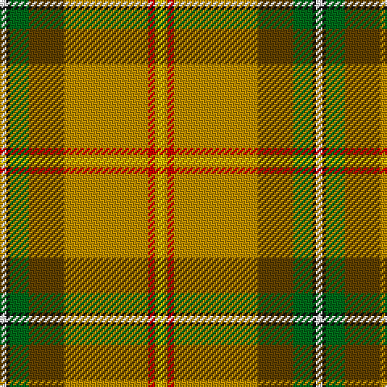

In pattern [WKGGYRYY](/patterns/wkggyryy/).

This was sourced from tartans-authority.  It is a [8 stripes tartan](/stripes/stripes8/).

Original link http://www.tartansauthority.com/tartan-ferret/display/1817/

## Thread count
W/4 K2 G12 T22 DY52 R4 DY2 Y/4

## Palette
Each colour and its ΔE from the base-6 reference it is a variant of.

| Colour | Shade | Base | ΔE (OKLab) |
|---|---|---|---|
| DY | <code style="background-color:#BC8C00;">#BC8C00</code> `#BC8C00` | Y <code style="background-color:#F2BF00;">#F2BF00</code> | 0.16 |
| G | <code style="background-color:#006818;">#006818</code> `#006818` | G <code style="background-color:#006100;">#006100</code> | 0.02 |
| K | <code style="background-color:#101010;">#101010</code> `#101010` | K <code style="background-color:#000000;">#000000</code> | 0.17 |
| R | <code style="background-color:#C80000;">#C80000</code> `#C80000` | R <code style="background-color:#CC0000;">#CC0000</code> | 0.01 |
| T | <code style="background-color:#604000;">#604000</code> `#604000` | G <code style="background-color:#006100;">#006100</code> | 0.14 |
| W | <code style="background-color:#FCFCFC;">#FCFCFC</code> `#FCFCFC` | W <code style="background-color:#F7F7F7;">#F7F7F7</code> | 0.01 |
| Y | <code style="background-color:#E8C000;">#E8C000</code> `#E8C000` | Y <code style="background-color:#F2BF00;">#F2BF00</code> | 0.02 |

# Sample pattern

## Nearest tartans

The nearest existing variants by ΔTartan distance.

1. [Saskatchewan](/setts/s8/w2k1g6r11y26ra2y1ya2x2~g004010-k000000-r806050-rac00000-we0e0e0-yd08010-yaf0c000/) — ΔT 0.74
1. [Saskatchewan](/setts/s14/w2k1g6ga11y26r2y1ya2y1r2y26ga11g6k1x2~g006818-ga604000-k101010-rc80000-wfcfcfc-ybc8c00-yae8c000/) — ΔT 1.22
1. [Saskatchewan District Tartan Tartan Number: 1817. Earliest known date: 1959 The colours chosen are the same as those for the flag. Red for the Blood of Christ, blue for the Heavenly Father, yellow for Fire of the Holy Spirit when tongues of fire symbolized his presence at Penticost. See products available Copyright © Blair Urquhart, Comrie, 2015](/setts/s8/w2k1g6ga11y26r2y1y2x2~g006818-ga604000-k101010-rc80000-we0e0e0-ye8c000/) — ΔT 1.29
1. [Essex County (Ontario)](/setts/s10/y30k1r4k1g3ga5gb4b6r2w2x2~b788cb4-g007c00-ga005800-gb003000-k000000-r8c0000-wc8c8c8-yc89800/) — ΔT 1.44
1. [Essex County Ontario District Tartan Tartan Number: 1840. Earliest known date: 1985 The Essex County district tartan was designed by Mrs Edyth Baker of Leamington, Ontario, Canada in 1983. She used colours representing the various industries of the region; agriculture, salt mining, car building anf fishing. Azure blue symbolizes the sky and the water. The tartan was formally adopted by the Corporation of the County of Essex in 1984, and approved by the Leamington Council. The tartan is accredited by the Scottish Tartans Society. (STS archive) See products available Copyright © Blair Urquhart, Comrie, 2015](/setts/s10/y30k1r4k1g3ga5gb4b6r2w2x2~b5c8ca8-g289c18-ga006818-gb003820-k101010-rc80000-we0e0e0-ye8c000/) — ΔT 1.76
1. [Muirhead (Original)](/setts/s11/y6ya48b8ya16w4ya3g19r24ya4r9w4~b2c2c80-g006818-rc80000-we0e0e0-ye8c000-yaa08858/) — ΔT 1.87
1. [Essex, County Ontario](/setts/s10/y30k1r4k1g3ga5gb4b6r2w2x2~b5480b0-g30a010-ga008000-gb003000-k000000-rc00000-we0e0e0-yf0c000/) — ΔT 1.93
1. [Baxter Clan Tartan Tartan Number: 175. Earliest known date: 1856 A discription of this sett is given in The Baronage of Angus and Mearns (1856). See products available Copyright © Blair Urquhart, Comrie, 2015](/setts/s11/w2r16k1b2k1y43k1b2k1g16b1x2~b5c8ca8-g006818-k101010-rc80000-we0e0e0-ye8c000/) — ΔT 1.97
1. [California Department of Forestry (Corporate)](/setts/s11/g30ga5gb3r1gb3k1gb3r1gb3b1y1x4~b1c0070-g8c7038-ga003820-gb289c18-k101010-rc80000-yd09800/) — ΔT 1.97
1. [McAleavy (2014)](/setts/s11/g56w6y6ya2wa2ya2wa16w10wa2g6r3x2~g606000-rc80000-wc0c0c0-wafcfcfc-yc4bc68-yafccc00/) — ΔT 1.98

## Neighbour map

Every grey dot is one of 15726 variants placed by the first two principal components of the ΔTartan feature space (44% of its variance). Red is this tartan; blue dots are its nearest — click one to open its page.

<svg viewBox="0 0 640 380" role="img" style="max-width:100%;height:auto;border:1px solid #e0e0e0;border-radius:4px;display:block" xmlns="http://www.w3.org/2000/svg"><image href="/nn/cloud.v1.png" width="640" height="380"/><a href="/setts/s8/w2k1g6r11y26ra2y1ya2x2~g004010-k000000-r806050-rac00000-we0e0e0-yd08010-yaf0c000/"><circle cx="291.3" cy="81.5" r="4" fill="#3465a4"><title>Saskatchewan</title></circle></a><a href="/setts/s14/w2k1g6ga11y26r2y1ya2y1r2y26ga11g6k1x2~g006818-ga604000-k101010-rc80000-wfcfcfc-ybc8c00-yae8c000/"><circle cx="299.9" cy="69.3" r="4" fill="#3465a4"><title>Saskatchewan</title></circle></a><a href="/setts/s8/w2k1g6ga11y26r2y1y2x2~g006818-ga604000-k101010-rc80000-we0e0e0-ye8c000/"><circle cx="254.6" cy="69.1" r="4" fill="#3465a4"><title>Saskatchewan District Tartan Tartan Number: 1817. Earliest known date: 1959 The colours chosen are the same as those for the flag. Red for the Blood of Christ, blue for the Heavenly Father, yellow for Fire of the Holy Spirit when tongues of fire symbolized his presence at Penticost. See products available Copyright © Blair Urquhart, Comrie, 2015</title></circle></a><a href="/setts/s10/y30k1r4k1g3ga5gb4b6r2w2x2~b788cb4-g007c00-ga005800-gb003000-k000000-r8c0000-wc8c8c8-yc89800/"><circle cx="234.8" cy="36.2" r="4" fill="#3465a4"><title>Essex County (Ontario)</title></circle></a><a href="/setts/s10/y30k1r4k1g3ga5gb4b6r2w2x2~b5c8ca8-g289c18-ga006818-gb003820-k101010-rc80000-we0e0e0-ye8c000/"><circle cx="222.5" cy="28.4" r="4" fill="#3465a4"><title>Essex County Ontario District Tartan Tartan Number: 1840. Earliest known date: 1985 The Essex County district tartan was designed by Mrs Edyth Baker of Leamington, Ontario, Canada in 1983. She used colours representing the various industries of the region; agriculture, salt mining, car building anf fishing. Azure blue symbolizes the sky and the water. The tartan was formally adopted by the Corporation of the County of Essex in 1984, and approved by the Leamington Council. The tartan is accredited by the Scottish Tartans Society. (STS archive) See products available Copyright © Blair Urquhart, Comrie, 2015</title></circle></a><a href="/setts/s11/y6ya48b8ya16w4ya3g19r24ya4r9w4~b2c2c80-g006818-rc80000-we0e0e0-ye8c000-yaa08858/"><circle cx="248.0" cy="121.1" r="4" fill="#3465a4"><title>Muirhead (Original)</title></circle></a><a href="/setts/s10/y30k1r4k1g3ga5gb4b6r2w2x2~b5480b0-g30a010-ga008000-gb003000-k000000-rc00000-we0e0e0-yf0c000/"><circle cx="214.8" cy="25.0" r="4" fill="#3465a4"><title>Essex, County Ontario</title></circle></a><a href="/setts/s11/w2r16k1b2k1y43k1b2k1g16b1x2~b5c8ca8-g006818-k101010-rc80000-we0e0e0-ye8c000/"><circle cx="280.1" cy="34.7" r="4" fill="#3465a4"><title>Baxter Clan Tartan Tartan Number: 175. Earliest known date: 1856 A discription of this sett is given in The Baronage of Angus and Mearns (1856). See products available Copyright © Blair Urquhart, Comrie, 2015</title></circle></a><a href="/setts/s11/g30ga5gb3r1gb3k1gb3r1gb3b1y1x4~b1c0070-g8c7038-ga003820-gb289c18-k101010-rc80000-yd09800/"><circle cx="371.4" cy="68.9" r="4" fill="#3465a4"><title>California Department of Forestry (Corporate)</title></circle></a><a href="/setts/s11/g56w6y6ya2wa2ya2wa16w10wa2g6r3x2~g606000-rc80000-wc0c0c0-wafcfcfc-yc4bc68-yafccc00/"><circle cx="292.5" cy="60.7" r="4" fill="#3465a4"><title>McAleavy (2014)</title></circle></a><circle cx="288.5" cy="84.7" r="5" fill="#c00000"/></svg>

ID: /setts/s8/w2k1g6ga11y26r2y1ya2x2~g006818-ga604000-k101010-rc80000-wfcfcfc-ybc8c00-yae8c000/
