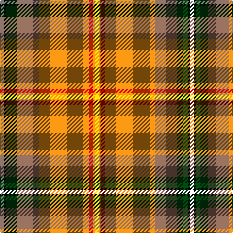

In pattern [WKGRYRYY](/patterns/wkgryryy/).

This was sourced from weddslist.  It is a [8 stripes tartan](/stripes/stripes8/).

Original link http://www.weddslist.com/cgi-bin/tartans/pg.pl?source=sts

## Thread count
LN/4 K2 DG12 LT22 O52 R4 O2 Y/4

## Palette
Each colour and its ΔE from the base-6 reference it is a variant of.

| Colour | Shade | Base | ΔE (OKLab) |
|---|---|---|---|
| DG | <code style="background-color:#004010;">#004010</code> `#004010` | G <code style="background-color:#006100;">#006100</code> | 0.11 |
| K | <code style="background-color:#000000;">#000000</code> `#000000` | K <code style="background-color:#000000;">#000000</code> | 0.00 |
| LN | <code style="background-color:#E0E0E0;">#E0E0E0</code> `#E0E0E0` | W <code style="background-color:#F7F7F7;">#F7F7F7</code> | 0.07 |
| LT | <code style="background-color:#806050;">#806050</code> `#806050` | R <code style="background-color:#CC0000;">#CC0000</code> | 0.17 |
| O | <code style="background-color:#D08010;">#D08010</code> `#D08010` | Y <code style="background-color:#F2BF00;">#F2BF00</code> | 0.17 |
| R | <code style="background-color:#C00000;">#C00000</code> `#C00000` | R <code style="background-color:#CC0000;">#CC0000</code> | 0.03 |
| Y | <code style="background-color:#F0C000;">#F0C000</code> `#F0C000` | Y <code style="background-color:#F2BF00;">#F2BF00</code> | 0.00 |

# Sample pattern

## Nearest tartans

The nearest existing variants by ΔTartan distance.

1. [Saskatchewan (District)](/setts/s8/w2k1g6ga11y26r2y1ya2~g006818-ga604000-k101010-rc80000-wfcfcfc-ybc8c00-yae8c000~x2/) — ΔT 0.74
1. [Saskatchewan](/setts/s14/w2k1g6ga11y26r2y1ya2y1r2y26ga11g6k1~g006818-ga604000-k101010-rc80000-wfcfcfc-ybc8c00-yae8c000~x2/) — ΔT 1.44
1. [Drummond, (Fingask)](/setts/s8/r22b3y1g12r6b3ba3w1~b304080-ba5480b0-g008000-rc00000-we0e0e0-yf0c000~x2/) — ΔT 1.56
1. [Essex County (Ontario)](/setts/s10/y30k1r4k1g3ga5gb4b6r2w2~b788cb4-g007c00-ga005800-gb003000-k000000-r8c0000-wc8c8c8-yc89800~x2/) — ΔT 1.60
1. [Saskatchewan District Tartan Tartan Number: 1817. Earliest known date: 1959 The colours chosen are the same as those for the flag. Red for the Blood of Christ, blue for the Heavenly Father, yellow for Fire of the Holy Spirit when tongues of fire symbolized his presence at Penticost. See products available Copyright © Blair Urquhart, Comrie, 2015](/setts/s8/w2k1g6ga11y26r2y1y2~g006818-ga604000-k101010-rc80000-we0e0e0-ye8c000~x2/) — ΔT 1.64
1. [Muirhead (Original)](/setts/s11/y6ya48b8ya16w4ya3g19r24ya4r9w4~b2c2c80-g006818-rc80000-we0e0e0-ye8c000-yaa08858/) — ΔT 1.66
1. [Sri Lanka](/setts/s13/y18r3g30b4k2w2k2b4r37ya1r3ya1r3~b1474b4-g006818-k101010-rc80000-we0e0e0-yd87c00-yae8c000~x2/) — ΔT 1.73
1. [Caledonian Society Ancient Artifact Tartan Tartan Number: 1554. Earliest known date: 1847 Coat at Banff museum. The MacPherson of MacPherson's Rant was hanged at Banff market cross. See products available Copyright © Blair Urquhart, Comrie, 2015](/setts/s8/r40g16y2k8b4w1ba5w2~b5c8ca8-ba2c2c80-g006818-k101010-rc80000-we0e0e0-ye8c000~x2/) — ΔT 1.75
1. [Ancient Caledonian Society](/setts/s8/r40g16y2k8ga4w1b5w2~b2c2c80-g006818-ga789484-k101010-rc80000-wf8f8f8-ye8c000~x2/) — ΔT 1.75
1. [Gordon of Abergeldie (Red..) Portrait Tartan Tartan Number: 955. Earliest known date: 1723 This sett was reconstructed from a scarf in a painting of Rachael Gordon, hanging in Abergeldie Castle, painted by Alexander in 1723. The count and colour desciption was taken by the Lord Lyon in 1953. See products available Copyright © Blair Urquhart, Comrie, 2015](/setts/s6/r20w1k1ra6y1g18~g006818-k101010-rc80000-rab468ac-we0e0e0-ye8c000~x2/) — ΔT 1.77

## Neighbour map

Every grey dot is one of 15726 variants placed by the first two principal components of the ΔTartan feature space (44% of its variance). Red is this tartan; blue dots are its nearest — click one to open its page.

<svg viewBox="0 0 640 380" role="img" style="max-width:100%;height:auto;border:1px solid #e0e0e0;border-radius:4px;display:block" xmlns="http://www.w3.org/2000/svg"><image href="/nn/cloud.v1.png" width="640" height="380"/><a href="/setts/s8/w2k1g6ga11y26r2y1ya2~g006818-ga604000-k101010-rc80000-wfcfcfc-ybc8c00-yae8c000~x2/"><circle cx="288.5" cy="84.7" r="4" fill="#3465a4"><title>Saskatchewan (District)</title></circle></a><a href="/setts/s14/w2k1g6ga11y26r2y1ya2y1r2y26ga11g6k1~g006818-ga604000-k101010-rc80000-wfcfcfc-ybc8c00-yae8c000~x2/"><circle cx="299.9" cy="69.3" r="4" fill="#3465a4"><title>Saskatchewan</title></circle></a><a href="/setts/s8/r22b3y1g12r6b3ba3w1~b304080-ba5480b0-g008000-rc00000-we0e0e0-yf0c000~x2/"><circle cx="307.7" cy="115.9" r="4" fill="#3465a4"><title>Drummond, (Fingask)</title></circle></a><a href="/setts/s10/y30k1r4k1g3ga5gb4b6r2w2~b788cb4-g007c00-ga005800-gb003000-k000000-r8c0000-wc8c8c8-yc89800~x2/"><circle cx="234.8" cy="36.2" r="4" fill="#3465a4"><title>Essex County (Ontario)</title></circle></a><a href="/setts/s8/w2k1g6ga11y26r2y1y2~g006818-ga604000-k101010-rc80000-we0e0e0-ye8c000~x2/"><circle cx="254.6" cy="69.1" r="4" fill="#3465a4"><title>Saskatchewan District Tartan Tartan Number: 1817. Earliest known date: 1959 The colours chosen are the same as those for the flag. Red for the Blood of Christ, blue for the Heavenly Father, yellow for Fire of the Holy Spirit when tongues of fire symbolized his presence at Penticost. See products available Copyright © Blair Urquhart, Comrie, 2015</title></circle></a><a href="/setts/s11/y6ya48b8ya16w4ya3g19r24ya4r9w4~b2c2c80-g006818-rc80000-we0e0e0-ye8c000-yaa08858/"><circle cx="248.0" cy="121.1" r="4" fill="#3465a4"><title>Muirhead (Original)</title></circle></a><a href="/setts/s13/y18r3g30b4k2w2k2b4r37ya1r3ya1r3~b1474b4-g006818-k101010-rc80000-we0e0e0-yd87c00-yae8c000~x2/"><circle cx="237.2" cy="38.3" r="4" fill="#3465a4"><title>Sri Lanka</title></circle></a><a href="/setts/s8/r40g16y2k8b4w1ba5w2~b5c8ca8-ba2c2c80-g006818-k101010-rc80000-we0e0e0-ye8c000~x2/"><circle cx="277.6" cy="58.8" r="4" fill="#3465a4"><title>Caledonian Society Ancient Artifact Tartan Tartan Number: 1554. Earliest known date: 1847 Coat at Banff museum. The MacPherson of MacPherson's Rant was hanged at Banff market cross. See products available Copyright © Blair Urquhart, Comrie, 2015</title></circle></a><a href="/setts/s8/r40g16y2k8ga4w1b5w2~b2c2c80-g006818-ga789484-k101010-rc80000-wf8f8f8-ye8c000~x2/"><circle cx="275.0" cy="57.5" r="4" fill="#3465a4"><title>Ancient Caledonian Society</title></circle></a><a href="/setts/s6/r20w1k1ra6y1g18~g006818-k101010-rc80000-rab468ac-we0e0e0-ye8c000~x2/"><circle cx="253.5" cy="132.3" r="4" fill="#3465a4"><title>Gordon of Abergeldie (Red..) Portrait Tartan Tartan Number: 955. Earliest known date: 1723 This sett was reconstructed from a scarf in a painting of Rachael Gordon, hanging in Abergeldie Castle, painted by Alexander in 1723. The count and colour desciption was taken by the Lord Lyon in 1953. See products available Copyright © Blair Urquhart, Comrie, 2015</title></circle></a><circle cx="291.3" cy="81.5" r="5" fill="#c00000"/></svg>

ID: /setts/s8/w2k1g6r11y26ra2y1ya2~g004010-k000000-r806050-rac00000-we0e0e0-yd08010-yaf0c000~x2/
