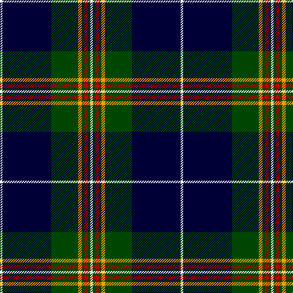

**Bands:** [WGRGYGKW](/stripes/wgrgygkw/) · **Stripes:** [W DG R DG LO DG K W](/stripes/stripes8/) W DG R DG LO DG K W

This was sourced from register-of-tartans.  It is a [8 band tartan](/bands/bands8/).

Original link https://www.tartanregister.gov.uk/tartanDetails.aspx?ref=10059

## Register references

External register numbers recorded for this tartan.

- Scottish Register of Tartans: [10059](https://www.tartanregister.gov.uk/tartanDetails.aspx?ref=10059)

## Thread count
W/4 DB80 G44 Y6 G4 R6 G4 W/4

## Palette
Each colour and its ΔE from the base-6 reference it is a variant of.

| Colour | Shade | Base | ΔE (OKLab) |
|---|---|---|---|
| DB | <code style="background-color:#000037;">#000037</code> `#000037` | K <code style="background-color:#000000;">#000000</code> | 0.19 |
| G | <code style="background-color:#004600;">#004600</code> `#004600` | G <code style="background-color:#006100;">#006100</code> | 0.09 |
| R | <code style="background-color:#BD0000;">#BD0000</code> `#BD0000` | R <code style="background-color:#CC0000;">#CC0000</code> | 0.03 |
| W | <code style="background-color:#FFFFFF;">#FFFFFF</code> `#FFFFFF` | W <code style="background-color:#F7F7F7;">#F7F7F7</code> | 0.02 |
| Y | <code style="background-color:#FFA000;">#FFA000</code> `#FFA000` | Y <code style="background-color:#F2BF00;">#F2BF00</code> | 0.08 |

# Sample pattern

## Nearest tartans

The nearest existing variants by ΔTartan distance.

1. [Tartan Day SA (Corporate)](/setts/s8/w2db40g22ly3g2r3g2w2~x2/) — ΔT 0.97
1. [Hope-Weir / Weir](/setts/s8/k8ly1k1db28k12g2k1t2~x2/) — ΔT 1.08
1. [Kingsbarns Golf Links](/setts/s10/b8ly3k4g4k48b48g4b4r3k8/) — ΔT 1.13
1. [Sinclair-Brown](/setts/s8/db64k11r2k4r2k4g32y4~x2/) — ΔT 1.14
1. [East Tennessee State University](/setts/s7/lo2w1db6w1ly2k17ly1~x2/) — ΔT 1.15
1. [Ewbank](/setts/s9/r3b14ly2k2b14k36ly2k2ly2~x2/) — ΔT 1.16
1. [Todd](/setts/s9/dt40dg3k3dg12w3dg3w3dg3r3~x2/) — ΔT 1.22
1. [Glasgow, University of](/setts/s8/db2w2k2y2k7g4db22k2~x2/) — ΔT 1.22
1. [Italian American (Corporate)](/setts/s9/r4k2w6k2b40k80g10w6r3/) — ΔT 1.26
1. [Italian American](/setts/s9/r4k2w6k2db40k80dg10w6r3/) — ΔT 1.26

## Neighbour map

Every grey dot is one of 14313 variants placed by the first two principal components of the ΔTartan feature space (44% of its variance). Red is this tartan; blue dots are its nearest — click one to open its page.

<svg viewBox="0 0 640 380" role="img" style="max-width:100%;height:auto;border:1px solid #e0e0e0;border-radius:4px;display:block" xmlns="http://www.w3.org/2000/svg"><image href="/nn/cloud.v1.png" width="640" height="380"/><a href="/setts/s8/w2db40g22ly3g2r3g2w2~x2/"><circle cx="303.8" cy="124.8" r="4" fill="#3465a4"><title>Tartan Day SA (Corporate)</title></circle></a><a href="/setts/s8/k8ly1k1db28k12g2k1t2~x2/"><circle cx="320.5" cy="125.7" r="4" fill="#3465a4"><title>Hope-Weir / Weir</title></circle></a><a href="/setts/s10/b8ly3k4g4k48b48g4b4r3k8/"><circle cx="253.8" cy="129.5" r="4" fill="#3465a4"><title>Kingsbarns Golf Links</title></circle></a><a href="/setts/s8/db64k11r2k4r2k4g32y4~x2/"><circle cx="313.0" cy="115.8" r="4" fill="#3465a4"><title>Sinclair-Brown</title></circle></a><a href="/setts/s7/lo2w1db6w1ly2k17ly1~x2/"><circle cx="283.2" cy="132.6" r="4" fill="#3465a4"><title>East Tennessee State University</title></circle></a><a href="/setts/s9/r3b14ly2k2b14k36ly2k2ly2~x2/"><circle cx="308.9" cy="143.3" r="4" fill="#3465a4"><title>Ewbank</title></circle></a><a href="/setts/s9/dt40dg3k3dg12w3dg3w3dg3r3~x2/"><circle cx="304.5" cy="137.5" r="4" fill="#3465a4"><title>Todd</title></circle></a><a href="/setts/s8/db2w2k2y2k7g4db22k2~x2/"><circle cx="276.2" cy="154.6" r="4" fill="#3465a4"><title>Glasgow, University of</title></circle></a><a href="/setts/s9/r4k2w6k2b40k80g10w6r3/"><circle cx="328.9" cy="88.8" r="4" fill="#3465a4"><title>Italian American (Corporate)</title></circle></a><a href="/setts/s9/r4k2w6k2db40k80dg10w6r3/"><circle cx="341.6" cy="97.1" r="4" fill="#3465a4"><title>Italian American</title></circle></a><circle cx="302.6" cy="128.4" r="5" fill="#c00000"/></svg>

ID: /setts/s8/w2k40dg22lo3dg2r3dg2w2~x2/
