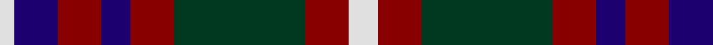

In pattern [WBRBRGRW](/patterns/wbrbrgrw/).

This was sourced from tartans-authority.  It is a [8 stripes tartan](/stripes/stripes8/).

Original link http://www.tartansauthority.com/tartan-ferret/display/2702/

## Attestations

This cloth appears in 3 source records; the oldest owns this page.

- 1995 — Utah (US State) (tartans-authority, [record](http://www.tartansauthority.com/tartan-ferret/display/2702/))
- 01/01/1997 — Utah (register-of-tartans, [record](https://www.tartanregister.gov.uk/tartanDetails.aspx?ref=4826))
- undated — Utah State American District Tartan Tartan Number: 2702. Earliest known date: 1995 Utah state tartan was commissioned by Garry Bryant, KdeB, KCR, SC, designed by Dr. Phil Smith and adopted by a joint committee of the state's Scottish Societies and made official by Senate Resolution. A combination of the Logan and Skene tartans to honour the first two fur trappers to enter Utah. Sample in STA Johnston Collection. Tartan Society notes add: It is the Logan Tartan TS399 with a white over check added and a blue substituted for a white. Ephraim Logan was an early visitor to Cache Valley in northern Utah in 1824 naming the river after his clan/family name. Official threadcount tripled. See products available Copyright © Blair Urquhart, Comrie, 2015 (house-of-tartan, [record](http://www.house-of-tartan.scotland.net/house/TartanViewjs.asp?colr=Def&tnam=2702))

## Thread count
LN/6 DB18 DR18 DB12 DR18 DG54 DR18 LN/12

## Palette
Each colour and its ΔE from the base-6 reference it is a variant of.

| Colour | Shade | Base | ΔE (OKLab) |
|---|---|---|---|
| DB | <code style="background-color:#1C0070;">#1C0070</code> `#1C0070` | B <code style="background-color:#2A418A;">#2A418A</code> | 0.14 |
| DG | <code style="background-color:#003820;">#003820</code> `#003820` | G <code style="background-color:#006100;">#006100</code> | 0.15 |
| DR | <code style="background-color:#880000;">#880000</code> `#880000` | R <code style="background-color:#CC0000;">#CC0000</code> | 0.15 |
| LN | <code style="background-color:#E0E0E0;">#E0E0E0</code> `#E0E0E0` | W <code style="background-color:#F7F7F7;">#F7F7F7</code> | 0.07 |

# Sample pattern

## Nearest tartans

The nearest existing variants by ΔTartan distance.

1. [Gordon of Esslemont Family Tartan Tartan Number: 1064. Earliest known date: c.1830 This sett is called 'Gordon of Esslemont' according to Captain Wolrige-Gordon of Esslemont in recent research. It was previously listed as 'Ancient Gordon' before the story of its origin came to light. Apparently the Duke of Gordon was offered tartans with one, two, and three stripes when he applied to Forsythe of Huntly to provide kilts for his troops. He chose the single stripe and called in the Heads of the families to choose from the others. Esslemont took the three stripe version. See products available Copyright © Blair Urquhart, Comrie, 2015](/setts/s7/y6g3y3g22k23b23k4~b780078-g006818-k101010-ye8c000~x2/) — ΔT 0.76
1. [Wilson's No.158](/setts/s10/g19w2g4k13b12k3b12k13g4w2~b780078-g006818-k101010-we0e0e0~x2/) — ΔT 0.78
1. [Wilson's No.076](/setts/s10/b17k18w2g17k3g17w2k18b17g3~b780078-g408060-k101010-wf8f8f8~x2/) — ΔT 0.80
1. [Wilson's No.160](/setts/s10/g19y2g4k13b12k3b12k13g4y2~b780078-g006818-k101010-ye8c000~x2/) — ΔT 0.82
1. [Edinburgh International Conference Centre](/setts/s6/r4b19r3k20ra24b3~b304080-k000000-r806050-ra906030~x2/) — ΔT 0.86
1. [Gordon of Esslemont](/setts/s7/y6g3y3g22k23b23k4~b5a008c-g005020-k101010-ye8c000~x2/) — ΔT 0.89
1. [Borthwick Family Tartan Tartan Number: 816. Earliest known date: pre 2003 Borthwick is an ancient Scottish family of Celtic origin. William de Borthwick built Borthwick Castle in Midlothian in the 14th century. The present chief of the border family is Major John Henry Stuart Borthwick of Crookston, Midlothian. He was recognised by Lord Lyon as the 23rd Lord Borthwick in 1986. See products available Copyright © Blair Urquhart, Comrie, 2015](/setts/s9/g12k2r12k3ra12k16ra12k3r6~g006818-k101010-ra00048-ra888888~x2/) — ΔT 0.90
1. [Wilson's No.175](/setts/s10/b16k17g18w2k5w2g18k17b16k3~b780078-g006818-k101010-wfcfcfc~x2/) — ΔT 0.93
1. [Borthwick](/setts/s9/g12k2r12k3ra12k16ra12k3r6~g005020-k101010-r960028-ra8a8a8a~x2/) — ΔT 0.94
1. [Scottish Ballet](/setts/s6/y5g22b15ba11b5g2~b440044-ba780078-g288028-ye8c000~x2/) — ΔT 0.97

## Neighbour map

Every grey dot is one of 15726 variants placed by the first two principal components of the ΔTartan feature space (44% of its variance). Red is this tartan; blue dots are its nearest — click one to open its page.

<svg viewBox="0 0 640 380" role="img" style="max-width:100%;height:auto;border:1px solid #e0e0e0;border-radius:4px;display:block" xmlns="http://www.w3.org/2000/svg"><image href="/nn/cloud.v1.png" width="640" height="380"/><a href="/setts/s7/y6g3y3g22k23b23k4~b780078-g006818-k101010-ye8c000~x2/"><circle cx="140.7" cy="210.7" r="4" fill="#3465a4"><title>Gordon of Esslemont Family Tartan Tartan Number: 1064. Earliest known date: c.1830 This sett is called 'Gordon of Esslemont' according to Captain Wolrige-Gordon of Esslemont in recent research. It was previously listed as 'Ancient Gordon' before the story of its origin came to light. Apparently the Duke of Gordon was offered tartans with one, two, and three stripes when he applied to Forsythe of Huntly to provide kilts for his troops. He chose the single stripe and called in the Heads of the families to choose from the others. Esslemont took the three stripe version. See products available Copyright © Blair Urquhart, Comrie, 2015</title></circle></a><a href="/setts/s10/g19w2g4k13b12k3b12k13g4w2~b780078-g006818-k101010-we0e0e0~x2/"><circle cx="160.4" cy="203.1" r="4" fill="#3465a4"><title>Wilson's No.158</title></circle></a><a href="/setts/s10/b17k18w2g17k3g17w2k18b17g3~b780078-g408060-k101010-wf8f8f8~x2/"><circle cx="152.4" cy="206.0" r="4" fill="#3465a4"><title>Wilson's No.076</title></circle></a><a href="/setts/s10/g19y2g4k13b12k3b12k13g4y2~b780078-g006818-k101010-ye8c000~x2/"><circle cx="164.3" cy="204.5" r="4" fill="#3465a4"><title>Wilson's No.160</title></circle></a><a href="/setts/s6/r4b19r3k20ra24b3~b304080-k000000-r806050-ra906030~x2/"><circle cx="150.3" cy="222.6" r="4" fill="#3465a4"><title>Edinburgh International Conference Centre</title></circle></a><a href="/setts/s7/y6g3y3g22k23b23k4~b5a008c-g005020-k101010-ye8c000~x2/"><circle cx="145.4" cy="215.8" r="4" fill="#3465a4"><title>Gordon of Esslemont</title></circle></a><a href="/setts/s9/g12k2r12k3ra12k16ra12k3r6~g006818-k101010-ra00048-ra888888~x2/"><circle cx="121.9" cy="221.0" r="4" fill="#3465a4"><title>Borthwick Family Tartan Tartan Number: 816. Earliest known date: pre 2003 Borthwick is an ancient Scottish family of Celtic origin. William de Borthwick built Borthwick Castle in Midlothian in the 14th century. The present chief of the border family is Major John Henry Stuart Borthwick of Crookston, Midlothian. He was recognised by Lord Lyon as the 23rd Lord Borthwick in 1986. See products available Copyright © Blair Urquhart, Comrie, 2015</title></circle></a><a href="/setts/s10/b16k17g18w2k5w2g18k17b16k3~b780078-g006818-k101010-wfcfcfc~x2/"><circle cx="161.8" cy="214.0" r="4" fill="#3465a4"><title>Wilson's No.175</title></circle></a><a href="/setts/s9/g12k2r12k3ra12k16ra12k3r6~g005020-k101010-r960028-ra8a8a8a~x2/"><circle cx="125.6" cy="223.1" r="4" fill="#3465a4"><title>Borthwick</title></circle></a><a href="/setts/s6/y5g22b15ba11b5g2~b440044-ba780078-g288028-ye8c000~x2/"><circle cx="192.6" cy="213.4" r="4" fill="#3465a4"><title>Scottish Ballet</title></circle></a><circle cx="156.2" cy="206.2" r="5" fill="#c00000"/></svg>

ID: /setts/s8/w2r3g9r3b2r3b3w1~b1c0070-g003820-r880000-we0e0e0~x6/
