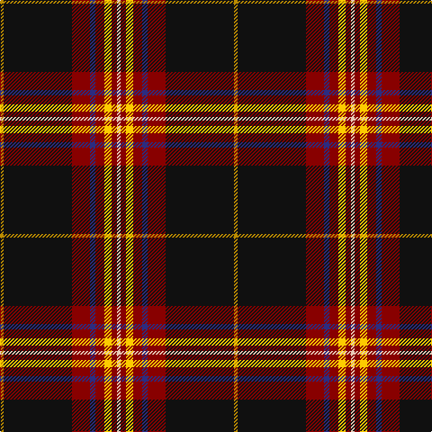

In pattern [WRYRBRKY](/patterns/wryrbrky/).

This was sourced from tartans-authority.  It is a [8 stripes tartan](/stripes/stripes8/).

Original link http://www.tartansauthority.com/tartan-ferret/display/8699/

## Thread count
DY/4 K76 DR20 DB6 DR10 Y8 DR6 LR/4

## Palette
Each colour and its ΔE from the base-6 reference it is a variant of.

| Colour | Shade | Base | ΔE (OKLab) |
|---|---|---|---|
| DB | <code style="background-color:#2C2C80;">#2C2C80</code> `#2C2C80` | B <code style="background-color:#2A418A;">#2A418A</code> | 0.06 |
| DR | <code style="background-color:#880000;">#880000</code> `#880000` | R <code style="background-color:#CC0000;">#CC0000</code> | 0.15 |
| DY | <code style="background-color:#BC8C00;">#BC8C00</code> `#BC8C00` | Y <code style="background-color:#F2BF00;">#F2BF00</code> | 0.16 |
| K | <code style="background-color:#101010;">#101010</code> `#101010` | K <code style="background-color:#000000;">#000000</code> | 0.17 |
| LR | <code style="background-color:#E8CCB8;">#E8CCB8</code> `#E8CCB8` | W <code style="background-color:#F7F7F7;">#F7F7F7</code> | 0.12 |
| Y | <code style="background-color:#FCCC00;">#FCCC00</code> `#FCCC00` | Y <code style="background-color:#F2BF00;">#F2BF00</code> | 0.04 |

# Sample pattern

## Nearest tartans

The nearest existing variants by ΔTartan distance.

1. [Westin Kierland](/setts/s8/r2k37ra10b3ra5y4ra3w2~b00008c-k101010-rb84c00-rac8002c-wffffff-yd09800~x2/) — ΔT 0.55
1. [Westin Kierland](/setts/s8/r2k37ra10b3ra5y4ra3w2~b2c2c80-k101010-rb84c00-rac80000-wfcfcfc-ye8c000~x2/) — ΔT 0.59
1. [Legion of Frontiersmen](/setts/s8/b62y7g7r3w3ba13w3r5~b441800-ba000048-g008b00-rc80000-wffffff-yffd700~x2/) — ΔT 0.84
1. [Legion of Frontiersmen](/setts/s8/b62y7g7r3w3ba13w3r5~b501400-ba2c2c80-g006818-rc80000-wfcfcfc-yfccc00~x2/) — ΔT 0.93
1. [Stuart/Stewart Black #2](/setts/s13/k58b5w5k10y3k3w3k3g14r11k3r4w3~b2c4084-g005020-k101010-rdc0000-we0e0e0-ye8c000~x2/) — ΔT 1.32
1. [Norwegian Night](/setts/s11/b6w3r14k3y2k2w2k38w2k2y2~b271b86-k120a01-rdd1212-wf7f1e8-yef8f06~x2/) — ΔT 1.35
1. [Stewart Black.. Clan Tartan Tartan Number: 1073. Earliest known date: c.1830 This sett appears in Paton's collection housed in the Scottish Tartans Museum, Tolbooth, Stirling (1995). The samples are undated but the collection is known to have been put together around the 1830's, with some additions during the Victorian period. The tartan is worn by the Royal Scots Dragoon Guards pipe band and the Grampian Police pipe band. See products available Copyright © Blair Urquhart, Comrie, 2015](/setts/s13/k58b5w5k10y3k3w3k3g14r11k3r4w3~b2c2c80-g006818-k101010-rc80000-we0e0e0-ye8c000~x2/) — ΔT 1.35
1. [Iberia Dress, Black (Fashion)](/setts/s7/k60w2r10g6w4r15y10~g003820-k101010-rc80000-we0e0e0-ye8c000~x2/) — ΔT 1.36
1. [Braveheart Commemorative Tartan Tartan Number: 2185. Earliest known date: 1995 Braveheart tartan commemorates the making of the film by the same name, which tells the story of one of Scotland's greatest heros, William Wallace. Originally designed for Ronnie Watt. See products available Copyright © Blair Urquhart, Comrie, 2015](/setts/s12/k30b3k4ba2k2ba2k2g10r6k2r3w2~b2c2c80-ba780078-g003820-k101010-rc80000-we0e0e0~x2/) — ΔT 1.37
1. [Brotherhood of Dirk (Corporate)](/setts/s11/r9k3r9k2b4k4ba4k3ba2k32g6~b1474b4-ba780078-g5c6428-k101010-rc8002c~x2/) — ΔT 1.38

## Neighbour map

Every grey dot is one of 15726 variants placed by the first two principal components of the ΔTartan feature space (44% of its variance). Red is this tartan; blue dots are its nearest — click one to open its page.

<svg viewBox="0 0 640 380" role="img" style="max-width:100%;height:auto;border:1px solid #e0e0e0;border-radius:4px;display:block" xmlns="http://www.w3.org/2000/svg"><image href="/nn/cloud.v1.png" width="640" height="380"/><a href="/setts/s8/r2k37ra10b3ra5y4ra3w2~b00008c-k101010-rb84c00-rac8002c-wffffff-yd09800~x2/"><circle cx="298.6" cy="104.8" r="4" fill="#3465a4"><title>Westin Kierland</title></circle></a><a href="/setts/s8/r2k37ra10b3ra5y4ra3w2~b2c2c80-k101010-rb84c00-rac80000-wfcfcfc-ye8c000~x2/"><circle cx="295.7" cy="103.4" r="4" fill="#3465a4"><title>Westin Kierland</title></circle></a><a href="/setts/s8/b62y7g7r3w3ba13w3r5~b441800-ba000048-g008b00-rc80000-wffffff-yffd700~x2/"><circle cx="314.3" cy="94.2" r="4" fill="#3465a4"><title>Legion of Frontiersmen</title></circle></a><a href="/setts/s8/b62y7g7r3w3ba13w3r5~b501400-ba2c2c80-g006818-rc80000-wfcfcfc-yfccc00~x2/"><circle cx="325.6" cy="94.6" r="4" fill="#3465a4"><title>Legion of Frontiersmen</title></circle></a><a href="/setts/s13/k58b5w5k10y3k3w3k3g14r11k3r4w3~b2c4084-g005020-k101010-rdc0000-we0e0e0-ye8c000~x2/"><circle cx="313.4" cy="80.7" r="4" fill="#3465a4"><title>Stuart/Stewart Black #2</title></circle></a><a href="/setts/s11/b6w3r14k3y2k2w2k38w2k2y2~b271b86-k120a01-rdd1212-wf7f1e8-yef8f06~x2/"><circle cx="315.6" cy="95.0" r="4" fill="#3465a4"><title>Norwegian Night</title></circle></a><a href="/setts/s13/k58b5w5k10y3k3w3k3g14r11k3r4w3~b2c2c80-g006818-k101010-rc80000-we0e0e0-ye8c000~x2/"><circle cx="312.8" cy="80.9" r="4" fill="#3465a4"><title>Stewart Black.. Clan Tartan Tartan Number: 1073. Earliest known date: c.1830 This sett appears in Paton's collection housed in the Scottish Tartans Museum, Tolbooth, Stirling (1995). The samples are undated but the collection is known to have been put together around the 1830's, with some additions during the Victorian period. The tartan is worn by the Royal Scots Dragoon Guards pipe band and the Grampian Police pipe band. See products available Copyright © Blair Urquhart, Comrie, 2015</title></circle></a><a href="/setts/s7/k60w2r10g6w4r15y10~g003820-k101010-rc80000-we0e0e0-ye8c000~x2/"><circle cx="314.7" cy="113.3" r="4" fill="#3465a4"><title>Iberia Dress, Black (Fashion)</title></circle></a><a href="/setts/s12/k30b3k4ba2k2ba2k2g10r6k2r3w2~b2c2c80-ba780078-g003820-k101010-rc80000-we0e0e0~x2/"><circle cx="317.0" cy="114.0" r="4" fill="#3465a4"><title>Braveheart Commemorative Tartan Tartan Number: 2185. Earliest known date: 1995 Braveheart tartan commemorates the making of the film by the same name, which tells the story of one of Scotland's greatest heros, William Wallace. Originally designed for Ronnie Watt. See products available Copyright © Blair Urquhart, Comrie, 2015</title></circle></a><a href="/setts/s11/r9k3r9k2b4k4ba4k3ba2k32g6~b1474b4-ba780078-g5c6428-k101010-rc8002c~x2/"><circle cx="313.0" cy="133.5" r="4" fill="#3465a4"><title>Brotherhood of Dirk (Corporate)</title></circle></a><circle cx="311.5" cy="109.9" r="5" fill="#c00000"/></svg>

ID: /setts/s8/w2r3y4r5b3r10k38ya2~b2c2c80-k101010-r880000-we8ccb8-yfccc00-yabc8c00~x2/
