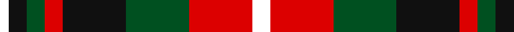

In pattern [WKGRKGRW](/stripes/wkgrkgrw/).

This was sourced from register-of-tartans.  It is a [8 stripe tartan](/stripes/stripes8/).

Original link https://www.tartanregister.gov.uk/tartanDetails.aspx?ref=11618

## Register references

External register numbers recorded for this tartan.

- Scottish Register of Tartans: [11618](https://www.tartanregister.gov.uk/tartanDetails.aspx?ref=11618)

## Thread count
W/10 R35 G35 K35 R10 G10 K10 W/5

## Palette
Each colour and the base-6 reference it is a variant of.

| Colour | Shade | Base |
|---|---|---|
| G | <code style="background-color:#005020;">#005020</code> `oklch(37.7% 0.105 149.6)` <small>#005020</small> | G <code style="background-color:#006100;">#006100</code> |
| K | <code style="background-color:#101010;">#101010</code> `oklch(17.3% 0.000 89.9)` <small>#101010</small> | K <code style="background-color:#000000;">#000000</code> |
| R | <code style="background-color:#DC0000;">#DC0000</code> `oklch(56.2% 0.230 29.2)` <small>#DC0000</small> | R <code style="background-color:#CC0000;">#CC0000</code> |
| W | <code style="background-color:#FFFFFF;">#FFFFFF</code> `oklch(100.0% 0.000 89.9)` <small>#FFFFFF</small> | W <code style="background-color:#F7F7F7;">#F7F7F7</code> |

# Sample pattern

## Nearest tartans

The nearest existing variants by ΔTartan distance, with this tartan at the top so the swatches line up against it.

ΔTartan

Tartan

Sett

—

<a href="/ttd/edit/#slug=w2r7dg7k7r2dg2k2w1~x5">Al Suwaidi of Abu Dhabi (Personal)</a> <a class="nn-out" href="/setts/s8/w2r7dg7k7r2dg2k2w1~x5/" title="open its dictionary page">↗</a>

0.82

<a href="/ttd/edit/#slug=lb13k3lb3k3lb3k15dy18r3~x2">Holden Brown (Corporate)</a> <a class="nn-out" href="/setts/s8/lb13k3lb3k3lb3k15dy18r3~x2/" title="open its dictionary page">↗</a>

1.07

<a href="/ttd/edit/#slug=g12k2r12k3y12k16y12k3r6~x2">Borthwick</a> <a class="nn-out" href="/setts/s9/g12k2r12k3y12k16y12k3r6~x2/" title="open its dictionary page">↗</a>

1.09

<a href="/ttd/edit/#slug=lb23k4lb4k4lb4k22o23lo5~x2">Aberlour</a> <a class="nn-out" href="/setts/s8/lb23k4lb4k4lb4k22o23lo5~x2/" title="open its dictionary page">↗</a>

1.10

<a href="/ttd/edit/#slug=dp13r8lb5dg24lb5r10lb5r10~x2">Chaudhri (Name)</a> <a class="nn-out" href="/setts/s8/dp13r8lb5dg24lb5r10lb5r10~x2/" title="open its dictionary page">↗</a>

1.16

<a href="/ttd/edit/#slug=dg12k2r12k3n12k16n12k3r6~x2">Borthwick Hunting</a> <a class="nn-out" href="/setts/s9/dg12k2r12k3n12k16n12k3r6~x2/" title="open its dictionary page">↗</a>

1.18

<a href="/ttd/edit/#slug=k14w2k3o14lb6r14k2r3~x2">Raytheon</a> <a class="nn-out" href="/setts/s8/k14w2k3o14lb6r14k2r3~x2/" title="open its dictionary page">↗</a>

1.20

<a href="/ttd/edit/#slug=ly6g3ly3g22k23dp23k4~x2">Gordon of Esslemont Family Tartan Tartan Number: 1064. Earliest known date: c.1830 This sett is called 'Gordon of Esslemont' according to Captain Wolrige-Gordon of Esslemont in recent research. It was previously listed as 'Ancient Gordon' before the story of its origin came to light. Apparently the Duke of Gordon was offered tartans with one, two, and three stripes when he applied to Forsythe of Huntly to provide kilts for his troops. He chose the single stripe and called in the Heads of the families to choose from the others. Esslemont took the three stripe version. See products available Copyright © Blair Urquhart, Comrie, 2015</a> <a class="nn-out" href="/setts/s7/ly6g3ly3g22k23dp23k4~x2/" title="open its dictionary page">↗</a>

1.20

<a href="/ttd/edit/#slug=lb2k2r14dg15k8lb7r14k2lb2">Montrose</a> <a class="nn-out" href="/setts/s9/lb2k2r14dg15k8lb7r14k2lb2/" title="open its dictionary page">↗</a>

1.21

<a href="/ttd/edit/#slug=r1g6ly1r2ly1r2ly1db6ly1~x8">Stevenson (Name)</a> <a class="nn-out" href="/setts/s9/r1g6ly1r2ly1r2ly1db6ly1~x8/" title="open its dictionary page">↗</a>

1.22

<a href="/ttd/edit/#slug=r33g17db50g17r11g17r9k7">Carnegie</a> <a class="nn-out" href="/setts/s8/r33g17db50g17r11g17r9k7/" title="open its dictionary page">↗</a>

## Neighbour map

Every grey dot is one of 14299 variants placed by the first two principal components of the ΔTartan feature space (44% of its variance). Red is this tartan; blue dots are its nearest — click one to open its page.

<svg viewBox="0 0 640 380" role="img" style="max-width:100%;height:auto;border:1px solid #e0e0e0;border-radius:4px;display:block" xmlns="http://www.w3.org/2000/svg"><image href="/nn/cloud.v1.png" width="640" height="380"/><a href="/setts/s8/lb13k3lb3k3lb3k15dy18r3~x2/"><circle cx="133.0" cy="195.5" r="4" fill="#3465a4"><title>Holden Brown (Corporate)</title></circle></a><a href="/setts/s9/g12k2r12k3y12k16y12k3r6~x2/"><circle cx="100.2" cy="213.9" r="4" fill="#3465a4"><title>Borthwick</title></circle></a><a href="/setts/s8/lb23k4lb4k4lb4k22o23lo5~x2/"><circle cx="131.0" cy="191.8" r="4" fill="#3465a4"><title>Aberlour</title></circle></a><a href="/setts/s8/dp13r8lb5dg24lb5r10lb5r10~x2/"><circle cx="120.2" cy="230.9" r="4" fill="#3465a4"><title>Chaudhri (Name)</title></circle></a><a href="/setts/s9/dg12k2r12k3n12k16n12k3r6~x2/"><circle cx="111.0" cy="218.0" r="4" fill="#3465a4"><title>Borthwick Hunting</title></circle></a><a href="/setts/s8/k14w2k3o14lb6r14k2r3~x2/"><circle cx="107.7" cy="179.0" r="4" fill="#3465a4"><title>Raytheon</title></circle></a><a href="/setts/s7/ly6g3ly3g22k23dp23k4~x2/"><circle cx="143.7" cy="210.8" r="4" fill="#3465a4"><title>Gordon of Esslemont Family Tartan Tartan Number: 1064. Earliest known date: c.1830 This sett is called 'Gordon of Esslemont' according to Captain Wolrige-Gordon of Esslemont in recent research. It was previously listed as 'Ancient Gordon' before the story of its origin came to light. Apparently the Duke of Gordon was offered tartans with one, two, and three stripes when he applied to Forsythe of Huntly to provide kilts for his troops. He chose the single stripe and called in the Heads of the families to choose from the others. Esslemont took the three stripe version. See products available Copyright © Blair Urquhart, Comrie, 2015</title></circle></a><a href="/setts/s9/lb2k2r14dg15k8lb7r14k2lb2/"><circle cx="159.2" cy="183.9" r="4" fill="#3465a4"><title>Montrose</title></circle></a><a href="/setts/s9/r1g6ly1r2ly1r2ly1db6ly1~x8/"><circle cx="114.6" cy="197.4" r="4" fill="#3465a4"><title>Stevenson (Name)</title></circle></a><a href="/setts/s8/r33g17db50g17r11g17r9k7/"><circle cx="158.1" cy="221.0" r="4" fill="#3465a4"><title>Carnegie</title></circle></a><circle cx="111.6" cy="203.7" r="5" fill="#c00000"/></svg>

ID: /setts/s8/w2r7dg7k7r2dg2k2w1~x5/
