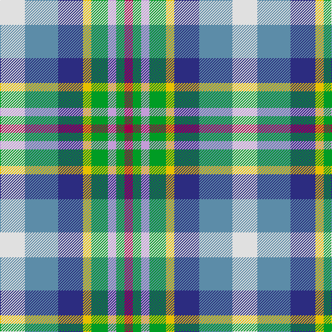

In pattern [RGWGYBBW](/patterns/rgwgybbw/).

This was sourced from tartans-authority.  It is a [8 stripes tartan](/stripes/stripes8/).

Original link http://www.tartansauthority.com/tartan-ferret/display/2618/

## Thread count
LN/36 B48 DB36 Y12 G24 LP12 G12 R/12

## Palette
Each colour and its ΔE from the base-6 reference it is a variant of.

| Colour | Shade | Base | ΔE (OKLab) |
|---|---|---|---|
| B | <code style="background-color:#5C8CA8;">#5C8CA8</code> `#5C8CA8` | B <code style="background-color:#2A418A;">#2A418A</code> | 0.23 |
| DB | <code style="background-color:#2C2C80;">#2C2C80</code> `#2C2C80` | B <code style="background-color:#2A418A;">#2A418A</code> | 0.06 |
| G | <code style="background-color:#009C24;">#009C24</code> `#009C24` | G <code style="background-color:#006100;">#006100</code> | 0.18 |
| LN | <code style="background-color:#E0E0E0;">#E0E0E0</code> `#E0E0E0` | W <code style="background-color:#F7F7F7;">#F7F7F7</code> | 0.07 |
| LP | <code style="background-color:#C49CD8;">#C49CD8</code> `#C49CD8` | W <code style="background-color:#F7F7F7;">#F7F7F7</code> | 0.25 |
| R | <code style="background-color:#A00048;">#A00048</code> `#A00048` | R <code style="background-color:#CC0000;">#CC0000</code> | 0.12 |
| Y | <code style="background-color:#E8C000;">#E8C000</code> `#E8C000` | Y <code style="background-color:#F2BF00;">#F2BF00</code> | 0.02 |

# Sample pattern

## Nearest tartans

The nearest existing variants by ΔTartan distance.

1. [Queensland](/setts/s8/w18b22ba15y6g10wa5g6r5~b5c8ca8-ba2c2c80-g009c24-rc80000-we0e0e0-wac49cd8-ye8c000~x2/) — ΔT 0.26
1. [Isle of Jura](/setts/s7/w18b18ba10wa3r15ra3y8~b5c8ca8-ba000048-rb84c00-rae86000-w98c8e8-waffffff-yf8e38c~x2/) — ΔT 0.98
1. [Somerset (District)](/setts/s9/g8r8y7ya5w2k2w2k2w2~g5c6428-k101010-r888888-we8ccb8-y48a4c0-yae08070~x4/) — ΔT 1.38
1. [Mounth The.. Corporate Tartan Tartan Number: 120. Earliest known date: 1988 Designed for Kincardine & Deeside branch of the National Trust for Scotland. Blue is a muted sky blue. Green is a dark pine green. See products available Copyright © Blair Urquhart, Comrie, 2015](/setts/s9/g2r13g12w3wa10w3wa12ga13ra2~g003820-ga289c18-r888888-ra901c38-we0e0e0-waa8ace8~x2/) — ΔT 1.38
1. [Somerset #2](/setts/s8/g14w14b12y8ga3k3ga3k5~b2c4084-g005020-ga503c14-k101010-wc0c0c0-yec9d9d~x2/) — ΔT 1.47
1. [Ellis (Personal)](/setts/s9/w2k1g4r2g2r4ga5k1y2~g009894-ga006818-k101010-rfc7878-we0e0e0-ye8c000~x6/) — ΔT 1.50
1. [Saltcoats (Saskatchewan)](/setts/s11/b3y3g15ba8w8b6g15ba6y3ga6r3~b141e46-ba0596fa-g808080-ga003c14-rdc0000-we0e0e0-ye8c000~x2/) — ΔT 1.50
1. [Northern College (Ontario)](/setts/s10/g5b3ba3g5w4y2ba1y2b1r1~b2c2c80-ba5c8ca8-g408060-rc80000-wf8f8f8-ye8c000~x6/) — ΔT 1.52
1. [Saltcoats (Saskatchewan) (District?)](/setts/s11/b3y3r15ba8w7b6r15ba6y3g6ra3~b1c1c50-ba2888c4-g003820-r888888-rac80000-we0e0e0-ye8c000~x2/) — ΔT 1.59
1. [Manx National](/setts/s7/b5g9r2y2ba6bb14w3~b88609c-ba303094-bb608ca4-g005814-ra86c1c-we0e0e0-ye8c000~x4/) — ΔT 1.68

## Neighbour map

Every grey dot is one of 15726 variants placed by the first two principal components of the ΔTartan feature space (44% of its variance). Red is this tartan; blue dots are its nearest — click one to open its page.

<svg viewBox="0 0 640 380" role="img" style="max-width:100%;height:auto;border:1px solid #e0e0e0;border-radius:4px;display:block" xmlns="http://www.w3.org/2000/svg"><image href="/nn/cloud.v1.png" width="640" height="380"/><a href="/setts/s8/w18b22ba15y6g10wa5g6r5~b5c8ca8-ba2c2c80-g009c24-rc80000-we0e0e0-wac49cd8-ye8c000~x2/"><circle cx="14.0" cy="183.8" r="4" fill="#3465a4"><title>Queensland</title></circle></a><a href="/setts/s7/w18b18ba10wa3r15ra3y8~b5c8ca8-ba000048-rb84c00-rae86000-w98c8e8-waffffff-yf8e38c~x2/"><circle cx="14.0" cy="173.5" r="4" fill="#3465a4"><title>Isle of Jura</title></circle></a><a href="/setts/s9/g8r8y7ya5w2k2w2k2w2~g5c6428-k101010-r888888-we8ccb8-y48a4c0-yae08070~x4/"><circle cx="14.0" cy="198.8" r="4" fill="#3465a4"><title>Somerset (District)</title></circle></a><a href="/setts/s9/g2r13g12w3wa10w3wa12ga13ra2~g003820-ga289c18-r888888-ra901c38-we0e0e0-waa8ace8~x2/"><circle cx="51.5" cy="182.3" r="4" fill="#3465a4"><title>Mounth The.. Corporate Tartan Tartan Number: 120. Earliest known date: 1988 Designed for Kincardine &amp; Deeside branch of the National Trust for Scotland. Blue is a muted sky blue. Green is a dark pine green. See products available Copyright © Blair Urquhart, Comrie, 2015</title></circle></a><a href="/setts/s8/g14w14b12y8ga3k3ga3k5~b2c4084-g005020-ga503c14-k101010-wc0c0c0-yec9d9d~x2/"><circle cx="14.0" cy="198.5" r="4" fill="#3465a4"><title>Somerset #2</title></circle></a><a href="/setts/s9/w2k1g4r2g2r4ga5k1y2~g009894-ga006818-k101010-rfc7878-we0e0e0-ye8c000~x6/"><circle cx="14.0" cy="195.3" r="4" fill="#3465a4"><title>Ellis (Personal)</title></circle></a><a href="/setts/s11/b3y3g15ba8w8b6g15ba6y3ga6r3~b141e46-ba0596fa-g808080-ga003c14-rdc0000-we0e0e0-ye8c000~x2/"><circle cx="51.2" cy="167.2" r="4" fill="#3465a4"><title>Saltcoats (Saskatchewan)</title></circle></a><a href="/setts/s10/g5b3ba3g5w4y2ba1y2b1r1~b2c2c80-ba5c8ca8-g408060-rc80000-wf8f8f8-ye8c000~x6/"><circle cx="49.3" cy="191.6" r="4" fill="#3465a4"><title>Northern College (Ontario)</title></circle></a><a href="/setts/s11/b3y3r15ba8w7b6r15ba6y3g6ra3~b1c1c50-ba2888c4-g003820-r888888-rac80000-we0e0e0-ye8c000~x2/"><circle cx="62.6" cy="169.6" r="4" fill="#3465a4"><title>Saltcoats (Saskatchewan) (District?)</title></circle></a><a href="/setts/s7/b5g9r2y2ba6bb14w3~b88609c-ba303094-bb608ca4-g005814-ra86c1c-we0e0e0-ye8c000~x4/"><circle cx="77.3" cy="177.6" r="4" fill="#3465a4"><title>Manx National</title></circle></a><circle cx="14.0" cy="189.2" r="5" fill="#c00000"/></svg>

ID: /setts/s8/w3b4ba3y1g2wa1g1r1~b5c8ca8-ba2c2c80-g009c24-ra00048-we0e0e0-wac49cd8-ye8c000~x12/
