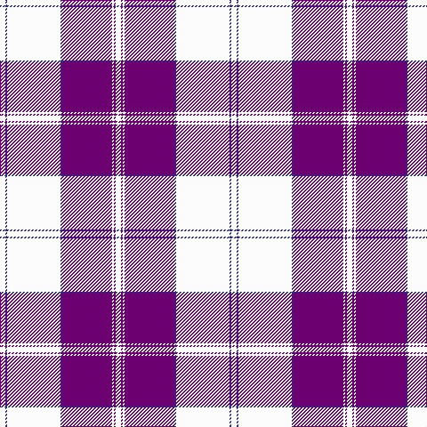

**Bands:** [WBWBBWBW](/stripes/wbwbbwbw/) · **Stripes:** [W DB W DB DP W DP W](/stripes/stripes8/) W DB W DB DP W DP W

This was sourced from register-of-tartans.  It is a [8 band tartan](/bands/bands8/).

Original link https://www.tartanregister.gov.uk/tartanDetails.aspx?ref=1046

## Attestations

This cloth appears in 3 source records; the oldest owns this page.

- 01/01/1982 — Dunlop Dress (register-of-tartans, [record](https://www.tartanregister.gov.uk/tartanDetails.aspx?ref=1046))
- 1982 — Dunlop Dress (Clan) (tartans-authority, [record](http://www.tartansauthority.com/tartan-ferret/display/1784/))
- undated — Dunlop Dress Family Tartan Tartan Number: 1784. Earliest known date: 1984 Revised version See products available Copyright © Blair Urquhart, Comrie, 2015 (house-of-tartan, [record](http://www.house-of-tartan.scotland.net/house/TartanViewjs.asp?colr=Def&tnam=1784))

## Register references

External register numbers recorded for this tartan.

- Scottish Register of Tartans: [1046](https://www.tartanregister.gov.uk/tartanDetails.aspx?ref=1046)
- Scottish Tartans Authority (ITI): 1784
- Scottish Tartans World Register: 1784

## Thread count
W/6 DB2 W60 DB2 P56 W2 P2 W/6

## Palette
Each colour and its ΔE from the base-6 reference it is a variant of.

| Colour | Shade | Base | ΔE (OKLab) |
|---|---|---|---|
| DB | <code style="background-color:#2C2C80;">#2C2C80</code> `#2C2C80` | B <code style="background-color:#2A418A;">#2A418A</code> | 0.06 |
| P | <code style="background-color:#6C0070;">#6C0070</code> `#6C0070` | B <code style="background-color:#2A418A;">#2A418A</code> | 0.16 |
| W | <code style="background-color:#FCFCFC;">#FCFCFC</code> `#FCFCFC` | W <code style="background-color:#F7F7F7;">#F7F7F7</code> | 0.01 |

# Sample pattern

## Nearest tartans

The nearest existing variants by ΔTartan distance.

1. [Dunlop, dress](/setts/s8/w3db1w30db1p28w1p1w3~x2/) — ΔT 0.49
1. [Cunningham Dress Purple (Dance) Fashion Tartan Tartan Number: 6531. Earliest known date: 01/01/1986 A dancers' tartan from D C Dalgliesh of Selkirk. See products available Copyright © Blair Urquhart, Comrie, 2015](/setts/s7/t2dp1k1dp20w20dp1w2~x4/) — ΔT 1.49
1. [Cunningham Dress Purple (Dance)](/setts/s7/w5dp2w34dp34k2dp2t4~x2/) — ΔT 1.53
1. [Grotto Dove (Dance)](/setts/s11/w102db20w4db4w4db4dg20r18db3r10w4/) — ΔT 1.70
1. [Rothesay, Dress (VS)](/setts/s10/r2w28db4w2k6w2r4k1r2w1~x2/) — ΔT 1.77
1. [Menzies Dress, Cerise (Dance)](/setts/s12/w4m1w2m3w24r5m3r1m1r1m20w2~x2/) — ΔT 1.80
1. [Longniddry Dress (Dance)](/setts/s8/dp42lb2w2lb2dp5t12w32dp4~x2/) — ΔT 1.85
1. [Buckleigh Dress (Fashion)](/setts/s10/k3r1k1w20k10r2k2w2k2r2~x4/) — ΔT 1.87
1. [Longniddry Dress District Tartan Tartan Number: 88. Earliest known date: pre 2003 A dancers tartan from D.C. Dalgleish weavers of Selkirk See products available Copyright © Blair Urquhart, Comrie, 2015](/setts/s8/dp42db2w2db2dp5t12w32dp4~x2/) — ΔT 1.92
1. [Irn Bru](/setts/s8/r49b16k2w3b2w2b3r2~x2/) — ΔT 1.92

## Neighbour map

Every grey dot is one of 14299 variants placed by the first two principal components of the ΔTartan feature space (44% of its variance). Red is this tartan; blue dots are its nearest — click one to open its page.

<svg viewBox="0 0 640 380" role="img" style="max-width:100%;height:auto;border:1px solid #e0e0e0;border-radius:4px;display:block" xmlns="http://www.w3.org/2000/svg"><image href="/nn/cloud.v1.png" width="640" height="380"/><a href="/setts/s8/w3db1w30db1p28w1p1w3~x2/"><circle cx="376.5" cy="107.4" r="4" fill="#3465a4"><title>Dunlop, dress</title></circle></a><a href="/setts/s7/t2dp1k1dp20w20dp1w2~x4/"><circle cx="301.0" cy="119.8" r="4" fill="#3465a4"><title>Cunningham Dress Purple (Dance) Fashion Tartan Tartan Number: 6531. Earliest known date: 01/01/1986 A dancers' tartan from D C Dalgliesh of Selkirk. See products available Copyright © Blair Urquhart, Comrie, 2015</title></circle></a><a href="/setts/s7/w5dp2w34dp34k2dp2t4~x2/"><circle cx="280.2" cy="123.8" r="4" fill="#3465a4"><title>Cunningham Dress Purple (Dance)</title></circle></a><a href="/setts/s11/w102db20w4db4w4db4dg20r18db3r10w4/"><circle cx="340.3" cy="62.9" r="4" fill="#3465a4"><title>Grotto Dove (Dance)</title></circle></a><a href="/setts/s10/r2w28db4w2k6w2r4k1r2w1~x2/"><circle cx="362.4" cy="78.1" r="4" fill="#3465a4"><title>Rothesay, Dress (VS)</title></circle></a><a href="/setts/s12/w4m1w2m3w24r5m3r1m1r1m20w2~x2/"><circle cx="332.6" cy="102.7" r="4" fill="#3465a4"><title>Menzies Dress, Cerise (Dance)</title></circle></a><a href="/setts/s8/dp42lb2w2lb2dp5t12w32dp4~x2/"><circle cx="292.9" cy="121.7" r="4" fill="#3465a4"><title>Longniddry Dress (Dance)</title></circle></a><a href="/setts/s10/k3r1k1w20k10r2k2w2k2r2~x4/"><circle cx="285.2" cy="118.8" r="4" fill="#3465a4"><title>Buckleigh Dress (Fashion)</title></circle></a><a href="/setts/s8/dp42db2w2db2dp5t12w32dp4~x2/"><circle cx="292.6" cy="122.4" r="4" fill="#3465a4"><title>Longniddry Dress District Tartan Tartan Number: 88. Earliest known date: pre 2003 A dancers tartan from D.C. Dalgleish weavers of Selkirk See products available Copyright © Blair Urquhart, Comrie, 2015</title></circle></a><a href="/setts/s8/r49b16k2w3b2w2b3r2~x2/"><circle cx="402.7" cy="90.2" r="4" fill="#3465a4"><title>Irn Bru</title></circle></a><circle cx="362.8" cy="101.3" r="5" fill="#c00000"/></svg>

ID: /setts/s8/w3db1w30db1dp28w1dp1w3~x2/
