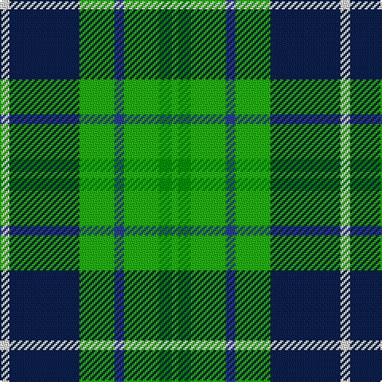

In pattern [GGGBGBBW](/stripes/gggbgbbw/).

This was sourced from weddslist.  It is a [8 stripe tartan](/stripes/stripes8/).

Original link http://www.weddslist.com/cgi-bin/tartans/pg.pl?source=sts

## Thread count
LN/6 DB20 DB24 G22 B6 G22 Ga8 G/4

## Palette
Each colour and the base-6 reference it is a variant of.

| Colour | Shade | Base |
|---|---|---|
| B | <code style="background-color:#304080;">#304080</code> `oklch(39.4% 0.109 270.2)` <small>#304080</small> | B <code style="background-color:#2A418A;">#2A418A</code> |
| DB | <code style="background-color:#102040;">#102040</code> `oklch(24.9% 0.065 262.6)` <small>#102040</small> | B <code style="background-color:#2A418A;">#2A418A</code> |
| G | <code style="background-color:#30A010;">#30A010</code> `oklch(61.9% 0.195 140.5)` <small>#30A010</small> | G <code style="background-color:#006100;">#006100</code> |
| Ga | <code style="background-color:#008000;">#008000</code> `oklch(52.0% 0.177 142.5)` <small>#008000</small> | G <code style="background-color:#006100;">#006100</code> |
| LN | <code style="background-color:#E0E0E0;">#E0E0E0</code> `oklch(90.7% 0.000 89.9)` <small>#E0E0E0</small> | W <code style="background-color:#F7F7F7;">#F7F7F7</code> |

# Sample pattern

## Nearest tartans

The nearest existing variants by ΔTartan distance.

1. [Disciples of Christ Motorcycle Ministry (Switzerland)](/setts/s7/k22g21k5g12t12o3w4~x2/) — ΔT 0.97
1. [Wilson's, No 149](/setts/s11/k8w2g11t2k2t2g11db6k2db6g8~x2/) — ΔT 1.09
1. [Loch Katrine](/setts/s7/b8k11w3k11g12g10m2~x2/) — ΔT 1.34
1. [Arrol](/setts/s9/r5db15k15g15w2g15k15g15w2~x2/) — ΔT 1.35
1. [MacRae, Ancient hunting](/setts/s8/g24k4g6r4g6k19db22w5~x2/) — ΔT 1.43
1. [Aztec, New Mexico](/setts/s8/r3k8g17ly2g17k8b8k2~x2/) — ΔT 1.43
1. [CSCA (Corporate)](/setts/s8/g5r4g19k10g8w4db18r4~x2/) — ΔT 1.44
1. [Hunter of Hunterston](/setts/s11/g5db2g12db12r2db12w2g12r2g4ly3~x2/) — ΔT 1.44
1. [Tweedside, hunting](/setts/s9/db21g5k5g15w3g5w3g5k3~x2/) — ΔT 1.46
1. [Verble (Personal)](/setts/s7/g4ly1k1t4g1ly1k1~x12/) — ΔT 1.50

## Neighbour map

Every grey dot is one of 14299 variants placed by the first two principal components of the ΔTartan feature space (44% of its variance). Red is this tartan; blue dots are its nearest — click one to open its page.

<svg viewBox="0 0 640 380" role="img" style="max-width:100%;height:auto;border:1px solid #e0e0e0;border-radius:4px;display:block" xmlns="http://www.w3.org/2000/svg"><image href="/nn/cloud.v1.png" width="640" height="380"/><a href="/setts/s7/k22g21k5g12t12o3w4~x2/"><circle cx="156.2" cy="221.1" r="4" fill="#3465a4"><title>Disciples of Christ Motorcycle Ministry (Switzerland)</title></circle></a><a href="/setts/s11/k8w2g11t2k2t2g11db6k2db6g8~x2/"><circle cx="152.3" cy="207.2" r="4" fill="#3465a4"><title>Wilson's, No 149</title></circle></a><a href="/setts/s7/b8k11w3k11g12g10m2~x2/"><circle cx="92.4" cy="235.2" r="4" fill="#3465a4"><title>Loch Katrine</title></circle></a><a href="/setts/s9/r5db15k15g15w2g15k15g15w2~x2/"><circle cx="132.3" cy="214.6" r="4" fill="#3465a4"><title>Arrol</title></circle></a><a href="/setts/s8/g24k4g6r4g6k19db22w5~x2/"><circle cx="118.8" cy="203.0" r="4" fill="#3465a4"><title>MacRae, Ancient hunting</title></circle></a><a href="/setts/s8/r3k8g17ly2g17k8b8k2~x2/"><circle cx="222.9" cy="207.6" r="4" fill="#3465a4"><title>Aztec, New Mexico</title></circle></a><a href="/setts/s8/g5r4g19k10g8w4db18r4~x2/"><circle cx="140.9" cy="224.8" r="4" fill="#3465a4"><title>CSCA (Corporate)</title></circle></a><a href="/setts/s11/g5db2g12db12r2db12w2g12r2g4ly3~x2/"><circle cx="208.8" cy="206.2" r="4" fill="#3465a4"><title>Hunter of Hunterston</title></circle></a><a href="/setts/s9/db21g5k5g15w3g5w3g5k3~x2/"><circle cx="189.0" cy="202.1" r="4" fill="#3465a4"><title>Tweedside, hunting</title></circle></a><a href="/setts/s7/g4ly1k1t4g1ly1k1~x12/"><circle cx="130.9" cy="241.3" r="4" fill="#3465a4"><title>Verble (Personal)</title></circle></a><circle cx="141.9" cy="225.0" r="5" fill="#c00000"/></svg>

ID: /setts/s8/w3dt10dt12g11db3g11g4g2~x2/
