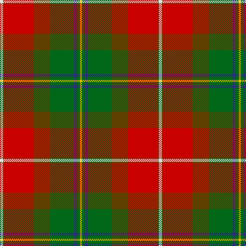

In pattern [WGRGGBGY](/stripes/wgrggbgy/).

This was sourced from house-of-tartan.  It is a [8 stripe tartan](/stripes/stripes8/).

Original link http://www.house-of-tartan.scotland.net/house/TartanViewjs.asp?colr=Def&tnam=1877

## Thread count
LN/6 T2 R58 T32 G46 DB6 G6 Y/4

## Palette
Each colour and its ΔE from the base-6 reference it is a variant of.

| Colour | Shade | Base | ΔE (OKLab) |
|---|---|---|---|
| DB | <code style="background-color:#2C2C80;">#2C2C80</code> `#2C2C80` | B <code style="background-color:#2A418A;">#2A418A</code> | 0.06 |
| G | <code style="background-color:#006818;">#006818</code> `#006818` | G <code style="background-color:#006100;">#006100</code> | 0.02 |
| LN | <code style="background-color:#E0E0E0;">#E0E0E0</code> `#E0E0E0` | W <code style="background-color:#F7F7F7;">#F7F7F7</code> | 0.07 |
| R | <code style="background-color:#C80000;">#C80000</code> `#C80000` | R <code style="background-color:#CC0000;">#CC0000</code> | 0.01 |
| T | <code style="background-color:#604000;">#604000</code> `#604000` | G <code style="background-color:#006100;">#006100</code> | 0.14 |
| Y | <code style="background-color:#E8C000;">#E8C000</code> `#E8C000` | Y <code style="background-color:#F2BF00;">#F2BF00</code> | 0.02 |

# Sample pattern

## Nearest tartans

The nearest existing variants by ΔTartan distance.

1. [Tache, Sir Etienne Paschal #2](/setts/s8/w3dy1r29dy16dg23db3dg3lo2~x2/) — ΔT 0.30
1. [Etienne, Paschal Tache Sir...](/setts/s8/w3o1r29o16g23db3g3ly2~x2/) — ΔT 0.44
1. [Henry W.A. Canadian Tartan Tartan Number: 1667. Earliest known date: 1983 See products available Copyright © Blair Urquhart, Comrie, 2015](/setts/s9/dy24r24w3g21ly2r1ly2dy6r2~x2/) — ΔT 0.98
1. [Westwood (Fashion?)](/setts/s10/r15lo30k1w6k1lo2dg16t4r6w1~x2/) — ΔT 1.12
1. [Henry, W.A.](/setts/s9/o24r24w3g21ly2r1ly2o6r2~x2/) — ΔT 1.19
1. [Bicknell, The Hamish (Personal)](/setts/s11/w3k1r25k2dy2g25dy2ly2dy10k1r2~x2/) — ΔT 1.20
1. [Gordon of Abergeldie (Red..) Portrait Tartan Tartan Number: 955. Earliest known date: 1723 This sett was reconstructed from a scarf in a painting of Rachael Gordon, hanging in Abergeldie Castle, painted by Alexander in 1723. The count and colour desciption was taken by the Lord Lyon in 1953. See products available Copyright © Blair Urquhart, Comrie, 2015](/setts/s6/r20w1k1m6ly1g18~x2/) — ΔT 1.27
1. [Moray of Abercairny](/setts/s11/w1t3db2r18r2g16r2r2r2t3w1~x2/) — ΔT 1.29
1. [Forrester (Clan)](/setts/s9/w3dt4w1dt15r24dg15ly1dg4ly3~x4/) — ΔT 1.33
1. [Gordon of Abergeldie, (Red..)](/setts/s6/r20w1k1dp6ly1g18~x2/) — ΔT 1.36

## Neighbour map

Every grey dot is one of 14299 variants placed by the first two principal components of the ΔTartan feature space (44% of its variance). Red is this tartan; blue dots are its nearest — click one to open its page.

<svg viewBox="0 0 640 380" role="img" style="max-width:100%;height:auto;border:1px solid #e0e0e0;border-radius:4px;display:block" xmlns="http://www.w3.org/2000/svg"><image href="/nn/cloud.v1.png" width="640" height="380"/><a href="/setts/s8/w3dy1r29dy16dg23db3dg3lo2~x2/"><circle cx="226.6" cy="114.4" r="4" fill="#3465a4"><title>Tache, Sir Etienne Paschal #2</title></circle></a><a href="/setts/s8/w3o1r29o16g23db3g3ly2~x2/"><circle cx="229.8" cy="115.4" r="4" fill="#3465a4"><title>Etienne, Paschal Tache Sir...</title></circle></a><a href="/setts/s9/dy24r24w3g21ly2r1ly2dy6r2~x2/"><circle cx="240.3" cy="135.3" r="4" fill="#3465a4"><title>Henry W.A. Canadian Tartan Tartan Number: 1667. Earliest known date: 1983 See products available Copyright © Blair Urquhart, Comrie, 2015</title></circle></a><a href="/setts/s10/r15lo30k1w6k1lo2dg16t4r6w1~x2/"><circle cx="208.8" cy="86.7" r="4" fill="#3465a4"><title>Westwood (Fashion?)</title></circle></a><a href="/setts/s9/o24r24w3g21ly2r1ly2o6r2~x2/"><circle cx="246.8" cy="137.5" r="4" fill="#3465a4"><title>Henry, W.A.</title></circle></a><a href="/setts/s11/w3k1r25k2dy2g25dy2ly2dy10k1r2~x2/"><circle cx="208.2" cy="82.1" r="4" fill="#3465a4"><title>Bicknell, The Hamish (Personal)</title></circle></a><a href="/setts/s6/r20w1k1m6ly1g18~x2/"><circle cx="254.3" cy="132.9" r="4" fill="#3465a4"><title>Gordon of Abergeldie (Red..) Portrait Tartan Tartan Number: 955. Earliest known date: 1723 This sett was reconstructed from a scarf in a painting of Rachael Gordon, hanging in Abergeldie Castle, painted by Alexander in 1723. The count and colour desciption was taken by the Lord Lyon in 1953. See products available Copyright © Blair Urquhart, Comrie, 2015</title></circle></a><a href="/setts/s11/w1t3db2r18r2g16r2r2r2t3w1~x2/"><circle cx="208.8" cy="102.8" r="4" fill="#3465a4"><title>Moray of Abercairny</title></circle></a><a href="/setts/s9/w3dt4w1dt15r24dg15ly1dg4ly3~x4/"><circle cx="200.1" cy="124.3" r="4" fill="#3465a4"><title>Forrester (Clan)</title></circle></a><a href="/setts/s6/r20w1k1dp6ly1g18~x2/"><circle cx="244.2" cy="128.8" r="4" fill="#3465a4"><title>Gordon of Abergeldie, (Red..)</title></circle></a><circle cx="227.8" cy="114.8" r="5" fill="#c00000"/></svg>

ID: /setts/s8/w3dy1r29dy16g23db3g3ly2~x2/
