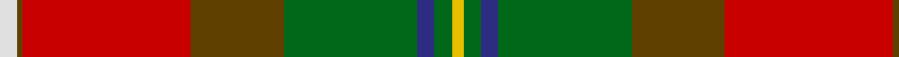

In pattern [WGRGGBGY](/patterns/wgrggbgy/).

This was sourced from house-of-tartan.  It is a [8 stripes tartan](/stripes/stripes8/).

Original link http://www.house-of-tartan.scotland.net/house/TartanViewjs.asp?colr=Def&tnam=1877

## Thread count
LN/6 T2 R58 T32 G46 DB6 G6 Y/4

## Palette
Each colour and its ΔE from the base-6 reference it is a variant of.

| Colour | Shade | Base | ΔE (OKLab) |
|---|---|---|---|
| DB | <code style="background-color:#2C2C80;">#2C2C80</code> `#2C2C80` | B <code style="background-color:#2A418A;">#2A418A</code> | 0.06 |
| G | <code style="background-color:#006818;">#006818</code> `#006818` | G <code style="background-color:#006100;">#006100</code> | 0.02 |
| LN | <code style="background-color:#E0E0E0;">#E0E0E0</code> `#E0E0E0` | W <code style="background-color:#F7F7F7;">#F7F7F7</code> | 0.07 |
| R | <code style="background-color:#C80000;">#C80000</code> `#C80000` | R <code style="background-color:#CC0000;">#CC0000</code> | 0.01 |
| T | <code style="background-color:#604000;">#604000</code> `#604000` | G <code style="background-color:#006100;">#006100</code> | 0.14 |
| Y | <code style="background-color:#E8C000;">#E8C000</code> `#E8C000` | Y <code style="background-color:#F2BF00;">#F2BF00</code> | 0.02 |

# Sample pattern

## Nearest tartans

The nearest existing variants by ΔTartan distance.

1. [Tache, Sir Etienne Paschal #2](/setts/s8/w3g1r29g16ga23b3ga3y2~b2c2c80-g604000-ga005010-rc80000-wfcfcfc-ybc8c00~x2/) — ΔT 0.30
1. [Etienne, Paschal Tache Sir...](/setts/s8/w3r1ra29r16g23b3g3y2~b304080-g008000-r806050-rac00000-we0e0e0-yf0c000~x2/) — ΔT 0.44
1. [Henry W.A. Canadian Tartan Tartan Number: 1667. Earliest known date: 1983 See products available Copyright © Blair Urquhart, Comrie, 2015](/setts/s9/g24r24w3ga21y2r1y2g6r2~g604000-ga006818-rc80000-we0e0e0-ye8c000~x2/) — ΔT 0.97
1. [Hamish Bicknell (Personal)](/setts/s11/w3k1r25k2g2ga25g2y2g10k1r2~g604000-ga006818-k101010-rc80000-we0e0e0-ye8c000~x2/) — ΔT 1.00
1. [Westwood (Fashion?)](/setts/s10/r15y30k1w6k1y2g16b4r6w1~b5c8ca8-g003820-k101010-rc80000-we0e0e0-ya08858~x2/) — ΔT 1.12
1. [Henry, W.A.](/setts/s9/r24ra24w3g21y2ra1y2r6ra2~g008000-r806050-rac00000-we0e0e0-yf0c000~x2/) — ΔT 1.19
1. [Bicknell, The Hamish (Personal)](/setts/s11/w3k1r25k2g2ga25g2y2g10k1r2~g603311-ga008000-k101010-raf1e2d-wffffff-yffe600~x2/) — ΔT 1.20
1. [Gordon of Abergeldie (Red..) Portrait Tartan Tartan Number: 955. Earliest known date: 1723 This sett was reconstructed from a scarf in a painting of Rachael Gordon, hanging in Abergeldie Castle, painted by Alexander in 1723. The count and colour desciption was taken by the Lord Lyon in 1953. See products available Copyright © Blair Urquhart, Comrie, 2015](/setts/s6/r20w1k1ra6y1g18~g006818-k101010-rc80000-rab468ac-we0e0e0-ye8c000~x2/) — ΔT 1.27
1. [Moray of Abercairny](/setts/s11/w1b3ba2r18ra2g16ra2r2ra2b3w1~b5c8ca8-ba1c1c50-g006818-r880000-rad05054-wf8f8f8~x2/) — ΔT 1.29
1. [Forrester (Clan)](/setts/s9/w3b4w1b15r24g15y1g4y3~b283854-g285800-rc80000-we0e0e0-ye8c000~x4/) — ΔT 1.33

## Neighbour map

Every grey dot is one of 15726 variants placed by the first two principal components of the ΔTartan feature space (44% of its variance). Red is this tartan; blue dots are its nearest — click one to open its page.

<svg viewBox="0 0 640 380" role="img" style="max-width:100%;height:auto;border:1px solid #e0e0e0;border-radius:4px;display:block" xmlns="http://www.w3.org/2000/svg"><image href="/nn/cloud.v1.png" width="640" height="380"/><a href="/setts/s8/w3g1r29g16ga23b3ga3y2~b2c2c80-g604000-ga005010-rc80000-wfcfcfc-ybc8c00~x2/"><circle cx="225.5" cy="110.9" r="4" fill="#3465a4"><title>Tache, Sir Etienne Paschal #2</title></circle></a><a href="/setts/s8/w3r1ra29r16g23b3g3y2~b304080-g008000-r806050-rac00000-we0e0e0-yf0c000~x2/"><circle cx="228.8" cy="111.2" r="4" fill="#3465a4"><title>Etienne, Paschal Tache Sir...</title></circle></a><a href="/setts/s9/g24r24w3ga21y2r1y2g6r2~g604000-ga006818-rc80000-we0e0e0-ye8c000~x2/"><circle cx="239.4" cy="131.3" r="4" fill="#3465a4"><title>Henry W.A. Canadian Tartan Tartan Number: 1667. Earliest known date: 1983 See products available Copyright © Blair Urquhart, Comrie, 2015</title></circle></a><a href="/setts/s11/w3k1r25k2g2ga25g2y2g10k1r2~g604000-ga006818-k101010-rc80000-we0e0e0-ye8c000~x2/"><circle cx="220.0" cy="83.5" r="4" fill="#3465a4"><title>Hamish Bicknell (Personal)</title></circle></a><a href="/setts/s10/r15y30k1w6k1y2g16b4r6w1~b5c8ca8-g003820-k101010-rc80000-we0e0e0-ya08858~x2/"><circle cx="207.5" cy="84.9" r="4" fill="#3465a4"><title>Westwood (Fashion?)</title></circle></a><a href="/setts/s9/r24ra24w3g21y2ra1y2r6ra2~g008000-r806050-rac00000-we0e0e0-yf0c000~x2/"><circle cx="246.1" cy="132.6" r="4" fill="#3465a4"><title>Henry, W.A.</title></circle></a><a href="/setts/s11/w3k1r25k2g2ga25g2y2g10k1r2~g603311-ga008000-k101010-raf1e2d-wffffff-yffe600~x2/"><circle cx="206.5" cy="79.7" r="4" fill="#3465a4"><title>Bicknell, The Hamish (Personal)</title></circle></a><a href="/setts/s6/r20w1k1ra6y1g18~g006818-k101010-rc80000-rab468ac-we0e0e0-ye8c000~x2/"><circle cx="253.5" cy="132.3" r="4" fill="#3465a4"><title>Gordon of Abergeldie (Red..) Portrait Tartan Tartan Number: 955. Earliest known date: 1723 This sett was reconstructed from a scarf in a painting of Rachael Gordon, hanging in Abergeldie Castle, painted by Alexander in 1723. The count and colour desciption was taken by the Lord Lyon in 1953. See products available Copyright © Blair Urquhart, Comrie, 2015</title></circle></a><a href="/setts/s11/w1b3ba2r18ra2g16ra2r2ra2b3w1~b5c8ca8-ba1c1c50-g006818-r880000-rad05054-wf8f8f8~x2/"><circle cx="207.1" cy="99.3" r="4" fill="#3465a4"><title>Moray of Abercairny</title></circle></a><a href="/setts/s9/w3b4w1b15r24g15y1g4y3~b283854-g285800-rc80000-we0e0e0-ye8c000~x4/"><circle cx="198.4" cy="123.0" r="4" fill="#3465a4"><title>Forrester (Clan)</title></circle></a><circle cx="226.7" cy="111.0" r="5" fill="#c00000"/></svg>

ID: /setts/s8/w3g1r29g16ga23b3ga3y2~b2c2c80-g604000-ga006818-rc80000-we0e0e0-ye8c000~x2/
