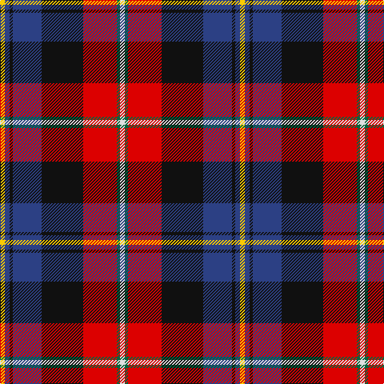

This page is one **sett** — a single exact thread-count. It belongs to the [tartan](/tartans/y3b3k2b18k26r21g2ln3/)
(the same proportion at any scale), whose colour order is pattern [WGRKBKBY](/stripes/wgrkbkby/).

Sourced from register-of-tartans.  It is a [8 stripe tartan](/stripes/stripes8/).

Original link https://www.tartanregister.gov.uk/tartanDetails.aspx?ref=11056

## Register references

External register numbers recorded for this tartan.

- Scottish Register of Tartans: [11056](https://www.tartanregister.gov.uk/tartanDetails.aspx?ref=11056)

## Thread count
Y/6 B6 K4 B36 K52 R42 G4 LN/6

## Palette
Each colour and the base-6 reference it is a variant of.

| Colour | Shade | Base |
|---|---|---|
| B | <code style="background-color:#2C4084;">#2C4084</code> `oklch(39.4% 0.117 268.3)` <small>#2C4084</small> | B <code style="background-color:#2A418A;">#2A418A</code> |
| G | <code style="background-color:#00643C;">#00643C</code> `oklch(44.3% 0.104 157.7)` <small>#00643C</small> | G <code style="background-color:#006100;">#006100</code> |
| K | <code style="background-color:#101010;">#101010</code> `oklch(17.3% 0.000 89.9)` <small>#101010</small> | K <code style="background-color:#000000;">#000000</code> |
| LN | <code style="background-color:#E0E0E0;">#E0E0E0</code> `oklch(90.7% 0.000 89.9)` <small>#E0E0E0</small> | W <code style="background-color:#F7F7F7;">#F7F7F7</code> |
| R | <code style="background-color:#DC0000;">#DC0000</code> `oklch(56.2% 0.230 29.2)` <small>#DC0000</small> | R <code style="background-color:#CC0000;">#CC0000</code> |
| Y | <code style="background-color:#FCCC00;">#FCCC00</code> `oklch(86.2% 0.176 91.5)` <small>#FCCC00</small> | Y <code style="background-color:#F2BF00;">#F2BF00</code> |

# Sample pattern

## Nearest tartans

The nearest existing variants by ΔTartan distance, with this tartan at the top so the swatches line up against it.

ΔTartan

Tartan

Sett

—

<a href="/ttd/edit/#slug=w3g2r21k26db18k2db3ly3~x2">Loch Etive</a> <a class="nn-out" href="/setts/s8/w3g2r21k26db18k2db3ly3~x2/" title="open its dictionary page">↗</a>

0.26

<a href="/ttd/edit/#slug=ly3db3k2db18k26r21g2lb3~x2">Loch Etive</a> <a class="nn-out" href="/setts/s8/ly3db3k2db18k26r21g2lb3~x2/" title="open its dictionary page">↗</a>

0.79

<a href="/ttd/edit/#slug=r17k5n4k6ly5db31k5g6n3~x2">Dean/Dundas (Melbourne, Australia) (Personal)</a> <a class="nn-out" href="/setts/s9/r17k5n4k6ly5db31k5g6n3~x2/" title="open its dictionary page">↗</a>

0.86

<a href="/ttd/edit/#slug=r6db3p24w2k23y23k2y6~x2">Culloden, Grey</a> <a class="nn-out" href="/setts/s8/r6db3p24w2k23y23k2y6~x2/" title="open its dictionary page">↗</a>

0.89

<a href="/ttd/edit/#slug=r17k5w4k6ly5db31k5g6w3~x2">Dean/Dundas (Personal)</a> <a class="nn-out" href="/setts/s9/r17k5w4k6ly5db31k5g6w3~x2/" title="open its dictionary page">↗</a>

0.91

<a href="/ttd/edit/#slug=k4db12lb3db4g8lo2r24db4r4~x2">MacCreary (Personal)</a> <a class="nn-out" href="/setts/s9/k4db12lb3db4g8lo2r24db4r4~x2/" title="open its dictionary page">↗</a>

0.93

<a href="/ttd/edit/#slug=k7db4r31db3ly2db27lb4~x2">Wishart Dress (Clan)</a> <a class="nn-out" href="/setts/s7/k7db4r31db3ly2db27lb4~x2/" title="open its dictionary page">↗</a>

1.00

<a href="/ttd/edit/#slug=k6r2db18lo2g2lo2g10r20db2lb1db6~x2">Aberdeen Asset Management (Corp)</a> <a class="nn-out" href="/setts/s11/k6r2db18lo2g2lo2g10r20db2lb1db6~x2/" title="open its dictionary page">↗</a>

1.00

<a href="/ttd/edit/#slug=ly2dp16k1r5k1r8k1r5k16lg2~x4">Tribal</a> <a class="nn-out" href="/setts/s10/ly2dp16k1r5k1r8k1r5k16lg2~x4/" title="open its dictionary page">↗</a>

1.00

<a href="/ttd/edit/#slug=db4ly3db22o6w2k6w2r26k3r4~x2">Asman Red (Personal)</a> <a class="nn-out" href="/setts/s10/db4ly3db22o6w2k6w2r26k3r4~x2/" title="open its dictionary page">↗</a>

1.02

<a href="/ttd/edit/#slug=g3g3r22k5db22ly2~x2">MacLeod Society of Scotland</a> <a class="nn-out" href="/setts/s6/g3g3r22k5db22ly2~x2/" title="open its dictionary page">↗</a>

## Neighbour map

Every grey dot is one of 14299 variants placed by the first two principal components of the ΔTartan feature space (44% of its variance). Red is this tartan; blue dots are its nearest — click one to open its page.

<svg viewBox="0 0 640 380" role="img" style="max-width:100%;height:auto;border:1px solid #e0e0e0;border-radius:4px;display:block" xmlns="http://www.w3.org/2000/svg"><image href="/nn/cloud.v1.png" width="640" height="380"/><a href="/setts/s8/ly3db3k2db18k26r21g2lb3~x2/"><circle cx="158.4" cy="136.0" r="4" fill="#3465a4"><title>Loch Etive</title></circle></a><a href="/setts/s9/r17k5n4k6ly5db31k5g6n3~x2/"><circle cx="132.4" cy="137.4" r="4" fill="#3465a4"><title>Dean/Dundas (Melbourne, Australia) (Personal)</title></circle></a><a href="/setts/s8/r6db3p24w2k23y23k2y6~x2/"><circle cx="119.9" cy="141.0" r="4" fill="#3465a4"><title>Culloden, Grey</title></circle></a><a href="/setts/s9/r17k5w4k6ly5db31k5g6w3~x2/"><circle cx="122.5" cy="132.0" r="4" fill="#3465a4"><title>Dean/Dundas (Personal)</title></circle></a><a href="/setts/s9/k4db12lb3db4g8lo2r24db4r4~x2/"><circle cx="182.7" cy="134.9" r="4" fill="#3465a4"><title>MacCreary (Personal)</title></circle></a><a href="/setts/s7/k7db4r31db3ly2db27lb4~x2/"><circle cx="200.2" cy="126.7" r="4" fill="#3465a4"><title>Wishart Dress (Clan)</title></circle></a><a href="/setts/s11/k6r2db18lo2g2lo2g10r20db2lb1db6~x2/"><circle cx="171.6" cy="106.4" r="4" fill="#3465a4"><title>Aberdeen Asset Management (Corp)</title></circle></a><a href="/setts/s10/ly2dp16k1r5k1r8k1r5k16lg2~x4/"><circle cx="138.8" cy="108.4" r="4" fill="#3465a4"><title>Tribal</title></circle></a><a href="/setts/s10/db4ly3db22o6w2k6w2r26k3r4~x2/"><circle cx="169.1" cy="111.3" r="4" fill="#3465a4"><title>Asman Red (Personal)</title></circle></a><a href="/setts/s6/g3g3r22k5db22ly2~x2/"><circle cx="188.3" cy="157.6" r="4" fill="#3465a4"><title>MacLeod Society of Scotland</title></circle></a><circle cx="153.5" cy="132.2" r="5" fill="#c00000"/></svg>

ID: /setts/s8/w3g2r21k26db18k2db3ly3~x2/
