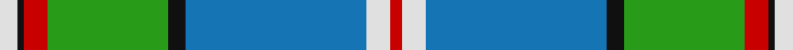
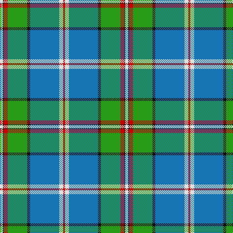

This page is one **sett** — a single exact thread-count. It belongs to the [tartan](/tartans/w3k1r4g20k3b30w4r2/)
(the same proportion at any scale), whose colour order is pattern [RWBKGRKW](/stripes/rwbkgrkw/).

Sourced from tartans-authority.  It is a [8 stripe tartan](/stripes/stripes8/).

Original link http://www.tartansauthority.com/tartan-ferret/display/6595/

## Register references

External register numbers recorded for this tartan.

- Scottish Tartans Authority (ITI): 6595

## Thread count
LN/6 K2 R8 G40 K6 B60 LN8 R/4

## Palette

Palette: <strong>Tartan Register</strong>
<table><thead><tr><th>Colour</th><th>Threads</th><th>Shade</th><th>Base</th><th>OKLCh</th></tr></thead><tbody><tr><td>LN/</td><td style="text-align:right;font-variant-numeric:tabular-nums">6</td><td><code style="background-color:#E0E0E0;">#E0E0E0</code> <small style="color:#888">#E0E0E0</small></td><td>W <code style="background-color:#F7F7F7;">#F7F7F7</code></td><td><small style="color:#888">oklch(90.7% 0.000 89.9)</small></td></tr><tr><td>K</td><td style="text-align:right;font-variant-numeric:tabular-nums">2</td><td><code style="background-color:#101010;">#101010</code> <small style="color:#888">#101010</small></td><td>K <code style="background-color:#000000;">#000000</code></td><td><small style="color:#888">oklch(17.3% 0.000 89.9)</small></td></tr><tr><td>R</td><td style="text-align:right;font-variant-numeric:tabular-nums">8</td><td><code style="background-color:#C80000;">#C80000</code> <small style="color:#888">#C80000</small></td><td>R <code style="background-color:#CC0000;">#CC0000</code></td><td><small style="color:#888">oklch(52.3% 0.215 29.2)</small></td></tr><tr><td>G</td><td style="text-align:right;font-variant-numeric:tabular-nums">40</td><td><code style="background-color:#289C18;">#289C18</code> <small style="color:#888">#289C18</small></td><td>G <code style="background-color:#006100;">#006100</code></td><td><small style="color:#888">oklch(60.6% 0.191 141.6)</small></td></tr><tr><td>K</td><td style="text-align:right;font-variant-numeric:tabular-nums">6</td><td><code style="background-color:#101010;">#101010</code> <small style="color:#888">#101010</small></td><td>K <code style="background-color:#000000;">#000000</code></td><td><small style="color:#888">oklch(17.3% 0.000 89.9)</small></td></tr><tr><td>B</td><td style="text-align:right;font-variant-numeric:tabular-nums">60</td><td><code style="background-color:#1474B4;">#1474B4</code> <small style="color:#888">#1474B4</small></td><td>B <code style="background-color:#2A418A;">#2A418A</code></td><td><small style="color:#888">oklch(54.0% 0.129 245.1)</small></td></tr><tr><td>LN</td><td style="text-align:right;font-variant-numeric:tabular-nums">8</td><td><code style="background-color:#E0E0E0;">#E0E0E0</code> <small style="color:#888">#E0E0E0</small></td><td>W <code style="background-color:#F7F7F7;">#F7F7F7</code></td><td><small style="color:#888">oklch(90.7% 0.000 89.9)</small></td></tr><tr><td>R/</td><td style="text-align:right;font-variant-numeric:tabular-nums">4</td><td><code style="background-color:#C80000;">#C80000</code> <small style="color:#888">#C80000</small></td><td>R <code style="background-color:#CC0000;">#CC0000</code></td><td><small style="color:#888">oklch(52.3% 0.215 29.2)</small></td></tr></tbody></table>

# Sample pattern

## Nearest tartans

The nearest existing variants by ΔTartan distance, with this tartan at the top so the swatches line up against it.

ΔTartan

Tartan

Sett

—

<a href="/ttd/edit/#slug=w3k1r4g20k3b30w4r2~x2">Scottish Prison Service (Corporate)</a> <a class="nn-out" href="/setts/s8/w3k1r4g20k3b30w4r2~x2/" title="open its dictionary page">↗</a>

1.11

<a href="/ttd/edit/#slug=w3k1t25r7g12k1ly3~x2">Caskie</a> <a class="nn-out" href="/setts/s7/w3k1t25r7g12k1ly3~x2/" title="open its dictionary page">↗</a>

1.18

<a href="/ttd/edit/#slug=w4b30k3g20r4k1w3k1r4g20k3b30w4r2~x2">Scottish Prison Service</a> <a class="nn-out" href="/setts/s14/w4b30k3g20r4k1w3k1r4g20k3b30w4r2~x2/" title="open its dictionary page">↗</a>

1.27

<a href="/ttd/edit/#slug=w2db20gi2g2gi2g4gi8ly2r1~x2">Nova Scotia (Province)</a> <a class="nn-out" href="/setts/s9/w2db20gi2g2gi2g4gi8ly2r1~x2/" title="open its dictionary page">↗</a>

1.35

<a href="/ttd/edit/#slug=ly2r2k2b27k6g13k1lb2~x2">German MacLeod</a> <a class="nn-out" href="/setts/s8/ly2r2k2b27k6g13k1lb2~x2/" title="open its dictionary page">↗</a>

1.37

<a href="/ttd/edit/#slug=gi39r2w1r2db14w14gi2g10~x2">Southwell (Australian) (Personal)</a> <a class="nn-out" href="/setts/s8/gi39r2w1r2db14w14gi2g10~x2/" title="open its dictionary page">↗</a>

1.38

<a href="/ttd/edit/#slug=dt2w5dt5y11w5dg12t1dg2t26dg2dt2~x2">Chalk (Personal)</a> <a class="nn-out" href="/setts/s11/dt2w5dt5y11w5dg12t1dg2t26dg2dt2~x2/" title="open its dictionary page">↗</a>

1.38

<a href="/ttd/edit/#slug=k2lb25k2b8k2g28ly2~x2">Presley of Lonmay</a> <a class="nn-out" href="/setts/s7/k2lb25k2b8k2g28ly2~x2/" title="open its dictionary page">↗</a>

1.38

<a href="/ttd/edit/#slug=ly4o2k2o42k13g25o6k2r4k2~x2">Dinwiddie Clan Tartan Tartan Number: 3212. Earliest known date: 2001 The registered tartan of the Dinwiddie Clan. Dinwiddies are normally associated with the Maxwells, but Lord Lyon stated, in 1988, that Dinwiddies were a sept of no other clan. See products available Copyright © Blair Urquhart, Comrie, 2015</a> <a class="nn-out" href="/setts/s10/ly4o2k2o42k13g25o6k2r4k2~x2/" title="open its dictionary page">↗</a>

1.40

<a href="/ttd/edit/#slug=g4ly1t3dbi15g2r2g14db1t28dbi2~x2">Heriot Watt University</a> <a class="nn-out" href="/setts/s10/g4ly1t3dbi15g2r2g14db1t28dbi2~x2/" title="open its dictionary page">↗</a>

1.45

<a href="/ttd/edit/#slug=b24k8g8r2g8k1w2~x2">Ferguson of Atholl Clan</a> <a class="nn-out" href="/setts/s7/b24k8g8r2g8k1w2~x2/" title="open its dictionary page">↗</a>

## Neighbour map

Every grey dot is one of 14359 variants placed by the first two principal components of the ΔTartan feature space (44% of its variance). Red is this tartan; blue dots are its nearest — click one to open its page.

<svg viewBox="0 0 640 380" role="img" style="max-width:100%;height:auto;border:1px solid #e0e0e0;border-radius:4px;display:block" xmlns="http://www.w3.org/2000/svg"><image href="/nn/cloud.v1.png" width="640" height="380"/><a href="/setts/s7/w3k1t25r7g12k1ly3~x2/"><circle cx="241.3" cy="119.6" r="4" fill="#3465a4"><title>Caskie</title></circle></a><a href="/setts/s14/w4b30k3g20r4k1w3k1r4g20k3b30w4r2~x2/"><circle cx="251.5" cy="99.9" r="4" fill="#3465a4"><title>Scottish Prison Service</title></circle></a><a href="/setts/s9/w2db20gi2g2gi2g4gi8ly2r1~x2/"><circle cx="230.4" cy="114.5" r="4" fill="#3465a4"><title>Nova Scotia (Province)</title></circle></a><a href="/setts/s8/ly2r2k2b27k6g13k1lb2~x2/"><circle cx="263.1" cy="112.8" r="4" fill="#3465a4"><title>German MacLeod</title></circle></a><a href="/setts/s8/gi39r2w1r2db14w14gi2g10~x2/"><circle cx="252.9" cy="101.7" r="4" fill="#3465a4"><title>Southwell (Australian) (Personal)</title></circle></a><a href="/setts/s11/dt2w5dt5y11w5dg12t1dg2t26dg2dt2~x2/"><circle cx="185.4" cy="118.5" r="4" fill="#3465a4"><title>Chalk (Personal)</title></circle></a><a href="/setts/s7/k2lb25k2b8k2g28ly2~x2/"><circle cx="217.3" cy="154.6" r="4" fill="#3465a4"><title>Presley of Lonmay</title></circle></a><a href="/setts/s10/ly4o2k2o42k13g25o6k2r4k2~x2/"><circle cx="266.5" cy="115.5" r="4" fill="#3465a4"><title>Dinwiddie Clan Tartan Tartan Number: 3212. Earliest known date: 2001 The registered tartan of the Dinwiddie Clan. Dinwiddies are normally associated with the Maxwells, but Lord Lyon stated, in 1988, that Dinwiddies were a sept of no other clan. See products available Copyright © Blair Urquhart, Comrie, 2015</title></circle></a><a href="/setts/s10/g4ly1t3dbi15g2r2g14db1t28dbi2~x2/"><circle cx="230.6" cy="102.8" r="4" fill="#3465a4"><title>Heriot Watt University</title></circle></a><a href="/setts/s7/b24k8g8r2g8k1w2~x2/"><circle cx="253.4" cy="157.6" r="4" fill="#3465a4"><title>Ferguson of Atholl Clan</title></circle></a><circle cx="251.9" cy="116.3" r="5" fill="#c00000"/></svg>

ID: /setts/s8/w3k1r4g20k3b30w4r2~x2/
