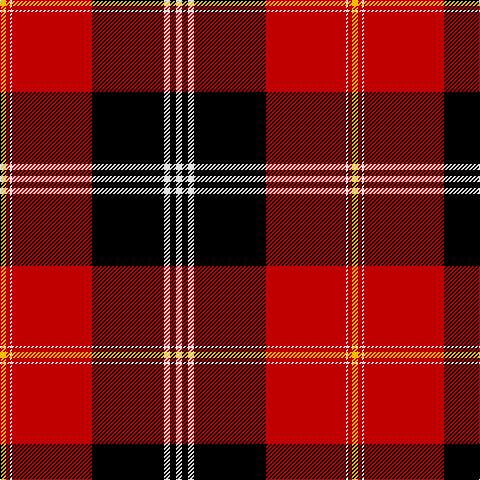

This page is one **sett** — a single exact thread-count. It belongs to the [tartan](/tartans/w3k3w3k36r40w1r2ly3/)
(the same proportion at any scale), whose colour order is pattern [WKWKRWRY](/stripes/wkwkrwry/).

Sourced from weddslist.  It is a [8 stripe tartan](/stripes/stripes8/).

Original link http://www.weddslist.com/cgi-bin/tartans/pg.pl?source=sts

## Thread count
Y/6 R4 LN2 R80 K72 LN6 K6 LN/6

## Palette

Palette: <strong>Tartan Register</strong> <small style="color:#888">(2 of 4 colours)</small>
<table><thead><tr><th>Colour</th><th>Threads</th><th>Shade</th><th>Base</th><th>OKLCh</th></tr></thead><tbody><tr><td>Y/</td><td style="text-align:right;font-variant-numeric:tabular-nums">6</td><td><code style="background-color:#F0C000;">#F0C000</code> <small style="color:#888">#F0C000</small></td><td>Y <code style="background-color:#F2BF00;">#F2BF00</code></td><td><small style="color:#888">oklch(82.7% 0.169 90.5)</small></td></tr><tr><td>R</td><td style="text-align:right;font-variant-numeric:tabular-nums">4</td><td><code style="background-color:#C00000;">#C00000</code> <small style="color:#888">#C00000</small></td><td>R <code style="background-color:#CC0000;">#CC0000</code></td><td><small style="color:#888">oklch(50.7% 0.208 29.2)</small></td></tr><tr><td>LN</td><td style="text-align:right;font-variant-numeric:tabular-nums">2</td><td><code style="background-color:#E0E0E0;">#E0E0E0</code> <small style="color:#888">#E0E0E0</small></td><td>W <code style="background-color:#F7F7F7;">#F7F7F7</code></td><td><small style="color:#888">oklch(90.7% 0.000 89.9)</small></td></tr><tr><td>R</td><td style="text-align:right;font-variant-numeric:tabular-nums">80</td><td><code style="background-color:#C00000;">#C00000</code> <small style="color:#888">#C00000</small></td><td>R <code style="background-color:#CC0000;">#CC0000</code></td><td><small style="color:#888">oklch(50.7% 0.208 29.2)</small></td></tr><tr><td>K</td><td style="text-align:right;font-variant-numeric:tabular-nums">72</td><td><code style="background-color:#000000;">#000000</code> <small style="color:#888">#000000</small></td><td>K <code style="background-color:#000000;">#000000</code></td><td><small style="color:#888">oklch(0.0% 0.000 0.0)</small></td></tr><tr><td>LN</td><td style="text-align:right;font-variant-numeric:tabular-nums">6</td><td><code style="background-color:#E0E0E0;">#E0E0E0</code> <small style="color:#888">#E0E0E0</small></td><td>W <code style="background-color:#F7F7F7;">#F7F7F7</code></td><td><small style="color:#888">oklch(90.7% 0.000 89.9)</small></td></tr><tr><td>K</td><td style="text-align:right;font-variant-numeric:tabular-nums">6</td><td><code style="background-color:#000000;">#000000</code> <small style="color:#888">#000000</small></td><td>K <code style="background-color:#000000;">#000000</code></td><td><small style="color:#888">oklch(0.0% 0.000 0.0)</small></td></tr><tr><td>LN/</td><td style="text-align:right;font-variant-numeric:tabular-nums">6</td><td><code style="background-color:#E0E0E0;">#E0E0E0</code> <small style="color:#888">#E0E0E0</small></td><td>W <code style="background-color:#F7F7F7;">#F7F7F7</code></td><td><small style="color:#888">oklch(90.7% 0.000 89.9)</small></td></tr></tbody></table>

# Sample pattern

## Nearest tartans

The nearest existing variants by ΔTartan distance, with this tartan at the top so the swatches line up against it.

ΔTartan

Tartan

Sett

—

<a href="/ttd/edit/#slug=w3k3w3k36r40w1r2ly3~x2">Marjoribanks</a> <a class="nn-out" href="/setts/s8/w3k3w3k36r40w1r2ly3~x2/" title="open its dictionary page">↗</a>

0.81

<a href="/ttd/edit/#slug=w3k3w3k37r40w1r2lo3~x2">Marjoribanks (Clan)</a> <a class="nn-out" href="/setts/s8/w3k3w3k37r40w1r2lo3~x2/" title="open its dictionary page">↗</a>

0.85

<a href="/ttd/edit/#slug=w10k2w2k66ly6r48k5r8">Sutherland de Albergaria (Personal)</a> <a class="nn-out" href="/setts/s8/w10k2w2k66ly6r48k5r8/" title="open its dictionary page">↗</a>

0.87

<a href="/ttd/edit/#slug=k3r1k30r28db1r1lb3~x2">Cunningham</a> <a class="nn-out" href="/setts/s7/k3r1k30r28db1r1lb3~x2/" title="open its dictionary page">↗</a>

1.02

<a href="/ttd/edit/#slug=k3r1k30r28db1r1w3~x2">Cunningham #3</a> <a class="nn-out" href="/setts/s7/k3r1k30r28db1r1w3~x2/" title="open its dictionary page">↗</a>

1.05

<a href="/ttd/edit/#slug=o5k1r2k4r36k23w4ly2~x2">Aberdeen F.C.</a> <a class="nn-out" href="/setts/s8/o5k1r2k4r36k23w4ly2~x2/" title="open its dictionary page">↗</a>

1.14

<a href="/ttd/edit/#slug=k3r1k30r28db1r1lr3~x2">Cunningham</a> <a class="nn-out" href="/setts/s7/k3r1k30r28db1r1lr3~x2/" title="open its dictionary page">↗</a>

1.17

<a href="/ttd/edit/#slug=k4lb2k28r30db1r3~x2">Ramsay</a> <a class="nn-out" href="/setts/s6/k4lb2k28r30db1r3~x2/" title="open its dictionary page">↗</a>

1.20

<a href="/ttd/edit/#slug=k4w2k28r30dp1r3~x2">Ramsay</a> <a class="nn-out" href="/setts/s6/k4w2k28r30dp1r3~x2/" title="open its dictionary page">↗</a>

1.29

<a href="/ttd/edit/#slug=k3r1k30r28k1r1lb3~x2">Cunningham D</a> <a class="nn-out" href="/setts/s7/k3r1k30r28k1r1lb3~x2/" title="open its dictionary page">↗</a>

1.33

<a href="/ttd/edit/#slug=r45k2r2k28w16r4k4lo2">Barbecue Plaid</a> <a class="nn-out" href="/setts/s8/r45k2r2k28w16r4k4lo2/" title="open its dictionary page">↗</a>

## Neighbour map

Every grey dot is one of 14299 variants placed by the first two principal components of the ΔTartan feature space (44% of its variance). Red is this tartan; blue dots are its nearest — click one to open its page.

<svg viewBox="0 0 640 380" role="img" style="max-width:100%;height:auto;border:1px solid #e0e0e0;border-radius:4px;display:block" xmlns="http://www.w3.org/2000/svg"><image href="/nn/cloud.v1.png" width="640" height="380"/><a href="/setts/s8/w3k3w3k37r40w1r2lo3~x2/"><circle cx="328.5" cy="93.4" r="4" fill="#3465a4"><title>Marjoribanks (Clan)</title></circle></a><a href="/setts/s8/w10k2w2k66ly6r48k5r8/"><circle cx="321.3" cy="107.1" r="4" fill="#3465a4"><title>Sutherland de Albergaria (Personal)</title></circle></a><a href="/setts/s7/k3r1k30r28db1r1lb3~x2/"><circle cx="340.7" cy="119.5" r="4" fill="#3465a4"><title>Cunningham</title></circle></a><a href="/setts/s7/k3r1k30r28db1r1w3~x2/"><circle cx="350.0" cy="117.7" r="4" fill="#3465a4"><title>Cunningham #3</title></circle></a><a href="/setts/s8/o5k1r2k4r36k23w4ly2~x2/"><circle cx="300.6" cy="84.2" r="4" fill="#3465a4"><title>Aberdeen F.C.</title></circle></a><a href="/setts/s7/k3r1k30r28db1r1lr3~x2/"><circle cx="348.4" cy="126.5" r="4" fill="#3465a4"><title>Cunningham</title></circle></a><a href="/setts/s6/k4lb2k28r30db1r3~x2/"><circle cx="338.1" cy="136.2" r="4" fill="#3465a4"><title>Ramsay</title></circle></a><a href="/setts/s6/k4w2k28r30dp1r3~x2/"><circle cx="339.2" cy="137.2" r="4" fill="#3465a4"><title>Ramsay</title></circle></a><a href="/setts/s7/k3r1k30r28k1r1lb3~x2/"><circle cx="367.9" cy="135.1" r="4" fill="#3465a4"><title>Cunningham D</title></circle></a><a href="/setts/s8/r45k2r2k28w16r4k4lo2/"><circle cx="283.7" cy="114.2" r="4" fill="#3465a4"><title>Barbecue Plaid</title></circle></a><circle cx="320.8" cy="93.4" r="5" fill="#c00000"/></svg>

ID: /setts/s8/w3k3w3k36r40w1r2ly3~x2/
