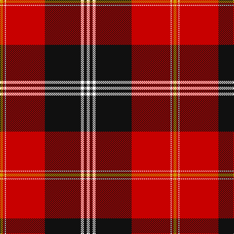

This page is one **sett** — a single exact thread-count. It belongs to the [tartan](/tartans/dy3r2w1r40k37w3k3w3/)
(the same proportion at any scale), whose colour order is pattern [WKWKRWRY](/stripes/wkwkrwry/).

Sourced from tartans-authority.  It is a [8 stripe tartan](/stripes/stripes8/).

Original link http://www.tartansauthority.com/tartan-ferret/display/2607/

2 attestations — the source records this cloth was collapsed from (oldest owns this page)

<ul>
<li>June 1997 — Marjoribanks (Clan) (tartans-authority, <a href="http://www.tartansauthority.com/tartan-ferret/display/2607/">record</a>)</li>
<li>01/06/1999 — Marjoribanks (register-of-tartans, <a href="https://www.tartanregister.gov.uk/tartanDetails.aspx?ref=2838">record</a>)</li>
</ul>

## Register references

External register numbers recorded for this tartan.

- Scottish Register of Tartans: [2838](https://www.tartanregister.gov.uk/tartanDetails.aspx?ref=2838)
- Scottish Tartans Authority (ITI): 2607
- Scottish Tartans World Register: 2607

## Thread count
DY/6 R4 W2 R80 K74 W6 K6 W/6

## Palette
Each colour and the base-6 reference it is a variant of.

| Colour | Shade | Base |
|---|---|---|
| DY | <code style="background-color:#D09800;">#D09800</code> `oklch(71.4% 0.147 82.1)` <small>#D09800</small> | Y <code style="background-color:#F2BF00;">#F2BF00</code> |
| K | <code style="background-color:#101010;">#101010</code> `oklch(17.3% 0.000 89.9)` <small>#101010</small> | K <code style="background-color:#000000;">#000000</code> |
| R | <code style="background-color:#C80000;">#C80000</code> `oklch(52.3% 0.215 29.2)` <small>#C80000</small> | R <code style="background-color:#CC0000;">#CC0000</code> |
| W | <code style="background-color:#FCFCFC;">#FCFCFC</code> `oklch(99.1% 0.000 89.9)` <small>#FCFCFC</small> | W <code style="background-color:#F7F7F7;">#F7F7F7</code> |

# Sample pattern

## Nearest tartans

The nearest existing variants by ΔTartan distance, with this tartan at the top so the swatches line up against it.

ΔTartan

Tartan

Sett

—

<a href="/ttd/edit/#slug=w3k3w3k37r40w1r2lo3~x2">Marjoribanks (Clan)</a> <a class="nn-out" href="/setts/s8/w3k3w3k37r40w1r2lo3~x2/" title="open its dictionary page">↗</a>

0.63

<a href="/ttd/edit/#slug=w10k2w2k66ly6r48k5r8">Sutherland de Albergaria (Personal)</a> <a class="nn-out" href="/setts/s8/w10k2w2k66ly6r48k5r8/" title="open its dictionary page">↗</a>

0.78

<a href="/ttd/edit/#slug=k3r1k30r28db1r1w3~x2">Cunningham #3</a> <a class="nn-out" href="/setts/s7/k3r1k30r28db1r1w3~x2/" title="open its dictionary page">↗</a>

0.81

<a href="/ttd/edit/#slug=w3k3w3k36r40w1r2ly3~x2">Marjoribanks</a> <a class="nn-out" href="/setts/s8/w3k3w3k36r40w1r2ly3~x2/" title="open its dictionary page">↗</a>

1.12

<a href="/ttd/edit/#slug=r5k1r2k4r36k23w4ly2~x2">Aberdeen Football Club (1999)</a> <a class="nn-out" href="/setts/s8/r5k1r2k4r36k23w4ly2~x2/" title="open its dictionary page">↗</a>

1.14

<a href="/ttd/edit/#slug=o5k1r2k4r36k23w4ly2~x2">Aberdeen F.C.</a> <a class="nn-out" href="/setts/s8/o5k1r2k4r36k23w4ly2~x2/" title="open its dictionary page">↗</a>

1.19

<a href="/ttd/edit/#slug=r45k2r2k28w16r4k4lo2">Barbecue Plaid</a> <a class="nn-out" href="/setts/s8/r45k2r2k28w16r4k4lo2/" title="open its dictionary page">↗</a>

1.20

<a href="/ttd/edit/#slug=lo4k17r1k4r2k4r33w3~x2">Mens Bigi</a> <a class="nn-out" href="/setts/s8/lo4k17r1k4r2k4r33w3~x2/" title="open its dictionary page">↗</a>

1.21

<a href="/ttd/edit/#slug=r5k2r2g42r5k36r70k2ly2r7g2">MacPherson of Cluny</a> <a class="nn-out" href="/setts/s11/r5k2r2g42r5k36r70k2ly2r7g2/" title="open its dictionary page">↗</a>

1.24

<a href="/ttd/edit/#slug=k3r1k30r28k1r1w3~x2">Cunningham</a> <a class="nn-out" href="/setts/s7/k3r1k30r28k1r1w3~x2/" title="open its dictionary page">↗</a>

1.24

<a href="/ttd/edit/#slug=r26w2ly1k3ly4r8k32w1k1w3~x2">Sens</a> <a class="nn-out" href="/setts/s10/r26w2ly1k3ly4r8k32w1k1w3~x2/" title="open its dictionary page">↗</a>

## Neighbour map

Every grey dot is one of 14299 variants placed by the first two principal components of the ΔTartan feature space (44% of its variance). Red is this tartan; blue dots are its nearest — click one to open its page.

<svg viewBox="0 0 640 380" role="img" style="max-width:100%;height:auto;border:1px solid #e0e0e0;border-radius:4px;display:block" xmlns="http://www.w3.org/2000/svg"><image href="/nn/cloud.v1.png" width="640" height="380"/><a href="/setts/s8/w10k2w2k66ly6r48k5r8/"><circle cx="321.3" cy="107.1" r="4" fill="#3465a4"><title>Sutherland de Albergaria (Personal)</title></circle></a><a href="/setts/s7/k3r1k30r28db1r1w3~x2/"><circle cx="350.0" cy="117.7" r="4" fill="#3465a4"><title>Cunningham #3</title></circle></a><a href="/setts/s8/w3k3w3k36r40w1r2ly3~x2/"><circle cx="320.8" cy="93.4" r="4" fill="#3465a4"><title>Marjoribanks</title></circle></a><a href="/setts/s8/r5k1r2k4r36k23w4ly2~x2/"><circle cx="316.6" cy="87.8" r="4" fill="#3465a4"><title>Aberdeen Football Club (1999)</title></circle></a><a href="/setts/s8/o5k1r2k4r36k23w4ly2~x2/"><circle cx="300.6" cy="84.2" r="4" fill="#3465a4"><title>Aberdeen F.C.</title></circle></a><a href="/setts/s8/r45k2r2k28w16r4k4lo2/"><circle cx="283.7" cy="114.2" r="4" fill="#3465a4"><title>Barbecue Plaid</title></circle></a><a href="/setts/s8/lo4k17r1k4r2k4r33w3~x2/"><circle cx="364.9" cy="122.5" r="4" fill="#3465a4"><title>Mens Bigi</title></circle></a><a href="/setts/s11/r5k2r2g42r5k36r70k2ly2r7g2/"><circle cx="345.6" cy="94.0" r="4" fill="#3465a4"><title>MacPherson of Cluny</title></circle></a><a href="/setts/s7/k3r1k30r28k1r1w3~x2/"><circle cx="377.1" cy="133.3" r="4" fill="#3465a4"><title>Cunningham</title></circle></a><a href="/setts/s10/r26w2ly1k3ly4r8k32w1k1w3~x2/"><circle cx="293.9" cy="94.0" r="4" fill="#3465a4"><title>Sens</title></circle></a><circle cx="328.5" cy="93.4" r="5" fill="#c00000"/></svg>

ID: /setts/s8/w3k3w3k37r40w1r2lo3~x2/
