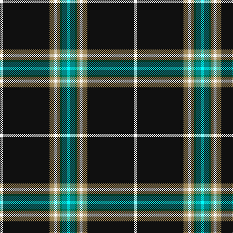

This page is one **sett** — a single exact thread-count. It belongs to the [tartan](/tartans/w3k48lo5w3lo3g2g5lt3/)
(the same proportion at any scale), whose colour order is pattern [WGGYWYKW](/stripes/wggywykw/).

Sourced from register-of-tartans.  It is a [8 stripe tartan](/stripes/stripes8/).

Original link https://www.tartanregister.gov.uk/tartanDetails.aspx?ref=11144

## Register references

External register numbers recorded for this tartan.

- Scottish Register of Tartans: [11144](https://www.tartanregister.gov.uk/tartanDetails.aspx?ref=11144)

## Thread count
W/6 K96 LT10 W6 LT6 G4 B10 LB/6

## Palette

Palette: <strong>Tartan Register</strong>
<table><thead><tr><th>Colour</th><th>Threads</th><th>Shade</th><th>Base</th><th>OKLCh</th></tr></thead><tbody><tr><td>W/</td><td style="text-align:right;font-variant-numeric:tabular-nums">6</td><td><code style="background-color:#F8F8F8;">#F8F8F8</code> <small style="color:#888">#F8F8F8</small></td><td>W <code style="background-color:#F7F7F7;">#F7F7F7</code></td><td><small style="color:#888">oklch(97.9% 0.000 89.9)</small></td></tr><tr><td>K</td><td style="text-align:right;font-variant-numeric:tabular-nums">96</td><td><code style="background-color:#101010;">#101010</code> <small style="color:#888">#101010</small></td><td>K <code style="background-color:#000000;">#000000</code></td><td><small style="color:#888">oklch(17.3% 0.000 89.9)</small></td></tr><tr><td>LT</td><td style="text-align:right;font-variant-numeric:tabular-nums">10</td><td><code style="background-color:#A08858;">#A08858</code> <small style="color:#888">#A08858</small></td><td>Y <code style="background-color:#F2BF00;">#F2BF00</code></td><td><small style="color:#888">oklch(63.7% 0.071 84.0)</small></td></tr><tr><td>W</td><td style="text-align:right;font-variant-numeric:tabular-nums">6</td><td><code style="background-color:#F8F8F8;">#F8F8F8</code> <small style="color:#888">#F8F8F8</small></td><td>W <code style="background-color:#F7F7F7;">#F7F7F7</code></td><td><small style="color:#888">oklch(97.9% 0.000 89.9)</small></td></tr><tr><td>LT</td><td style="text-align:right;font-variant-numeric:tabular-nums">6</td><td><code style="background-color:#A08858;">#A08858</code> <small style="color:#888">#A08858</small></td><td>Y <code style="background-color:#F2BF00;">#F2BF00</code></td><td><small style="color:#888">oklch(63.7% 0.071 84.0)</small></td></tr><tr><td>G</td><td style="text-align:right;font-variant-numeric:tabular-nums">4</td><td><code style="background-color:#00643C;">#00643C</code> <small style="color:#888">#00643C</small></td><td>G <code style="background-color:#006100;">#006100</code></td><td><small style="color:#888">oklch(44.3% 0.104 157.7)</small></td></tr><tr><td>B</td><td style="text-align:right;font-variant-numeric:tabular-nums">10</td><td><code style="background-color:#048888;">#048888</code> <small style="color:#888">#048888</small></td><td>G <code style="background-color:#006100;">#006100</code></td><td><small style="color:#888">oklch(56.8% 0.096 194.8)</small></td></tr><tr><td>LB/</td><td style="text-align:right;font-variant-numeric:tabular-nums">6</td><td><code style="background-color:#00FCFC;">#00FCFC</code> <small style="color:#888">#00FCFC</small></td><td>W <code style="background-color:#F7F7F7;">#F7F7F7</code></td><td><small style="color:#888">oklch(89.7% 0.153 194.8)</small></td></tr></tbody></table>

# Sample pattern

## Nearest tartans

The nearest existing variants by ΔTartan distance, with this tartan at the top so the swatches line up against it.

ΔTartan

Tartan

Sett

—

<a href="/ttd/edit/#slug=w3k48lo5w3lo3g2g5lt3~x2">Pavelka Limited</a> <a class="nn-out" href="/setts/s8/w3k48lo5w3lo3g2g5lt3~x2/" title="open its dictionary page">↗</a>

0.75

<a href="/ttd/edit/#slug=k2r3k36n2k5n7ly3lt5lg2~x2">Victory</a> <a class="nn-out" href="/setts/s9/k2r3k36n2k5n7ly3lt5lg2~x2/" title="open its dictionary page">↗</a>

0.82

<a href="/ttd/edit/#slug=dy3k48dy5w3dy3g2g5lb3~x2">Pavelka Ltd</a> <a class="nn-out" href="/setts/s8/dy3k48dy5w3dy3g2g5lb3~x2/" title="open its dictionary page">↗</a>

0.94

<a href="/ttd/edit/#slug=w2do3g5k50g4do3w2t3k2ly2~x2">Hawes (2014)</a> <a class="nn-out" href="/setts/s10/w2do3g5k50g4do3w2t3k2ly2~x2/" title="open its dictionary page">↗</a>

1.06

<a href="/ttd/edit/#slug=k44ly3k4ly3k4db4w2db4r2w2dg4ly2~x2">Clan An Caigeann (Corporate)</a> <a class="nn-out" href="/setts/s12/k44ly3k4ly3k4db4w2db4r2w2dg4ly2~x2/" title="open its dictionary page">↗</a>

1.14

<a href="/ttd/edit/#slug=w2do3g5k50g4do3w2db3k2ly2~x2">Hawks (2014)</a> <a class="nn-out" href="/setts/s10/w2do3g5k50g4do3w2db3k2ly2~x2/" title="open its dictionary page">↗</a>

1.20

<a href="/ttd/edit/#slug=k48db4k8ly2k3w3k3g12r6k3r3w3~x2">Stewart Black Clan Tartan Tartan Number: 1061. Earliest known date: c.1930 Count from a silk sample in the STS collection labelled Stewart See products available Copyright © Blair Urquhart, Comrie, 2015</a> <a class="nn-out" href="/setts/s12/k48db4k8ly2k3w3k3g12r6k3r3w3~x2/" title="open its dictionary page">↗</a>

1.23

<a href="/ttd/edit/#slug=dt5k35b3k2r3k2g3k2w3k2~x2">Thin Blue Line UK</a> <a class="nn-out" href="/setts/s10/dt5k35b3k2r3k2g3k2w3k2~x2/" title="open its dictionary page">↗</a>

1.24

<a href="/ttd/edit/#slug=r5g3ly6w3ly5k55w5~x2">Avalon</a> <a class="nn-out" href="/setts/s7/r5g3ly6w3ly5k55w5~x2/" title="open its dictionary page">↗</a>

1.26

<a href="/ttd/edit/#slug=w5k4db2k5ly2r2ly2k30g3w7k4~x2">Braddock Family (Northumberland) (Personal)</a> <a class="nn-out" href="/setts/s11/w5k4db2k5ly2r2ly2k30g3w7k4~x2/" title="open its dictionary page">↗</a>

1.26

<a href="/ttd/edit/#slug=k50g6db6r6n6w3~x2">Friends of Nordegg</a> <a class="nn-out" href="/setts/s6/k50g6db6r6n6w3~x2/" title="open its dictionary page">↗</a>

## Neighbour map

Every grey dot is one of 14299 variants placed by the first two principal components of the ΔTartan feature space (44% of its variance). Red is this tartan; blue dots are its nearest — click one to open its page.

<svg viewBox="0 0 640 380" role="img" style="max-width:100%;height:auto;border:1px solid #e0e0e0;border-radius:4px;display:block" xmlns="http://www.w3.org/2000/svg"><image href="/nn/cloud.v1.png" width="640" height="380"/><a href="/setts/s9/k2r3k36n2k5n7ly3lt5lg2~x2/"><circle cx="346.0" cy="101.7" r="4" fill="#3465a4"><title>Victory</title></circle></a><a href="/setts/s8/dy3k48dy5w3dy3g2g5lb3~x2/"><circle cx="387.7" cy="98.0" r="4" fill="#3465a4"><title>Pavelka Ltd</title></circle></a><a href="/setts/s10/w2do3g5k50g4do3w2t3k2ly2~x2/"><circle cx="397.6" cy="77.0" r="4" fill="#3465a4"><title>Hawes (2014)</title></circle></a><a href="/setts/s12/k44ly3k4ly3k4db4w2db4r2w2dg4ly2~x2/"><circle cx="369.4" cy="74.0" r="4" fill="#3465a4"><title>Clan An Caigeann (Corporate)</title></circle></a><a href="/setts/s10/w2do3g5k50g4do3w2db3k2ly2~x2/"><circle cx="406.2" cy="81.7" r="4" fill="#3465a4"><title>Hawks (2014)</title></circle></a><a href="/setts/s12/k48db4k8ly2k3w3k3g12r6k3r3w3~x2/"><circle cx="368.1" cy="82.8" r="4" fill="#3465a4"><title>Stewart Black Clan Tartan Tartan Number: 1061. Earliest known date: c.1930 Count from a silk sample in the STS collection labelled Stewart See products available Copyright © Blair Urquhart, Comrie, 2015</title></circle></a><a href="/setts/s10/dt5k35b3k2r3k2g3k2w3k2~x2/"><circle cx="401.9" cy="100.3" r="4" fill="#3465a4"><title>Thin Blue Line UK</title></circle></a><a href="/setts/s7/r5g3ly6w3ly5k55w5~x2/"><circle cx="370.6" cy="115.0" r="4" fill="#3465a4"><title>Avalon</title></circle></a><a href="/setts/s11/w5k4db2k5ly2r2ly2k30g3w7k4~x2/"><circle cx="312.1" cy="98.6" r="4" fill="#3465a4"><title>Braddock Family (Northumberland) (Personal)</title></circle></a><a href="/setts/s6/k50g6db6r6n6w3~x2/"><circle cx="340.3" cy="131.4" r="4" fill="#3465a4"><title>Friends of Nordegg</title></circle></a><circle cx="362.9" cy="85.6" r="5" fill="#c00000"/></svg>

ID: /setts/s8/w3k48lo5w3lo3g2g5lt3~x2/
