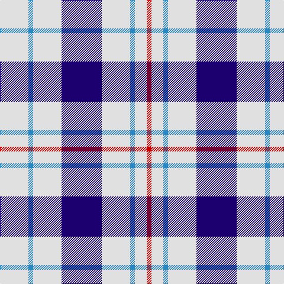

In pattern [RWBWBWBW](/patterns/rwbwbwbw/).

This was sourced from register-of-tartans.  It is a [8 stripes tartan](/stripes/stripes8/).

Original link https://www.tartanregister.gov.uk/tartanDetails.aspx?ref=2957

## Attestations

This cloth appears in 2 source records; the oldest owns this page.

- 01/01/2005 — Milne Royal Blue Dress (Dance) (register-of-tartans, [record](https://www.tartanregister.gov.uk/tartanDetails.aspx?ref=2957))
- pre 2005 — Milne Dress, Royal Blue (Dance) (tartans-authority, [record](http://www.tartansauthority.com/tartan-ferret/display/6547/))

## Thread count
LN/48 B8 LN48 DB68 LN48 B8 LN20 R/8

## Palette
Each colour and its ΔE from the base-6 reference it is a variant of.

| Colour | Shade | Base | ΔE (OKLab) |
|---|---|---|---|
| B | <code style="background-color:#2888C4;">#2888C4</code> `#2888C4` | B <code style="background-color:#2C4084;">#2C4084</code> | 0.21 |
| DB | <code style="background-color:#1C0070;">#1C0070</code> `#1C0070` | B <code style="background-color:#2C4084;">#2C4084</code> | 0.14 |
| LN | <code style="background-color:#E0E0E0;">#E0E0E0</code> `#E0E0E0` | W <code style="background-color:#F4F4F0;">#F4F4F0</code> | 0.06 |
| R | <code style="background-color:#C80000;">#C80000</code> `#C80000` | R <code style="background-color:#C80000;">#C80000</code> | 0.00 |

# Sample pattern

## Nearest tartans

The nearest existing variants by ΔTartan distance.

1. [Milne Royal Blue Dress Fashion Tartan Tartan Number: 6547. Earliest known date: 01/01/2005 A Dance version of #634 (original Scottish Tartans Authority reference) reputed to be a personal tartan./Threadcount and colours aren't 100% original. Generated manually./ See products available Copyright © Blair Urquhart, Comrie, 2015](/setts/s8/w24b5w24ba36w28b6w12r6-b20608c-ba2c2c80-rc80000-we0e0e0/) — ΔT 0.55
1. [Boswell Dress Personal Tartan Tartan Number: 6359. Earliest known date: 2004 A tartan for William Boswell of Balmuto in Fife. See products available Copyright © Blair Urquhart, Comrie, 2015](/setts/s8/w26r6w4k10w4r6w26b16-b2c2c80-k101010-rc80000-we0e0e0/) — ΔT 1.12
1. [Unidentified (Shirt)](/setts/s6/w14b32w40b6w6y6-b2c4084-we0e0e0-ye8c000/) — ΔT 1.35
1. [Unidentified (Shirt)](/setts/s6/w14b32w40b6w6y6-b304080-we0e0e0-yf0c000/) — ΔT 1.36
1. [Buchanan, dress Blue](/setts/s6/w10b32w10b32w66r6-b304080-rc00000-we0e0e0/) — ΔT 1.41
1. [Buchanan Dress Blue Clan Tartan Tartan Number: 1672. Earliest known date: pre 2003 One of a number of dress tartans produced by Hugh Macpherson, a kiltmaker in Edinburgh, intended for dancing and other informal occassions. The 'dress' version of clan tartan is usually created by substituting white for one of the 'ground' colours. See products available Copyright © Blair Urquhart, Comrie, 2015](/setts/s6/w10b32w10b32w66r6-b2c2c80-rc80000-we0e0e0/) — ΔT 1.42
1. [Buchanan Dress Blue (Dance)](/setts/s6/w10b32w10b32w66r6-b1c0070-r880000-wf8f8f8/) — ΔT 1.49
1. [Milne Purple Dress (Dance)](/setts/s8/w48b8w48r68w48b8w20ra8-b202060-rb468ac-rac80000-wfcfcfc/) — ΔT 1.50
1. [Henderson Dress (Dance)](/setts/s9/w4b12w12b4w20k4w8k12y4-b3850c8-k101010-wfcfcfc-yd09800/) — ΔT 1.57
1. [MacPherson, Blue & White](/setts/s7/w10r6w52b42w6b16y6-b304080-rc00000-we0e0e0-yf0c000/) — ΔT 1.59

## Neighbour map

Every grey dot is one of 15726 variants placed by the first two principal components of the ΔTartan feature space (44% of its variance). Red is this tartan; blue dots are its nearest — click one to open its page.

<svg viewBox="0 0 640 380" role="img" style="max-width:100%;height:auto;border:1px solid #e0e0e0;border-radius:4px;display:block" xmlns="http://www.w3.org/2000/svg"><image href="/nn/cloud.v1.png" width="640" height="380"/><a href="/setts/s8/w24b5w24ba36w28b6w12r6-b20608c-ba2c2c80-rc80000-we0e0e0/"><circle cx="262.6" cy="204.6" r="4" fill="#3465a4"><title>Milne Royal Blue Dress Fashion Tartan Tartan Number: 6547. Earliest known date: 01/01/2005 A Dance version of #634 (original Scottish Tartans Authority reference) reputed to be a personal tartan./Threadcount and colours aren't 100% original. Generated manually./ See products available Copyright © Blair Urquhart, Comrie, 2015</title></circle></a><a href="/setts/s8/w26r6w4k10w4r6w26b16-b2c2c80-k101010-rc80000-we0e0e0/"><circle cx="246.9" cy="194.2" r="4" fill="#3465a4"><title>Boswell Dress Personal Tartan Tartan Number: 6359. Earliest known date: 2004 A tartan for William Boswell of Balmuto in Fife. See products available Copyright © Blair Urquhart, Comrie, 2015</title></circle></a><a href="/setts/s6/w14b32w40b6w6y6-b2c4084-we0e0e0-ye8c000/"><circle cx="286.4" cy="221.4" r="4" fill="#3465a4"><title>Unidentified (Shirt)</title></circle></a><a href="/setts/s6/w14b32w40b6w6y6-b304080-we0e0e0-yf0c000/"><circle cx="286.9" cy="221.2" r="4" fill="#3465a4"><title>Unidentified (Shirt)</title></circle></a><a href="/setts/s6/w10b32w10b32w66r6-b304080-rc00000-we0e0e0/"><circle cx="299.0" cy="203.7" r="4" fill="#3465a4"><title>Buchanan, dress Blue</title></circle></a><a href="/setts/s6/w10b32w10b32w66r6-b2c2c80-rc80000-we0e0e0/"><circle cx="294.8" cy="202.1" r="4" fill="#3465a4"><title>Buchanan Dress Blue Clan Tartan Tartan Number: 1672. Earliest known date: pre 2003 One of a number of dress tartans produced by Hugh Macpherson, a kiltmaker in Edinburgh, intended for dancing and other informal occassions. The 'dress' version of clan tartan is usually created by substituting white for one of the 'ground' colours. See products available Copyright © Blair Urquhart, Comrie, 2015</title></circle></a><a href="/setts/s6/w10b32w10b32w66r6-b1c0070-r880000-wf8f8f8/"><circle cx="283.2" cy="198.1" r="4" fill="#3465a4"><title>Buchanan Dress Blue (Dance)</title></circle></a><a href="/setts/s8/w48b8w48r68w48b8w20ra8-b202060-rb468ac-rac80000-wfcfcfc/"><circle cx="299.0" cy="186.8" r="4" fill="#3465a4"><title>Milne Purple Dress (Dance)</title></circle></a><a href="/setts/s9/w4b12w12b4w20k4w8k12y4-b3850c8-k101010-wfcfcfc-yd09800/"><circle cx="173.9" cy="208.6" r="4" fill="#3465a4"><title>Henderson Dress (Dance)</title></circle></a><a href="/setts/s7/w10r6w52b42w6b16y6-b304080-rc00000-we0e0e0-yf0c000/"><circle cx="240.5" cy="180.1" r="4" fill="#3465a4"><title>MacPherson, Blue &amp; White</title></circle></a><circle cx="281.5" cy="191.3" r="5" fill="#c00000"/></svg>

ID: /setts/s8/w48b8w48ba68w48b8w20r8-b2888c4-ba1c0070-rc80000-we0e0e0/
