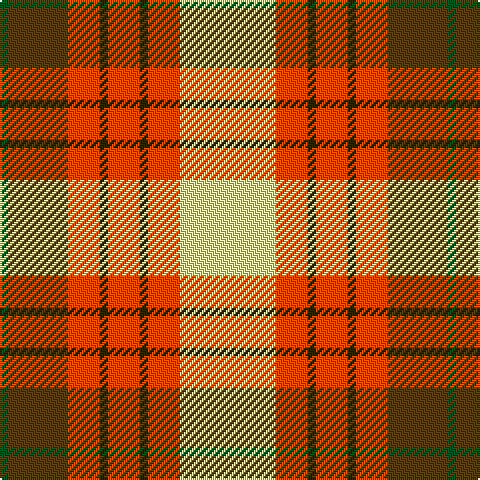

In pattern [GGRGRGRW](/patterns/ggrgrgrw/).

This was sourced from register-of-tartans.  It is a [8 stripes tartan](/stripes/stripes8/).

Original link https://www.tartanregister.gov.uk/tartanDetails.aspx?ref=4297

## Thread count
G/4 T30 R16 K4 R16 K4 R16 LY/48

## Palette
Each colour and its ΔE from the base-6 reference it is a variant of.

| Colour | Shade | Base | ΔE (OKLab) |
|---|---|---|---|
| G | <code style="background-color:#005020;">#005020</code> `#005020` | G <code style="background-color:#006100;">#006100</code> | 0.07 |
| K | <code style="background-color:#2A2303;">#2A2303</code> `#2A2303` | G <code style="background-color:#006100;">#006100</code> | 0.21 |
| LY | <code style="background-color:#F5DCA0;">#F5DCA0</code> `#F5DCA0` | W <code style="background-color:#F7F7F7;">#F7F7F7</code> | 0.11 |
| R | <code style="background-color:#FA4B00;">#FA4B00</code> `#FA4B00` | R <code style="background-color:#CC0000;">#CC0000</code> | 0.13 |
| T | <code style="background-color:#503C14;">#503C14</code> `#503C14` | G <code style="background-color:#006100;">#006100</code> | 0.14 |

# Sample pattern

## Nearest tartans

The nearest existing variants by ΔTartan distance.

1. [Satchidananda (Personal)](/setts/s9/g36y8b20w4r40y10r4w4g12-b2888c4-g604000-rfc5000-we0e0e0-ye8c000/) — ΔT 0.94
1. [MacLachlan, dress](/setts/s7/r68w6g8ga46w48k6g8-g006030-ga008000-k000000-rd03030-we0e0e0/) — ΔT 1.17
1. [MacLachlan Dress](/setts/s7/r72w6y8g48w48k6y12-g006818-k101010-r880000-wf8f8f8-yd09800/) — ΔT 1.23
1. [Carolyn, Melieres](/setts/s10/y8w4y4w16r32g6r6g16r12k4-g008000-k000000-rc00000-we0e0e0-yf0c000/) — ΔT 1.27
1. [Melieres, Carolyn (Personal)](/setts/s10/y8w4y4w16r32g6r6g16r12k4-g006818-k101010-rc80000-we0e0e0-ye8c000/) — ΔT 1.28
1. [Prince Charles Edward](/setts/s9/r48g12y16k8y16g48y8r12w4-g008000-k000000-rc00000-we0e0e0-yf0c000/) — ΔT 1.30
1. [Barbour - Muted](/setts/s7/y8r4y42b22w4ra42ya8-b1c1c1c-ra00000-ra98481c-wfcfcfc-yd8b000-yafccc00/) — ΔT 1.30
1. [Keeling (Corporate)](/setts/s7/y34g14y12r86k10ra12k26-g289c18-k101010-rc80000-ra888888-ye8c000/) — ΔT 1.34
1. [Oor Wullie (DC Thomson)](/setts/s7/y6r6ya4r40k32w48wa4-k101010-rff0000-we0e0e0-waffffff-yffe600-yaffa500/) — ΔT 1.39
1. [MacLean Dress (Lumsden)](/setts/s6/r4w48g24r32wa12y4-g006818-ra40000-wf8ece0-waa8ace8-yd09800/) — ΔT 1.41

## Neighbour map

Every grey dot is one of 15726 variants placed by the first two principal components of the ΔTartan feature space (44% of its variance). Red is this tartan; blue dots are its nearest — click one to open its page.

<svg viewBox="0 0 640 380" role="img" style="max-width:100%;height:auto;border:1px solid #e0e0e0;border-radius:4px;display:block" xmlns="http://www.w3.org/2000/svg"><image href="/nn/cloud.v1.png" width="640" height="380"/><a href="/setts/s9/g36y8b20w4r40y10r4w4g12-b2888c4-g604000-rfc5000-we0e0e0-ye8c000/"><circle cx="150.6" cy="154.7" r="4" fill="#3465a4"><title>Satchidananda (Personal)</title></circle></a><a href="/setts/s7/r68w6g8ga46w48k6g8-g006030-ga008000-k000000-rd03030-we0e0e0/"><circle cx="146.7" cy="152.6" r="4" fill="#3465a4"><title>MacLachlan, dress</title></circle></a><a href="/setts/s7/r72w6y8g48w48k6y12-g006818-k101010-r880000-wf8f8f8-yd09800/"><circle cx="138.2" cy="148.7" r="4" fill="#3465a4"><title>MacLachlan Dress</title></circle></a><a href="/setts/s10/y8w4y4w16r32g6r6g16r12k4-g008000-k000000-rc00000-we0e0e0-yf0c000/"><circle cx="168.1" cy="157.3" r="4" fill="#3465a4"><title>Carolyn, Melieres</title></circle></a><a href="/setts/s10/y8w4y4w16r32g6r6g16r12k4-g006818-k101010-rc80000-we0e0e0-ye8c000/"><circle cx="173.6" cy="158.8" r="4" fill="#3465a4"><title>Melieres, Carolyn (Personal)</title></circle></a><a href="/setts/s9/r48g12y16k8y16g48y8r12w4-g008000-k000000-rc00000-we0e0e0-yf0c000/"><circle cx="152.0" cy="149.7" r="4" fill="#3465a4"><title>Prince Charles Edward</title></circle></a><a href="/setts/s7/y8r4y42b22w4ra42ya8-b1c1c1c-ra00000-ra98481c-wfcfcfc-yd8b000-yafccc00/"><circle cx="146.9" cy="146.1" r="4" fill="#3465a4"><title>Barbour - Muted</title></circle></a><a href="/setts/s7/y34g14y12r86k10ra12k26-g289c18-k101010-rc80000-ra888888-ye8c000/"><circle cx="185.0" cy="160.2" r="4" fill="#3465a4"><title>Keeling (Corporate)</title></circle></a><a href="/setts/s7/y6r6ya4r40k32w48wa4-k101010-rff0000-we0e0e0-waffffff-yffe600-yaffa500/"><circle cx="118.7" cy="121.1" r="4" fill="#3465a4"><title>Oor Wullie (DC Thomson)</title></circle></a><a href="/setts/s6/r4w48g24r32wa12y4-g006818-ra40000-wf8ece0-waa8ace8-yd09800/"><circle cx="148.1" cy="161.5" r="4" fill="#3465a4"><title>MacLean Dress (Lumsden)</title></circle></a><circle cx="152.6" cy="144.6" r="5" fill="#c00000"/></svg>

ID: /setts/s8/w48r16g4r16g4r16ga30gb4-g2a2303-ga503c14-gb005020-rfa4b00-wf5dca0/
