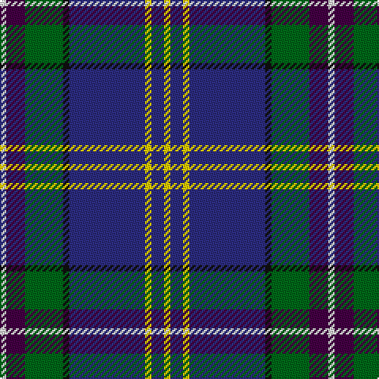

In pattern [WBGKBYBY](/patterns/wbgkbyby/).

This was sourced from tartans-authority.  It is a [8 stripes tartan](/stripes/stripes8/).

Original link http://www.tartansauthority.com/tartan-ferret/display/10433/

## Thread count
LN/4 DP12 G24 K4 DB48 Y4 DB8 Y/4

## Palette
Each colour and its ΔE from the base-6 reference it is a variant of.

| Colour | Shade | Base | ΔE (OKLab) |
|---|---|---|---|
| DB | <code style="background-color:#2C2C80;">#2C2C80</code> `#2C2C80` | B <code style="background-color:#2C4084;">#2C4084</code> | 0.05 |
| DP | <code style="background-color:#440044;">#440044</code> `#440044` | B <code style="background-color:#2C4084;">#2C4084</code> | 0.17 |
| G | <code style="background-color:#006818;">#006818</code> `#006818` | G <code style="background-color:#006400;">#006400</code> | 0.02 |
| K | <code style="background-color:#101010;">#101010</code> `#101010` | K <code style="background-color:#000000;">#000000</code> | 0.17 |
| LN | <code style="background-color:#E0E0E0;">#E0E0E0</code> `#E0E0E0` | W <code style="background-color:#F4F4F0;">#F4F4F0</code> | 0.06 |
| Y | <code style="background-color:#FCCC00;">#FCCC00</code> `#FCCC00` | Y <code style="background-color:#E8C000;">#E8C000</code> | 0.04 |

# Sample pattern

## Nearest tartans

The nearest existing variants by ΔTartan distance.

1. [Vipont Family Tartan Tartan Number: 1479. Earliest known date: 1983 This count comes from a sample at the Scottish Tartans Society, in the MacGregor Hastie collection. He in turn procured it from J.Wright of Edinburgh. A contradictory note in the files says, "It was apparently designed and woven by them (J.Wright) for the family of Vipont c.1930. It is rarely if ever used today." The Scottish Viponts are an ancient family, who formerly possessed lands in Aberdour, Fife. See products available Copyright © Blair Urquhart, Comrie, 2015](/setts/s7/r8g28k6w6g24b72wa8-b2c2c80-g006818-k101010-rc80000-wc49cd8-wae0e0e0/) — ΔT 0.70
1. [Tupper, John Charles (Personal)](/setts/s10/r4w4g16ga4g4b40ba16ga4b30w4-b202060-ba5c8ca8-g003820-ga289c18-r880000-wfcfcfc/) — ΔT 0.73
1. [Tupper, John Charles (Personal)](/setts/s10/r4w4g16ga4g4b40ba16ga4b30w4-b1c1c50-ba5f749c-g003820-ga649848-r800028-wffffff/) — ΔT 0.76
1. [Shearer (2016)](/setts/s6/k8b8ba64r8bb34w4-b646464-ba003c64-bb788cb4-k000000-rc8002c-wfcfcfc/) — ΔT 0.81
1. [Ferster, James Carney (Personal)](/setts/s6/b24ba70w8wa6k22r10-b1474b4-ba003c64-k101010-r880000-w98c8e8-wafcfcfc/) — ΔT 0.88
1. [Ferster, James Carney](/setts/s6/b24ba70y8w6k22ka10-b5f749c-ba433a5a-k1c1714-ka000000-wf9f5ef-yafb8bb/) — ΔT 0.91
1. [Czech National (District)](/setts/s11/b8y4b48k4b10r6k28g28w6r6b6-b2c2c80-g006818-k101010-rc80000-we0e0e0-ye8c000/) — ΔT 0.98
1. [Scottish Italian](/setts/s8/b22ba10g8w6r6k32ba56b4-b1474b4-ba202060-g006818-k101010-rc80000-wfcfcfc/) — ΔT 1.01
1. [Wrigglesworth (Name)](/setts/s7/b60ba20w20b10r6y6g6-b2c2c80-ba1474b4-g289c18-ra00048-wc0c0c0-ye8c000/) — ΔT 1.07
1. [LLoyd of Astargus Canadian Family Tartan Tartan Number: 5771. Earliest known date: 2001 The designer of this tartan is of Welsh & Scottish blood and sees this tartan as being appropriate for any Lloyds with Scottish blood. The 'Astargus' derives from Gaelic - 'Astar' being said to mean "travelling or making distance" and 'gus' meaning "until I come back" See products available Copyright © Blair Urquhart, Comrie, 2015](/setts/s6/r6b76k26w6ra40y4-b202060-k101010-r800000-ra888888-we0e0e0-yf0c400/) — ΔT 1.08

## Neighbour map

Every grey dot is one of 15726 variants placed by the first two principal components of the ΔTartan feature space (44% of its variance). Red is this tartan; blue dots are its nearest — click one to open its page.

<svg viewBox="0 0 640 380" role="img" style="max-width:100%;height:auto;border:1px solid #e0e0e0;border-radius:4px;display:block" xmlns="http://www.w3.org/2000/svg"><image href="/nn/cloud.v1.png" width="640" height="380"/><a href="/setts/s7/r8g28k6w6g24b72wa8-b2c2c80-g006818-k101010-rc80000-wc49cd8-wae0e0e0/"><circle cx="225.6" cy="155.5" r="4" fill="#3465a4"><title>Vipont Family Tartan Tartan Number: 1479. Earliest known date: 1983 This count comes from a sample at the Scottish Tartans Society, in the MacGregor Hastie collection. He in turn procured it from J.Wright of Edinburgh. A contradictory note in the files says, &quot;It was apparently designed and woven by them (J.Wright) for the family of Vipont c.1930. It is rarely if ever used today.&quot; The Scottish Viponts are an ancient family, who formerly possessed lands in Aberdour, Fife. See products available Copyright © Blair Urquhart, Comrie, 2015</title></circle></a><a href="/setts/s10/r4w4g16ga4g4b40ba16ga4b30w4-b202060-ba5c8ca8-g003820-ga289c18-r880000-wfcfcfc/"><circle cx="230.7" cy="148.4" r="4" fill="#3465a4"><title>Tupper, John Charles (Personal)</title></circle></a><a href="/setts/s10/r4w4g16ga4g4b40ba16ga4b30w4-b1c1c50-ba5f749c-g003820-ga649848-r800028-wffffff/"><circle cx="235.2" cy="149.9" r="4" fill="#3465a4"><title>Tupper, John Charles (Personal)</title></circle></a><a href="/setts/s6/k8b8ba64r8bb34w4-b646464-ba003c64-bb788cb4-k000000-rc8002c-wfcfcfc/"><circle cx="245.0" cy="147.9" r="4" fill="#3465a4"><title>Shearer (2016)</title></circle></a><a href="/setts/s6/b24ba70w8wa6k22r10-b1474b4-ba003c64-k101010-r880000-w98c8e8-wafcfcfc/"><circle cx="215.7" cy="169.4" r="4" fill="#3465a4"><title>Ferster, James Carney (Personal)</title></circle></a><a href="/setts/s6/b24ba70y8w6k22ka10-b5f749c-ba433a5a-k1c1714-ka000000-wf9f5ef-yafb8bb/"><circle cx="218.9" cy="164.9" r="4" fill="#3465a4"><title>Ferster, James Carney</title></circle></a><a href="/setts/s11/b8y4b48k4b10r6k28g28w6r6b6-b2c2c80-g006818-k101010-rc80000-we0e0e0-ye8c000/"><circle cx="194.2" cy="137.4" r="4" fill="#3465a4"><title>Czech National (District)</title></circle></a><a href="/setts/s8/b22ba10g8w6r6k32ba56b4-b1474b4-ba202060-g006818-k101010-rc80000-wfcfcfc/"><circle cx="203.0" cy="152.3" r="4" fill="#3465a4"><title>Scottish Italian</title></circle></a><a href="/setts/s7/b60ba20w20b10r6y6g6-b2c2c80-ba1474b4-g289c18-ra00048-wc0c0c0-ye8c000/"><circle cx="234.6" cy="157.7" r="4" fill="#3465a4"><title>Wrigglesworth (Name)</title></circle></a><a href="/setts/s6/r6b76k26w6ra40y4-b202060-k101010-r800000-ra888888-we0e0e0-yf0c400/"><circle cx="232.4" cy="143.4" r="4" fill="#3465a4"><title>LLoyd of Astargus Canadian Family Tartan Tartan Number: 5771. Earliest known date: 2001 The designer of this tartan is of Welsh &amp; Scottish blood and sees this tartan as being appropriate for any Lloyds with Scottish blood. The 'Astargus' derives from Gaelic - 'Astar' being said to mean &quot;travelling or making distance&quot; and 'gus' meaning &quot;until I come back&quot; See products available Copyright © Blair Urquhart, Comrie, 2015</title></circle></a><circle cx="230.7" cy="142.4" r="5" fill="#c00000"/></svg>

ID: /setts/s8/w4b12g24k4ba48y4ba8y4-b440044-ba2c2c80-g006818-k101010-we0e0e0-yfccc00/
