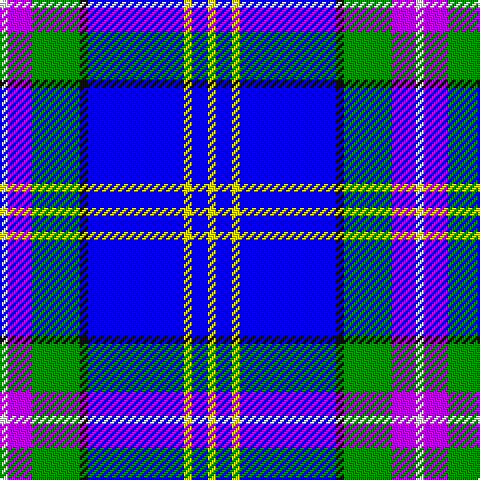

In pattern [WBGKBYBY](/patterns/wbgkbyby/).

This was sourced from register-of-tartans.  It is a [8 stripes tartan](/stripes/stripes8/).

Original link https://www.tartanregister.gov.uk/tartanDetails.aspx?ref=10433

## Thread count
W/4 P12 G24 K4 B48 Y4 B8 Y/4

## Palette
Each colour and its ΔE from the base-6 reference it is a variant of.

| Colour | Shade | Base | ΔE (OKLab) |
|---|---|---|---|
| B | <code style="background-color:#0000CD;">#0000CD</code> `#0000CD` | B <code style="background-color:#2C4084;">#2C4084</code> | 0.15 |
| G | <code style="background-color:#008B00;">#008B00</code> `#008B00` | G <code style="background-color:#006400;">#006400</code> | 0.12 |
| K | <code style="background-color:#101010;">#101010</code> `#101010` | K <code style="background-color:#000000;">#000000</code> | 0.17 |
| P | <code style="background-color:#AA00FF;">#AA00FF</code> `#AA00FF` | B <code style="background-color:#2C4084;">#2C4084</code> | 0.29 |
| W | <code style="background-color:#FFFFFF;">#FFFFFF</code> `#FFFFFF` | W <code style="background-color:#F4F4F0;">#F4F4F0</code> | 0.03 |
| Y | <code style="background-color:#FFE600;">#FFE600</code> `#FFE600` | Y <code style="background-color:#E8C000;">#E8C000</code> | 0.10 |

# Sample pattern

## Nearest tartans

The nearest existing variants by ΔTartan distance.

1. [Queensferry High School: Ferry Fling](/setts/s9/w5wa3wb7w5wb27b8ba43wc3wb3-b4169e1-ba000080-wd3d3d3-wafffafa-wb7ec0ee-wcffffff/) — ΔT 1.14
1. [Oren Peterson](/setts/s6/r4g8b40ra4ba60w4-b778899-ba000080-g006400-rd02090-raff0000-wffffff/) — ΔT 1.28
1. [Dinwiddie Hunting](/setts/s10/y12b6k6b72k20ba36b12k4g8k6-b0000cd-ba666666-g008b00-k101010-yffe600/) — ΔT 1.46
1. [Manx National #2](/setts/s7/b8g31r4y4ba17bb64w4-b5a008c-ba080848-bb0596fa-g005020-rdc0000-we0e0e0-yc89600/) — ΔT 1.48
1. [Wrigglesworth (Name)](/setts/s7/b60ba20w20b10r6y6g6-b2c2c80-ba1474b4-g289c18-ra00048-wc0c0c0-ye8c000/) — ΔT 1.53
1. [New Millennium](/setts/s11/g8b46w46b4g8k12b48ba8b12w6r8-b1c0070-ba2474e8-g006818-k101010-r880000-wc0c0c0/) — ΔT 1.53
1. [Unidentified #23](/setts/s7/b70r4k32y4ba50w4ba12-b080848-ba0596fa-k101010-rdc0000-we0e0e0-ye8c000/) — ΔT 1.59
1. [Dickson (Kirkcudbrightshire)](/setts/s7/b12k16b12g24ba58w6ba8-b0000ff-ba000080-g009900-k101010-wffffff/) — ΔT 1.61
1. [U.S. Forces Thurso (Military)](/setts/s7/b80r6k20y4ya30w4ya8-b1c0070-k101010-r880000-wfcfcfc-yd09800-ya7ca8cc/) — ΔT 1.62
1. [Loch Ness in Scotland](/setts/s7/g8b56y24ya4g4ya24r4-b000064-g289c18-rc8002c-y48a4c0-yaa0a0a0/) — ΔT 1.65

## Neighbour map

Every grey dot is one of 15726 variants placed by the first two principal components of the ΔTartan feature space (44% of its variance). Red is this tartan; blue dots are its nearest — click one to open its page.

<svg viewBox="0 0 640 380" role="img" style="max-width:100%;height:auto;border:1px solid #e0e0e0;border-radius:4px;display:block" xmlns="http://www.w3.org/2000/svg"><image href="/nn/cloud.v1.png" width="640" height="380"/><a href="/setts/s9/w5wa3wb7w5wb27b8ba43wc3wb3-b4169e1-ba000080-wd3d3d3-wafffafa-wb7ec0ee-wcffffff/"><circle cx="160.0" cy="110.7" r="4" fill="#3465a4"><title>Queensferry High School: Ferry Fling</title></circle></a><a href="/setts/s6/r4g8b40ra4ba60w4-b778899-ba000080-g006400-rd02090-raff0000-wffffff/"><circle cx="241.2" cy="142.1" r="4" fill="#3465a4"><title>Oren Peterson</title></circle></a><a href="/setts/s10/y12b6k6b72k20ba36b12k4g8k6-b0000cd-ba666666-g008b00-k101010-yffe600/"><circle cx="232.0" cy="130.5" r="4" fill="#3465a4"><title>Dinwiddie Hunting</title></circle></a><a href="/setts/s7/b8g31r4y4ba17bb64w4-b5a008c-ba080848-bb0596fa-g005020-rdc0000-we0e0e0-yc89600/"><circle cx="190.6" cy="116.0" r="4" fill="#3465a4"><title>Manx National #2</title></circle></a><a href="/setts/s7/b60ba20w20b10r6y6g6-b2c2c80-ba1474b4-g289c18-ra00048-wc0c0c0-ye8c000/"><circle cx="234.6" cy="157.7" r="4" fill="#3465a4"><title>Wrigglesworth (Name)</title></circle></a><a href="/setts/s11/g8b46w46b4g8k12b48ba8b12w6r8-b1c0070-ba2474e8-g006818-k101010-r880000-wc0c0c0/"><circle cx="208.1" cy="131.5" r="4" fill="#3465a4"><title>New Millennium</title></circle></a><a href="/setts/s7/b70r4k32y4ba50w4ba12-b080848-ba0596fa-k101010-rdc0000-we0e0e0-ye8c000/"><circle cx="171.8" cy="136.7" r="4" fill="#3465a4"><title>Unidentified #23</title></circle></a><a href="/setts/s7/b12k16b12g24ba58w6ba8-b0000ff-ba000080-g009900-k101010-wffffff/"><circle cx="186.3" cy="188.0" r="4" fill="#3465a4"><title>Dickson (Kirkcudbrightshire)</title></circle></a><a href="/setts/s7/b80r6k20y4ya30w4ya8-b1c0070-k101010-r880000-wfcfcfc-yd09800-ya7ca8cc/"><circle cx="254.6" cy="118.8" r="4" fill="#3465a4"><title>U.S. Forces Thurso (Military)</title></circle></a><a href="/setts/s7/g8b56y24ya4g4ya24r4-b000064-g289c18-rc8002c-y48a4c0-yaa0a0a0/"><circle cx="195.2" cy="155.1" r="4" fill="#3465a4"><title>Loch Ness in Scotland</title></circle></a><circle cx="197.5" cy="131.8" r="5" fill="#c00000"/></svg>

ID: /setts/s8/w4b12g24k4ba48y4ba8y4-baa00ff-ba0000cd-g008b00-k101010-wffffff-yffe600/
