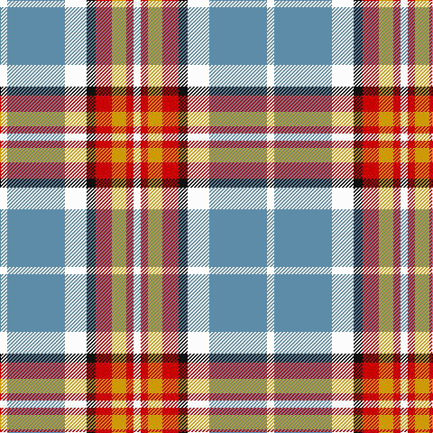

In pattern [WBWKRYRW](/patterns/wbwkryrw/).

This was sourced from tartans-authority.  It is a [8 stripes tartan](/stripes/stripes8/).

Original link http://www.tartansauthority.com/tartan-ferret/display/11253/

## Thread count
W/8 B64 W24 K10 R18 DY16 R8 W/8

## Palette
Each colour and its ΔE from the base-6 reference it is a variant of.

| Colour | Shade | Base | ΔE (OKLab) |
|---|---|---|---|
| B | <code style="background-color:#5C8CA8;">#5C8CA8</code> `#5C8CA8` | B <code style="background-color:#2A418A;">#2A418A</code> | 0.23 |
| DY | <code style="background-color:#D09800;">#D09800</code> `#D09800` | Y <code style="background-color:#F2BF00;">#F2BF00</code> | 0.12 |
| K | <code style="background-color:#101010;">#101010</code> `#101010` | K <code style="background-color:#000000;">#000000</code> | 0.17 |
| R | <code style="background-color:#C80000;">#C80000</code> `#C80000` | R <code style="background-color:#CC0000;">#CC0000</code> | 0.01 |
| W | <code style="background-color:#FCFCFC;">#FCFCFC</code> `#FCFCFC` | W <code style="background-color:#F7F7F7;">#F7F7F7</code> | 0.01 |

# Sample pattern

## Nearest tartans

The nearest existing variants by ΔTartan distance.

1. [Brunnbauer (2015)](/setts/s8/w4b32w12k5r9y8r4w4x2~b5f749c-k1c1714-rc8002c-wf8f8f8-ye0a126/) — ΔT 0.41
1. [Ailsa Craig](/setts/s8/r5w2ra20y2k16w18k2w5x2~k101010-rc80000-ra888888-wf8f8f8-ye8c000/) — ΔT 0.99
1. [Lalage (Personal)](/setts/s8/w4k13w17y2r2y24w2wa2x2~k101010-rdc0000-wdcecf4-waf8f8f8-ya08858/) — ΔT 0.99
1. [Lalage (Personal)](/setts/s8/w4k13w17y2r2y24w2wa2x2~k101010-rc80000-wdcecf4-waf8f8f8-ya08858/) — ΔT 1.00
1. [MacKintosh Dress (Dance)](/setts/s6/g3r9ga18b8w33r3x2~b780078-g289c18-ga285800-rc80000-we0e0e0/) — ΔT 1.02
1. [Ailsa Craig (District)](/setts/s8/r5w2b20y2k16w18k2w5x2~b7490a4-k101010-rc80000-wf8f8f8-ye8c000/) — ΔT 1.02
1. [Oliver, dress](/setts/s9/w5g3r3g3r3b20r16w21k3x2~b304080-g008000-k000000-rd03030-we0e0e0/) — ΔT 1.05
1. [MacTavish of Dunardry (Clan)](/setts/s7/b8w28y3g3b8k9b4x2~b5c8ca8-g408060-k101010-we0e0e0-ya08858/) — ΔT 1.06
1. [MacTavish of Dunardry Dress](/setts/s7/b8w28r3g3b8k9b4x2~b5a6e90-g487731-k101010-r95765b-wffffff/) — ΔT 1.11
1. [MacRae Grey (Fashion)](/setts/s11/r2ra9w4wa2b22wa2w4wa22b2wa8r2x2~b5c5c5c-r880000-ra888888-wc0c0c0-wafcfcfc/) — ΔT 1.11

## Neighbour map

Every grey dot is one of 15726 variants placed by the first two principal components of the ΔTartan feature space (44% of its variance). Red is this tartan; blue dots are its nearest — click one to open its page.

<svg viewBox="0 0 640 380" role="img" style="max-width:100%;height:auto;border:1px solid #e0e0e0;border-radius:4px;display:block" xmlns="http://www.w3.org/2000/svg"><image href="/nn/cloud.v1.png" width="640" height="380"/><a href="/setts/s8/w4b32w12k5r9y8r4w4x2~b5f749c-k1c1714-rc8002c-wf8f8f8-ye0a126/"><circle cx="150.1" cy="157.3" r="4" fill="#3465a4"><title>Brunnbauer (2015)</title></circle></a><a href="/setts/s8/r5w2ra20y2k16w18k2w5x2~k101010-rc80000-ra888888-wf8f8f8-ye8c000/"><circle cx="115.4" cy="150.2" r="4" fill="#3465a4"><title>Ailsa Craig</title></circle></a><a href="/setts/s8/w4k13w17y2r2y24w2wa2x2~k101010-rdc0000-wdcecf4-waf8f8f8-ya08858/"><circle cx="164.4" cy="136.9" r="4" fill="#3465a4"><title>Lalage (Personal)</title></circle></a><a href="/setts/s8/w4k13w17y2r2y24w2wa2x2~k101010-rc80000-wdcecf4-waf8f8f8-ya08858/"><circle cx="164.4" cy="137.0" r="4" fill="#3465a4"><title>Lalage (Personal)</title></circle></a><a href="/setts/s6/g3r9ga18b8w33r3x2~b780078-g289c18-ga285800-rc80000-we0e0e0/"><circle cx="174.5" cy="161.5" r="4" fill="#3465a4"><title>MacKintosh Dress (Dance)</title></circle></a><a href="/setts/s8/r5w2b20y2k16w18k2w5x2~b7490a4-k101010-rc80000-wf8f8f8-ye8c000/"><circle cx="113.7" cy="150.8" r="4" fill="#3465a4"><title>Ailsa Craig (District)</title></circle></a><a href="/setts/s9/w5g3r3g3r3b20r16w21k3x2~b304080-g008000-k000000-rd03030-we0e0e0/"><circle cx="108.4" cy="156.7" r="4" fill="#3465a4"><title>Oliver, dress</title></circle></a><a href="/setts/s7/b8w28y3g3b8k9b4x2~b5c8ca8-g408060-k101010-we0e0e0-ya08858/"><circle cx="174.4" cy="163.1" r="4" fill="#3465a4"><title>MacTavish of Dunardry (Clan)</title></circle></a><a href="/setts/s7/b8w28r3g3b8k9b4x2~b5a6e90-g487731-k101010-r95765b-wffffff/"><circle cx="161.2" cy="155.8" r="4" fill="#3465a4"><title>MacTavish of Dunardry Dress</title></circle></a><a href="/setts/s11/r2ra9w4wa2b22wa2w4wa22b2wa8r2x2~b5c5c5c-r880000-ra888888-wc0c0c0-wafcfcfc/"><circle cx="173.6" cy="122.8" r="4" fill="#3465a4"><title>MacRae Grey (Fashion)</title></circle></a><circle cx="146.8" cy="157.2" r="5" fill="#c00000"/></svg>

ID: /setts/s8/w4b32w12k5r9y8r4w4x2~b5c8ca8-k101010-rc80000-wfcfcfc-yd09800/
