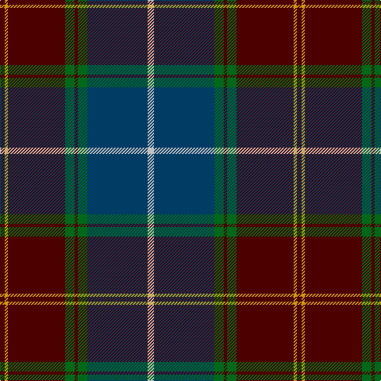

In pattern [BYBGBGBW](/patterns/bybgbgbw/).

This was sourced from tartans-authority.  It is a [8 stripes tartan](/stripes/stripes8/).

Original link http://www.tartansauthority.com/tartan-ferret/display/2514/

## Thread count
DR/6 DY4 DR72 G12 DR4 G12 DB76 N/8

## Palette
Each colour and its ΔE from the base-6 reference it is a variant of.

| Colour | Shade | Base | ΔE (OKLab) |
|---|---|---|---|
| DB | <code style="background-color:#003C64;">#003C64</code> `#003C64` | B <code style="background-color:#2A418A;">#2A418A</code> | 0.08 |
| DR | <code style="background-color:#4C0000;">#4C0000</code> `#4C0000` | B <code style="background-color:#2A418A;">#2A418A</code> | 0.25 |
| DY | <code style="background-color:#D09800;">#D09800</code> `#D09800` | Y <code style="background-color:#F2BF00;">#F2BF00</code> | 0.12 |
| G | <code style="background-color:#006818;">#006818</code> `#006818` | G <code style="background-color:#006100;">#006100</code> | 0.02 |
| N | <code style="background-color:#C0C0C0;">#C0C0C0</code> `#C0C0C0` | W <code style="background-color:#F7F7F7;">#F7F7F7</code> | 0.17 |

# Sample pattern

## Nearest tartans

The nearest existing variants by ΔTartan distance.

1. [Scotland 2000](/setts/s8/w4b38g6ba2g6ba36y2ba3x2~b003c64-ba4c0000-g006818-wffffff-yd09800/) — ΔT 0.63
1. [21st Century (Fashion)](/setts/s8/w4b38g6r2g6r38y2r3x2~b003c64-g006818-r880000-we0e0e0-ybc8c00/) — ΔT 0.79
1. [Peter of Lee (Chief) (Personal)](/setts/s8/r4g4k2g29b21k3b3y3x2~b2c2c80-g003820-k101010-rc80000-ye8c000/) — ΔT 1.00
1. [Kilkenny, County (District)](/setts/s7/b4g27r2ba25y5g3r3x2~b480800-ba202060-g003820-rb84c00-ybc8c00/) — ΔT 1.05
1. [Mann](/setts/s9/k3r2g4r1b25ga12g14b3r1x2~b202060-g604000-ga006818-k101010-rc80000/) — ΔT 1.05
1. [Ormiston (Personal)](/setts/s9/g26b3r3b20r3b3r30w3k2x2~b2c4084-g005020-k101010-r960000-wc0c0c0/) — ΔT 1.06
1. [Brown of the Southeast (Personal)](/setts/s8/b12g2b4g2b4k33g13r4x2~b505c64-g4c5420-k101010-rc80000/) — ΔT 1.09
1. [Scotland 2000](/setts/s8/r5y2r35g6r2g6b38w4x2~b304080-g008000-r802040-we0e0e0-yf0c000/) — ΔT 1.14
1. [Singh](/setts/s8/b3r3b34g18y2g18w2r3x2~b6c0070-g006818-r880000-wc0c0c0-yd09800/) — ΔT 1.14
1. [Loch Long One Design](/setts/s6/y4k28r2b22ba8b3x2~b3d3134-ba5f749c-k1c1714-rca2625-ye0a126/) — ΔT 1.15

## Neighbour map

Every grey dot is one of 15726 variants placed by the first two principal components of the ΔTartan feature space (44% of its variance). Red is this tartan; blue dots are its nearest — click one to open its page.

<svg viewBox="0 0 640 380" role="img" style="max-width:100%;height:auto;border:1px solid #e0e0e0;border-radius:4px;display:block" xmlns="http://www.w3.org/2000/svg"><image href="/nn/cloud.v1.png" width="640" height="380"/><a href="/setts/s8/w4b38g6ba2g6ba36y2ba3x2~b003c64-ba4c0000-g006818-wffffff-yd09800/"><circle cx="272.1" cy="144.1" r="4" fill="#3465a4"><title>Scotland 2000</title></circle></a><a href="/setts/s8/w4b38g6r2g6r38y2r3x2~b003c64-g006818-r880000-we0e0e0-ybc8c00/"><circle cx="290.1" cy="142.1" r="4" fill="#3465a4"><title>21st Century (Fashion)</title></circle></a><a href="/setts/s8/r4g4k2g29b21k3b3y3x2~b2c2c80-g003820-k101010-rc80000-ye8c000/"><circle cx="294.9" cy="170.5" r="4" fill="#3465a4"><title>Peter of Lee (Chief) (Personal)</title></circle></a><a href="/setts/s7/b4g27r2ba25y5g3r3x2~b480800-ba202060-g003820-rb84c00-ybc8c00/"><circle cx="280.3" cy="187.4" r="4" fill="#3465a4"><title>Kilkenny, County (District)</title></circle></a><a href="/setts/s9/k3r2g4r1b25ga12g14b3r1x2~b202060-g604000-ga006818-k101010-rc80000/"><circle cx="292.8" cy="151.3" r="4" fill="#3465a4"><title>Mann</title></circle></a><a href="/setts/s9/g26b3r3b20r3b3r30w3k2x2~b2c4084-g005020-k101010-r960000-wc0c0c0/"><circle cx="252.6" cy="158.6" r="4" fill="#3465a4"><title>Ormiston (Personal)</title></circle></a><a href="/setts/s8/b12g2b4g2b4k33g13r4x2~b505c64-g4c5420-k101010-rc80000/"><circle cx="301.7" cy="185.1" r="4" fill="#3465a4"><title>Brown of the Southeast (Personal)</title></circle></a><a href="/setts/s8/r5y2r35g6r2g6b38w4x2~b304080-g008000-r802040-we0e0e0-yf0c000/"><circle cx="285.6" cy="144.5" r="4" fill="#3465a4"><title>Scotland 2000</title></circle></a><a href="/setts/s8/b3r3b34g18y2g18w2r3x2~b6c0070-g006818-r880000-wc0c0c0-yd09800/"><circle cx="286.5" cy="152.7" r="4" fill="#3465a4"><title>Singh</title></circle></a><a href="/setts/s6/y4k28r2b22ba8b3x2~b3d3134-ba5f749c-k1c1714-rca2625-ye0a126/"><circle cx="263.3" cy="195.8" r="4" fill="#3465a4"><title>Loch Long One Design</title></circle></a><circle cx="290.7" cy="151.7" r="5" fill="#c00000"/></svg>

ID: /setts/s8/w4b38g6ba2g6ba36y2ba3x2~b003c64-ba4c0000-g006818-wc0c0c0-yd09800/
