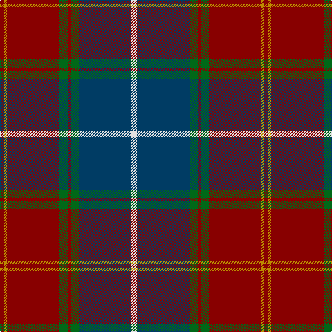

In pattern [RYRGRGBW](/patterns/ryrgrgbw/).

This was sourced from tartans-authority.  It is a [8 stripes tartan](/stripes/stripes8/).

Original link http://www.tartansauthority.com/tartan-ferret/display/6410/

## Thread count
DR/6 DY4 DR76 G12 DR4 G12 DB76 LN/8

## Palette
Each colour and its ΔE from the base-6 reference it is a variant of.

| Colour | Shade | Base | ΔE (OKLab) |
|---|---|---|---|
| DB | <code style="background-color:#003C64;">#003C64</code> `#003C64` | B <code style="background-color:#2A418A;">#2A418A</code> | 0.08 |
| DR | <code style="background-color:#880000;">#880000</code> `#880000` | R <code style="background-color:#CC0000;">#CC0000</code> | 0.15 |
| DY | <code style="background-color:#BC8C00;">#BC8C00</code> `#BC8C00` | Y <code style="background-color:#F2BF00;">#F2BF00</code> | 0.16 |
| G | <code style="background-color:#006818;">#006818</code> `#006818` | G <code style="background-color:#006100;">#006100</code> | 0.02 |
| LN | <code style="background-color:#E0E0E0;">#E0E0E0</code> `#E0E0E0` | W <code style="background-color:#F7F7F7;">#F7F7F7</code> | 0.07 |

# Sample pattern

## Nearest tartans

The nearest existing variants by ΔTartan distance.

1. [Singh](/setts/s8/b3r3b34g18y2g18w2r3~b6c0070-g006818-r880000-wc0c0c0-yd09800~x2/) — ΔT 0.77
1. [Scotland 2000](/setts/s8/w4b38g6ba2g6ba36y2ba3~b003c64-ba4c0000-g006818-wffffff-yd09800~x2/) — ΔT 0.79
1. [Scotland 2000 (Commemorative)](/setts/s8/w4b38g6ba2g6ba36y2ba3~b003c64-ba4c0000-g006818-wc0c0c0-yd09800~x2/) — ΔT 0.79
1. [Scotland 2000](/setts/s8/r5y2r35g6r2g6b38w4~b304080-g008000-r802040-we0e0e0-yf0c000~x2/) — ΔT 0.85
1. [Ormiston (Personal)](/setts/s9/g26b3r3b20r3b3r30w3k2~b2c4084-g005020-k101010-r960000-wc0c0c0~x2/) — ΔT 0.98
1. [Bennett, J P. (Personal)](/setts/s7/r2g18k2g3k20ga30w2~g74787c-ga604000-k101010-rc80000-we0e0e0~x2/) — ΔT 1.12
1. [Spragg, Andrew](/setts/s7/r2g16ra1r2ra12y1ga1~g165041-ga547c73-ra62a2a-racc1100-yffe600~x2/) — ΔT 1.20
1. [Kormylo (Personal)](/setts/s12/w2b2r18b2g20r2b40r2g12b3r9y2~b202060-g003820-rc80000-wfcfcfc-ye8c000~x2/) — ΔT 1.21
1. [Wellmont Foundation (Corporate)](/setts/s7/b12w2b13g3ga2r24ga3~b14283c-g003820-ga006818-ra40000-wfcfcfc~x2/) — ΔT 1.21
1. [Rattay](/setts/s9/g71k4r4b9r4b4r36b4y4~b000052-g11450d-k000000-raa0000-yaaaaaa~x2/) — ΔT 1.21

## Neighbour map

Every grey dot is one of 15726 variants placed by the first two principal components of the ΔTartan feature space (44% of its variance). Red is this tartan; blue dots are its nearest — click one to open its page.

<svg viewBox="0 0 640 380" role="img" style="max-width:100%;height:auto;border:1px solid #e0e0e0;border-radius:4px;display:block" xmlns="http://www.w3.org/2000/svg"><image href="/nn/cloud.v1.png" width="640" height="380"/><a href="/setts/s8/b3r3b34g18y2g18w2r3~b6c0070-g006818-r880000-wc0c0c0-yd09800~x2/"><circle cx="286.5" cy="152.7" r="4" fill="#3465a4"><title>Singh</title></circle></a><a href="/setts/s8/w4b38g6ba2g6ba36y2ba3~b003c64-ba4c0000-g006818-wffffff-yd09800~x2/"><circle cx="272.1" cy="144.1" r="4" fill="#3465a4"><title>Scotland 2000</title></circle></a><a href="/setts/s8/w4b38g6ba2g6ba36y2ba3~b003c64-ba4c0000-g006818-wc0c0c0-yd09800~x2/"><circle cx="290.7" cy="151.7" r="4" fill="#3465a4"><title>Scotland 2000 (Commemorative)</title></circle></a><a href="/setts/s8/r5y2r35g6r2g6b38w4~b304080-g008000-r802040-we0e0e0-yf0c000~x2/"><circle cx="285.6" cy="144.5" r="4" fill="#3465a4"><title>Scotland 2000</title></circle></a><a href="/setts/s9/g26b3r3b20r3b3r30w3k2~b2c4084-g005020-k101010-r960000-wc0c0c0~x2/"><circle cx="252.6" cy="158.6" r="4" fill="#3465a4"><title>Ormiston (Personal)</title></circle></a><a href="/setts/s7/r2g18k2g3k20ga30w2~g74787c-ga604000-k101010-rc80000-we0e0e0~x2/"><circle cx="230.1" cy="168.9" r="4" fill="#3465a4"><title>Bennett, J P. (Personal)</title></circle></a><a href="/setts/s7/r2g16ra1r2ra12y1ga1~g165041-ga547c73-ra62a2a-racc1100-yffe600~x2/"><circle cx="301.8" cy="151.9" r="4" fill="#3465a4"><title>Spragg, Andrew</title></circle></a><a href="/setts/s12/w2b2r18b2g20r2b40r2g12b3r9y2~b202060-g003820-rc80000-wfcfcfc-ye8c000~x2/"><circle cx="247.0" cy="117.6" r="4" fill="#3465a4"><title>Kormylo (Personal)</title></circle></a><a href="/setts/s7/b12w2b13g3ga2r24ga3~b14283c-g003820-ga006818-ra40000-wfcfcfc~x2/"><circle cx="246.9" cy="178.3" r="4" fill="#3465a4"><title>Wellmont Foundation (Corporate)</title></circle></a><a href="/setts/s9/g71k4r4b9r4b4r36b4y4~b000052-g11450d-k000000-raa0000-yaaaaaa~x2/"><circle cx="318.2" cy="130.2" r="4" fill="#3465a4"><title>Rattay</title></circle></a><circle cx="290.1" cy="142.1" r="5" fill="#c00000"/></svg>

ID: /setts/s8/w4b38g6r2g6r38y2r3~b003c64-g006818-r880000-we0e0e0-ybc8c00~x2/
