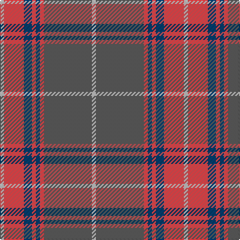

In pattern [WBRBRBRW](/patterns/wbrbrbrw/).

This was sourced from house-of-tartan.  It is a [8 stripes tartan](/stripes/stripes8/).

Original link http://www.house-of-tartan.scotland.net/house/TartanViewjs.asp?colr=Def&tnam=2346

## Thread count
Na/4 DO20 DB8 DO4 DB4 DO4 N48 Na/4

## Palette
Each colour and its ΔE from the base-6 reference it is a variant of.

| Colour | Shade | Base | ΔE (OKLab) |
|---|---|---|---|
| DB | <code style="background-color:#003C64;">#003C64</code> `#003C64` | B <code style="background-color:#2A418A;">#2A418A</code> | 0.08 |
| DO | <code style="background-color:#D05054;">#D05054</code> `#D05054` | R <code style="background-color:#CC0000;">#CC0000</code> | 0.09 |
| N | <code style="background-color:#5C5C5C;">#5C5C5C</code> `#5C5C5C` | B <code style="background-color:#2A418A;">#2A418A</code> | 0.15 |
| Na | <code style="background-color:#C0C0C0;">#C0C0C0</code> `#C0C0C0` | W <code style="background-color:#F7F7F7;">#F7F7F7</code> | 0.17 |

# Sample pattern

## Nearest tartans

The nearest existing variants by ΔTartan distance.

1. [Tenmaya Check](/setts/s8/w4r48ra4b4ra4b8ra20w4-b003c64-r888888-rad05054-wc0c0c0/) — ΔT 0.71
1. [Hebridean Granite Fashion Tartan Tartan Number: 6821. Earliest known date: 2005 For a new House of Edgar collection. Intended to emulate the gray morning suit perhaps. See products available Copyright © Blair Urquhart, Comrie, 2015](/setts/s8/r6y8r8b8r36b6ba72w6-b383838-ba484848-r888888-we0e0e0-yb0b0b0/) — ΔT 1.23
1. [Balfour blue & brown](/setts/s6/b36y4r12y4r38ra6-b304080-r806050-rac00000-yf0c000/) — ΔT 1.26
1. [Hebridean Granite (Fashion)](/setts/s8/r6y8r8k8r36k6b72w6-b5c5c5c-k101010-r888888-wf8f8f8-ya0a0a0/) — ΔT 1.31
1. [Shieldhall (Fashion)](/setts/s12/b48r4b8r4b8w8b12ra36r4ra8r4ra12-b4c3428-rc80000-ra888888-wc0c0c0/) — ΔT 1.31
1. [Speyside Grey (Fashion)](/setts/s8/b64k6b6k6r10k16ra42k8-b5c5c5c-k101010-r98481c-ra888888/) — ΔT 1.37
1. [Gammell (Personal)](/setts/s8/b64r6b6r6b6r20g48ra6-b5c8ca8-g006818-rb03000-ra901c38/) — ΔT 1.40
1. [Spragg (Name)](/setts/s7/r4g32ra2r4ra24y2b2-b5c8ca8-g048888-r901c38-rac80000-ye8c000/) — ΔT 1.40
1. [Dama Classic](/setts/s8/g60y6g6y6g24b60k6b10-b2e2e2e-g615e57-k181818-ye2d1a3/) — ΔT 1.43
1. [Brave for Men](/setts/s8/k5r5k5r34b33k6b5ba2-b3d3d3d-ba778899-k101010-r906c5a/) — ΔT 1.43

## Neighbour map

Every grey dot is one of 15726 variants placed by the first two principal components of the ΔTartan feature space (44% of its variance). Red is this tartan; blue dots are its nearest — click one to open its page.

<svg viewBox="0 0 640 380" role="img" style="max-width:100%;height:auto;border:1px solid #e0e0e0;border-radius:4px;display:block" xmlns="http://www.w3.org/2000/svg"><image href="/nn/cloud.v1.png" width="640" height="380"/><a href="/setts/s8/w4r48ra4b4ra4b8ra20w4-b003c64-r888888-rad05054-wc0c0c0/"><circle cx="339.4" cy="177.1" r="4" fill="#3465a4"><title>Tenmaya Check</title></circle></a><a href="/setts/s8/r6y8r8b8r36b6ba72w6-b383838-ba484848-r888888-we0e0e0-yb0b0b0/"><circle cx="299.2" cy="168.0" r="4" fill="#3465a4"><title>Hebridean Granite Fashion Tartan Tartan Number: 6821. Earliest known date: 2005 For a new House of Edgar collection. Intended to emulate the gray morning suit perhaps. See products available Copyright © Blair Urquhart, Comrie, 2015</title></circle></a><a href="/setts/s6/b36y4r12y4r38ra6-b304080-r806050-rac00000-yf0c000/"><circle cx="315.8" cy="222.6" r="4" fill="#3465a4"><title>Balfour blue &amp; brown</title></circle></a><a href="/setts/s8/r6y8r8k8r36k6b72w6-b5c5c5c-k101010-r888888-wf8f8f8-ya0a0a0/"><circle cx="287.9" cy="162.4" r="4" fill="#3465a4"><title>Hebridean Granite (Fashion)</title></circle></a><a href="/setts/s12/b48r4b8r4b8w8b12ra36r4ra8r4ra12-b4c3428-rc80000-ra888888-wc0c0c0/"><circle cx="301.5" cy="165.6" r="4" fill="#3465a4"><title>Shieldhall (Fashion)</title></circle></a><a href="/setts/s8/b64k6b6k6r10k16ra42k8-b5c5c5c-k101010-r98481c-ra888888/"><circle cx="267.0" cy="192.9" r="4" fill="#3465a4"><title>Speyside Grey (Fashion)</title></circle></a><a href="/setts/s8/b64r6b6r6b6r20g48ra6-b5c8ca8-g006818-rb03000-ra901c38/"><circle cx="300.7" cy="196.5" r="4" fill="#3465a4"><title>Gammell (Personal)</title></circle></a><a href="/setts/s7/r4g32ra2r4ra24y2b2-b5c8ca8-g048888-r901c38-rac80000-ye8c000/"><circle cx="296.8" cy="149.8" r="4" fill="#3465a4"><title>Spragg (Name)</title></circle></a><a href="/setts/s8/g60y6g6y6g24b60k6b10-b2e2e2e-g615e57-k181818-ye2d1a3/"><circle cx="333.3" cy="207.1" r="4" fill="#3465a4"><title>Dama Classic</title></circle></a><a href="/setts/s8/k5r5k5r34b33k6b5ba2-b3d3d3d-ba778899-k101010-r906c5a/"><circle cx="306.7" cy="182.6" r="4" fill="#3465a4"><title>Brave for Men</title></circle></a><circle cx="334.5" cy="177.7" r="5" fill="#c00000"/></svg>

ID: /setts/s8/w4b48r4ba4r4ba8r20w4-b5c5c5c-ba003c64-rd05054-wc0c0c0/
